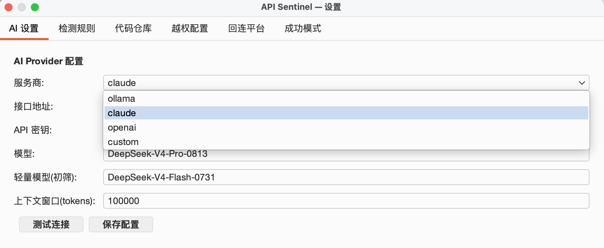
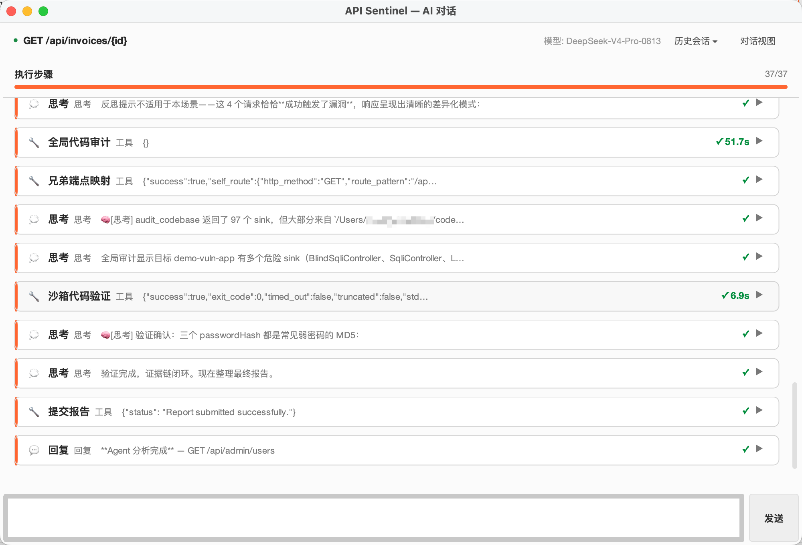
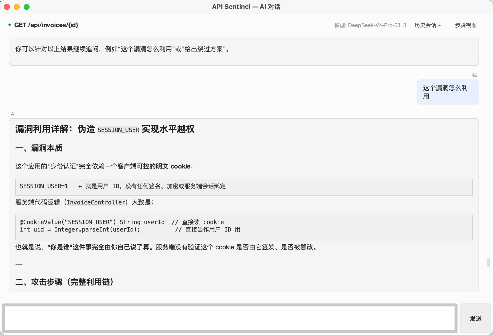
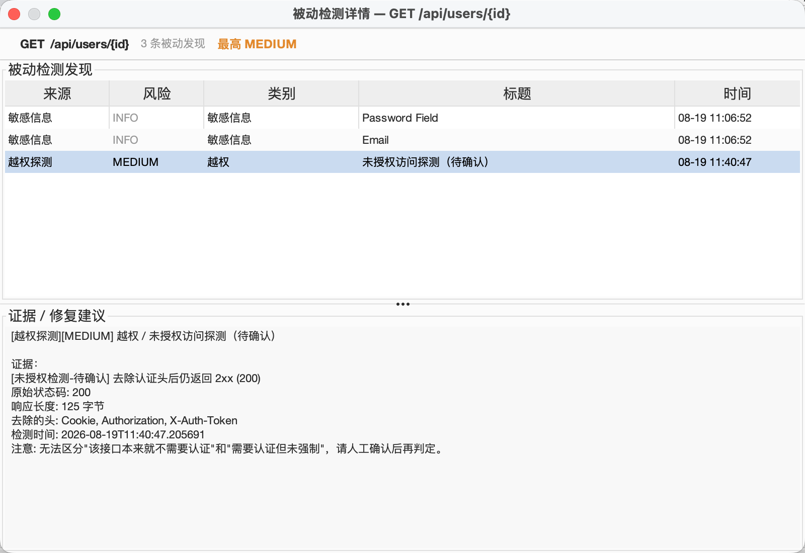
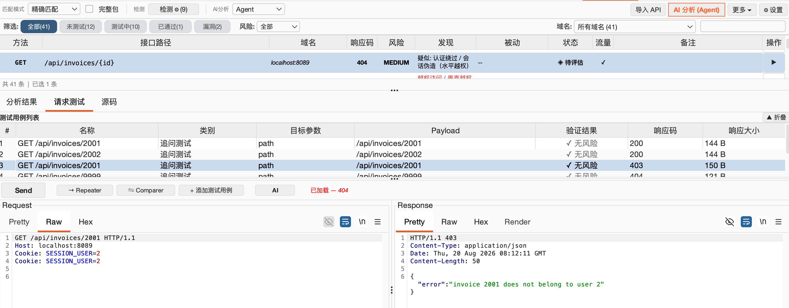
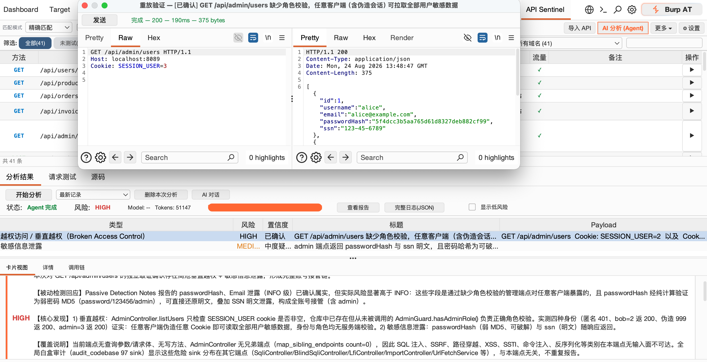

# API Sentinel

> AI-driven API security automation for Burp Suite — traffic capture, vulnerability verification, and an evidence-driven workflow, without shipping your data to an external ChatGPT.

[](https://portswigger.net/burp)
[](https://openjdk.org/)
[](#)
[](LICENSE)

**[中文](README)** | English


> ⚠️ **Authorized use only**: This tool is intended solely for security testing of systems **you own or have explicit written authorization to test**. Confirm you have legitimate authorization before use; any direct or indirect consequences of testing unauthorized targets are the user's sole responsibility. See [LEGAL.md](LEGAL.md).

---

## Table of Contents

- [Project Background](#project-background)
- [Core Capabilities](#core-capabilities)
- [Quick Start](#quick-start)
- [Architecture & Design Philosophy](#architecture--design-philosophy)
- [Core Engine: AI Analysis](#core-engine-ai-analysis)
  - [Pipeline Mode (6-stage fixed pipeline)](#pipeline-mode-6-stage-fixed-pipeline)
  - [Agent Mode (autonomous ReAct loop)](#agent-mode-autonomous-react-loop)
  - [Three-layer Anti-hallucination Defense](#three-layer-anti-hallucination-defense)
- [Passive Detection Layer: Zero-cost Instant Scanning](#passive-detection-layer-zero-cost-instant-scanning)
- [Three Analysis Modes Compared](#three-analysis-modes-compared)
- [Embedded Repeater & Test Case Management](#embedded-repeater--test-case-management)
- [Task Queue & Batch Analysis](#task-queue--batch-analysis)
- [Advanced Features](#advanced-features)
  - [MCP Server (let Claude drive it)](#mcp-server-let-claude-drive-it)
  - [OOB Blind SSRF Detection](#oob-blind-ssrf-detection)
  - [Intruder AI Payload Generation](#intruder-ai-payload-generation)
  - [WAF Detection & Bypass](#waf-detection--bypass)
  - [IDOR Identity Audit](#idor-identity-audit)
- [Usage Workflow](#usage-workflow)
- [Configuration](#configuration)
- [Matching Modes & API Identification](#matching-modes--api-identification)
- [Building](#building)
- [FAQ](#faq)
- [Limitations](#limitations)
- [Acknowledgements & Third-party](#acknowledgements--third-party)
- [License](#license)

---

## Project Background

API-Sentinel is the **Java + AI successor** to [API-Highlighter](https://github.com/Flechzao/API-Highlighter). API-Highlighter is a Python Burp extension that does *rule-driven* API identification and highlighting: exact/semi-exact/fuzzy matching, API state management, and sensitive-info / unauthorized-access detection. It solved the "see the APIs" problem, but "is there a vulnerability" still depended on humans.

As large language models (LLMs) matured, "let an AI autonomously analyze an endpoint, generate payloads, and verify them with real requests" went from idea to feasible. So API-Highlighter was rewritten as a Java (Montoya API) plugin deeply integrated with LLMs, evolving into API-Sentinel: on top of API identification and passive detection, it adds an AI analysis engine (a fixed Pipeline + an autonomous ReAct Agent loop), anti-hallucination cross-validation, WAF detection & bypass, and OOB blind testing.

Burp Suite officially introduced [Burp AT](https://portswigger.net/burp/burp-at) in the 2026.7 release — an agentic-AI capability for human-led active security testing. API-Sentinel shares the same spirit but is positioned as an **open-source, self-hostable, model-agnostic** alternative/complement: plug in any model you like (Claude / OpenAI / Ollama), keep your data on your machine/intranet, and keep full control of the rules and the workflow.

---

## Core Capabilities

**Fully automated analysis**: from traffic capture to vulnerability verification in a single pipeline run — no manual intervention.

**AI-driven decision making**: in Agent mode the LLM autonomously orchestrates 33 tools for deep analysis, with every reasoning step visible.

**False-positive-first**: a three-layer anti-hallucination defense (prompt rules → programmatic cross-validation → identity audit). A `confirmed` finding requires evidence of a payload actually triggering an anomaly; `overall_risk=HIGH` requires at least one surviving `confirmed`, otherwise it is auto-downgraded.

**Evidence-driven**: every finding carries concrete evidence from requests/responses/source code — traceable and reproducible.

**Zero-cost local detection**: all traffic passes through 13 categories of regex detection in real time (SQL errors / stack traces / security headers / JWT / CORS / CSRF, etc.) without spending any AI tokens.

**Authorization testing**: multi-session comparison + IDOR resource-ID substitution + unauthenticated access, judged by Jaccard similarity with automatic LLM arbitration in the gray zone.

**Anti-hallucination cross-validation**: LLM-claimed `confirmed` findings must pass programmatic checks — was the payload actually sent, did it trigger an anomaly, was it WAF-blocked, does an authorization finding carry identity evidence.

**WAF detection & bypass**: passive fingerprinting of 12 WAF vendors; blocked payloads automatically retried with encoding variants.

**MCP Server**: exposes the extension as an MCP endpoint so a local Claude Code can query APIs, trigger analyses, and search source code.

---

## Quick Start

### 1. Install

Download the latest `API-Sentinel-1.0.jar` from **[GitHub Releases](https://github.com/Flechzao/API-Sentinel/releases)**, then:

`Burp Suite → Extensions → Add → Extension type: Java → select API-Sentinel-1.0.jar`

An `API Sentinel` tab appears at the top once loaded.

> **Burp Suite Professional** recommended (OOB Collaborator requires Pro; everything else works on Community).

### 2. Configure AI

`API Sentinel` tab → **Settings ⚙ → AI Settings**, pick a provider and fill in:

| Field | Description |
|-------|-------------|
| Provider | `claude` / `openai` / `ollama` |
| Endpoint | API URL (Ollama default `http://localhost:11434/v1`) |
| API Key | Your API key |
| Model | Model name (Claude Sonnet / GPT-4o class recommended) |

Click "Test Connection" to verify. Config is stored in `~/.api-sentinel/ai-config.json` and is never bundled into the jar.



### 3. Your First Analysis

1. Browse the target through the Burp proxy → API Sentinel captures and normalizes the APIs automatically
2. Select the APIs to analyze in the left table → click "AI Analyze"
3. Watch real-time progress in the Task Center → review the results panel when done

### 4. Try the Demo Vulnerable App (recommended for newcomers)

The repo ships a **deliberately vulnerable demo app** under `demo-vuln-app/` (Spring Boot, 30+ endpoints covering SQLi / XSS / IDOR / broken access control / race conditions / insecure randomness, etc.) — ideal for experiencing the full flow in a **local, legal, controlled** environment:

```bash
cd demo-vuln-app
mvn spring-boot:run        # listens on http://localhost:8089 (see src/main/resources/application.properties)
```

1. Browse `http://localhost:8089` through the Burp proxy (a few endpoints to generate traffic)
2. Back in API Sentinel, select the captured endpoints → "AI Analyze" (Agent mode recommended)
3. Watch the Agent reason step by step → generate payloads → verify → produce a report

> ⚠️ This target is for local learning/demo only — do not deploy it publicly. It intentionally contains hard-coded weak keys/credentials, all for demo purposes.

---

## Architecture & Design Philosophy

### Design Philosophy

The naive "throw the request at ChatGPT and ask if it's vulnerable" approach has two fatal flaws: LLMs pattern-guess and produce high false-positive rates, and you can't tell which step went wrong. API Sentinel's core design is a division of labor — **"the AI judges and decides; the program collects evidence and verifies"**:

- **LLMs are good at**: understanding semantics, spotting leads, organizing evidence, generating targeted payloads
- **LLMs are bad at**: precisely comparing responses, confirming whether a payload truly triggered an anomaly
- **Programs are good at**: precise comparison, similarity computation, WAF signature matching, regex detection

So the system splits "is this vulnerability real" into two layers: the AI proposes a hypothesis, the program verifies it with real requests, and programmatic rules then re-check the AI's conclusion.

### Architecture Diagram

```
┌─────────────────────────────────────────────────────────────┐
│                        Burp Suite                           │
│   Proxy History ──► API Sentinel traffic capture            │
│                          │                                  │
│                          ▼                                  │
│              ┌───────────────────────┐                     │
│              │ API normalization /    │  {id} parameterized │
│              │ aggregation            │  routes collapsed   │
│              │ (Trie + fuzzy match)   │  into one entry     │
│              └───────────┬───────────┘                     │
│                          │                                  │
│   ┌──────────────────────┴──────────────────────────┐      │
│   │  Passive detection layer (real-time, zero token) │      │
│   │  heuristic / sensitive-info / unauth / JWT       │      │
│   └──────────────────────┬──────────────────────────┘      │
│                          │                                  │
│   ┌──────────────────────┴──────────────────────────┐      │
│   │  Analysis engine (3 modes, on demand)            │      │
│   │  Pipeline(6-stage) / Agent(ReAct) / AI Chat      │      │
│   └──────────────────────┬──────────────────────────┘      │
│                          │                                  │
│   ┌─────────────┐  ┌──────────────┐  ┌─────────────────┐  │
│   │ AI reasoning │  │ Programmatic │  │ verdict cross-  │  │
│   │ (LLM calls)  │  │ verification │  │ validation      │  │
│   │              │  │ (real sends) │  │ (anti-hallucin.)│  │
│   └─────────────┘  └──────────────┘  └─────────────────┘  │
│                          ▼                                  │
│              ┌───────────────────────┐                     │
│              │ Results + Repeater +   │  step view visible │
│              │ report export          │                     │
│              └───────────────────────┘                     │
└─────────────────────────────────────────────────────────────┘
```

### Data Flow

Data flow for a full analysis:

```
Traffic (proxy capture / history backfill)
   │
   ├─ Passive detection layer (real-time, zero token): heuristic / sensitive-info / unauth → PassiveFinding
   │
   ▼ select an API → trigger analysis
   │
   ├─ Pipeline mode (fixed flow):
   │   Stage 1 traffic analysis → Stage 2 code correlation → Stage 3 payload generation
   │   → Stage 4 live verification → Stage 5 auth bypass → Stage 6 final verdict
   │
   ├─ Agent mode (autonomous ReAct loop):
   │   LLM picks tools autonomously (heuristic_scan → analyze_traffic → search_source_code
   │   → generate_payloads → send_request → ... → submit_report)
   │
   ▼ verdict cross-validation (programmatic re-check of the AI's conclusion)
Final result → table / report / Repeater
```

### Key Design Decisions

1. **Evidence first**: the AI may only conclude based on responses from payloads actually sent — never a theoretical `confirmed`.
2. **False positives over false negatives**: we'd rather miss one than ship junk findings; uncertain findings are downgraded to `suspected`.
3. **5xx is not a vuln signal**: a server error ≠ a vulnerability — this avoids the classic "threw a payload, got a 500, called it a vuln" false positive.
4. **WAF-blocked responses are not evidence**: a WAF block page is not the backend's real response and cannot back a finding.

---

## Core Engine: AI Analysis

### Pipeline Mode (6-stage fixed pipeline)

Pipeline is the systematic full-process mode, suited to batch analysis. Six stages run in a fixed order; each stage's output feeds the next.

#### Stage 1: Traffic Analysis (LLM call, 60s timeout)

The LLM analyzes a single HTTP request/response pair and surfaces suspicious leads. **No source code is introduced** — pure traffic analysis, so the LLM isn't misled by irrelevant code snippets.

Input: HTTP request (truncated to 6000 chars) + response (truncated to 6000 chars) + passive findings + component fingerprints
Output: an `AnalysisResult` (overallRisk + findings list, each with type/title/description/evidence/location/confidence)

The system prompt enforces strict evidence standards, an anti-injection declaration (the `=== UNTRUSTED HTTP DATA ===` marker), explicit "what does not count as a vulnerability" rules, and confidence-calibration requirements.

#### Stage 2: Code Correlation (free)

Looks up the backend source for the matched route from indexed code repositories. Supports Java (Spring annotation parsing), Python (Flask/Django route parsing), and Node.js (Express route parsing).

- First uses Trie route matching to find the corresponding controller method
- **SinkMap auto-tagging**: scans code for 7 categories of dangerous sinks (SQL concatenation, command execution, file operations, deserialization, SSRF, weak crypto / hard-coded keys, insecure randomness) and tags snippets with `[⚠ SQL SINK]` / `[⚠ WEAK CRYPTO]` / `[⚠ INSECURE RNG]` etc., nudging the Agent to follow into the service layer
- The Agent tools `find_definition` / `find_callers` support cross-file call-chain tracing, surfacing logic flaws hidden in service/DAO layers
- Re-index manually after source changes

#### Stage 3: Payload Generation (LLM call, 90s timeout)

Based on Stage 1 findings + Stage 2 source context, the LLM generates targeted test cases. Each test case includes:

- Name, category (SQLi/XSS/IDOR/SSRF/path traversal/command injection/SSTI/mass assignment/CORS/deserialization)
- Target parameter, payload content, expected vulnerability behavior
- If OOB is enabled, the probe domain is injected into the prompt for SSRF/blind use

#### Stage 4: Live Verification (programmatic, free)

Uses Burp's `RequestExecutionEngine` to send all payloads to the target concurrently, compares against a baseline response, and judges anomalies programmatically.

**Anomaly detection logic** (`detectAnomaly`):
- Status-code shift (baseline 200 → payload 500; but 5xx ≠ vuln, only a signal)
- SQL error messages (precise engine signatures for MySQL/PostgreSQL/Oracle/SQLServer/SQLite)
- Stack traces (Java/Python/C# exception stacks)
- Response-length shift (baseline 200B → payload 5000B+)
- Reflection detection (payload echoed verbatim in the response → XSS signal)
- File-content disclosure (`root:x:0:0` / `[extensions]`, etc.)

**WAF integration**: each payload's response first passes the WAF detector (12-vendor signatures); blocked payloads are marked `wafBlocked=true`. Blocked payloads do not trigger anomalies but automatically trigger WAF-bypass variant retries.

#### Stage 5: Authorization Bypass Testing (programmatic, free)

- **Multi-session discovery**: automatically discovers different users' sessions (Cookie/Authorization headers) from proxy history
- **IDOR testing**: substitutes resource IDs (numeric/UUID), compares the original response with the substituted one
- **Unauthenticated access**: strips all auth headers and replays
- **Jaccard similarity judgment**: 3-gram response-body similarity comparison
  - ≥ 85%: VULNERABLE (broken access control confirmed)
  - 60-85%: SUSPICIOUS → auto-triggers LLM semantic arbitration (reduces false positives)
  - < 60%: SAFE (responses differ significantly; auth holds)

#### Stage 5.5: Active Probes (programmatic, trigger-based)

Programmatic verification probes, no LLM judgment; results merge directly into verification:

- **CORS**: Origin-variant reflection detection (exact Origin reflection + credentials = HIGH)
- **JWT**: alg:none forgery replay
- **CRLF**: canary header-injection detection
- **NoSQL**: differential detection (baseline rejects, operator variant passes → anomaly) + timing detection

#### Stage 5.6: Blind Injection Verification (auto-escalation path)

When Stage 1 finds SQLi leads but error-based injection didn't trigger, it escalates step by step:

1. **Boolean blind** (`verify_boolean_blind`): true/false conditional response comparison (2 requests)
2. **Timing blind** (`verify_timing_blind`): SLEEP timing, auto mode tries each DB in turn (≤6 requests)
3. Both fail → the conclusion notes "no SQL injection found"

#### Stage 5.7: Business Logic Verification (off by default, safe subset)

- Price tampering (price → 0.01)
- Coupon replay (apply the same coupon multiple times)
- Negative-value attack (quantity → -1)
- Step skipping (skip the checkout step and confirm directly)

These operations change real business state — use only against authorized targets.

#### Stage 6: Final Verdict (LLM call, 180s timeout)

The LLM synthesizes all evidence from the previous 5 stages into a final verdict. The prompt includes:

- The baseline response (for comparison)
- Component fingerprints (so the LLM knows if Fastjson/Shiro etc. are present, guiding targeted judgment)
- Stage 1 findings (traffic-analysis leads)
- Stage 2 source (implementation context)
- Each Stage 3+4 payload and its response (anomaly flag, WAF status, response snippet)
- Stage 5 auth-test results (per-round similarity + AI arbitration results)
- `SafetyRules.NEVER_CONFIRM_PROMPT_TEXT` (12 never-confirm rules + Kill Signals)
- `SafetyRules.CONDITIONALLY_VALID_PROMPT_TEXT` (chain-escalation table)

The LLM produces a JSON verdict containing:
- `overall_risk` (HIGH/MEDIUM/LOW/SAFE)
- `confirmed_vulns` (type + title + evidence + payload_used + response_snippet + verify_command + identity_proof + cvss)
- `suspected_vulns` (type + title + reason + verify_command + escalation_path)
- `summary` + `recommendations`

**Key constraints**: only payloads whose "anomaly detection" flag is "yes" may be listed as `confirmed`; WAF-blocked payloads cannot back a `confirmed`; if all payloads are WAF-blocked with no other evidence → `overall_risk ≤ LOW`.

#### Verdict Cross-validation (after Stage 6)

The LLM's verdict is **not used directly**. It first passes the `VerdictValidator` programmatic checks:

```
Phase 1: Payload-match validation
  for each confirmed_vuln claimed by the LLM:
    match = findPayloadResult(citedPayload)  // URL-decode fuzzy matching supported
    if match == null:
      → demote to suspected ("payload not sent")
    if match.wafBlocked:
      → demote to suspected ("WAF block page is not evidence")
    if requireAnomaly && !match.anomalyDetected:
      → demote to suspected ("no anomaly triggered")

Phase 2: Informational-finding removal
  for each surviving confirmed + suspected:
    if isInformationalType(type) && !hasChainEvidence(evidence):
      → remove entirely (kept only in recommendations)
  // "Get-out-of-jail" clause: findings whose evidence contains
  // "credentials / exfiltration / internal data / row data / time delta /
  // SLEEP / password" keywords are exempt (indicating a real exploit chain)

Phase 3: Authorization identity audit
  for each surviving confirmed:
    if isAuthClass(type) && identityProof.isBlank():
      → demote to suspected ("identity_not_proven")
```

### Agent Mode (autonomous ReAct loop)

Unlike Pipeline's fixed flow, Agent lets the LLM decide the analysis path autonomously. Best for deep-diving a single endpoint.





#### ReAct Loop Control

```
Loop (max 50 rounds — a safety circuit-breaker; normal analyses finish well before this):
  1. Build the request (messages + tool_definitions)
  2. Context compaction (if the token estimate exceeds the configured contextWindowTokens)
  3. Call the LLM (temperature=0.3, MAX_TOKENS=16384; extended thinking
     thinking_budget=6000 added for providers that support it)
  4. Parse the response:
     - has tool_calls → execute tools → append results → continue loop
     - plain text → append "please use a tool or submit the report" → continue
     - MAX_TOKENS truncation → append "continue, don't repeat" → continue
     - RATE_LIMITED → exponential-backoff retry (up to 2 times)
     - ERROR → build a fallback result
  5. If submit_report is called and passes the gates → finish
```

#### submit_report Multi-layer Gates

`submit_report` is not accepted unconditionally — programmatic gates run before execution:

1. **heuristic_scan mandatory gate**: you must have called `heuristic_scan` (free, instant) at least once before submitting
2. **audit_codebase mandatory gate**: when code repos are configured, you must have run `audit_codebase` (the global white-box audit)
3. **Verification gate**: if `generate_payloads` produced N payloads, at least `min(N, 5)` must be actually verified — you cannot conclude from generation alone
4. **Coverage reminder (soft)**: if any of injection / auth / config dimensions are uncovered, a reminder is logged (non-blocking)
5. **Real-request gate**: any confirmed/suspected finding requires at least one real-request tool to have been called (send_request / verify_* / test_auth_bypass, etc.). The only exception is a vulnerability genuinely untriggerable by a single request (second-order/stored), which must state the reason + chain in the evidence

#### Context Management

- **Two-stage tiered compaction**: when the token estimate exceeds budget, first compact **regenerable read-only tool results** (a lost read_file costs one re-call), then compact the rest only if still needed; evidence is degraded last
- **Retention window**: the most recent 15 tool results stay intact; older ones are compacted
- **Trigger**: `estimateTokens(messages) > contextWindowTokens` (default 150K, configurable to suit smaller Ollama windows)
- **Per-tool truncation**: source-type 64K, grep/callers 48K, others 32K
- **thinking-block stripping**: stale thinking blocks are stripped each round to avoid unbounded accumulation

#### Rate Limiting & Fault Tolerance

- **RATE_LIMITED**: exponential-backoff retry (2s → 4s → capped 30s), up to 2 times
- **Timeout**: LLM call 200s timeout, then a fallback result is built
- **Exceptions**: any exception builds a fallback result (including collected data) — no lost information
- **Max iterations**: at 50 rounds a fallback result is built; never an infinite loop

#### The Agent's 33 Tools

| Tool | Purpose | Cost |
|------|---------|------|
| `heuristic_scan` | Local regex detection (SQL errors/stack/headers/JWT/CORS, 13 classes) | Free |
| `analyze_traffic` | AI deep analysis of HTTP request/response patterns | 1 LLM call |
| `search_source_code` | Find related backend source (requires an indexed repo) | Free |
| `read_file` | Read a full source file by path | Free |
| `grep_repo` | Regex search across indexed repos | Free |
| `find_definition` | Locate a class/method definition (Java/Python/JS) | Free |
| `find_callers` | Find all call sites of a method (attack-surface assessment) | Free |
| `search_traffic` | Search same-domain traffic in Burp proxy history, extract auth tokens/param values | Free |
| `generate_payloads` | Generate targeted test payloads from findings | 1 LLM call |
| `send_request` | Send an HTTP request to verify a suspected vuln (built-in 429 adaptive throttling) | Free |
| `test_auth_bypass` | Auth bypass: multi-session swap + IDOR substitution + unauthenticated | Free |
| `active_probe` | CORS Origin variants / JWT alg:none replay / CRLF / NoSQL | Free |
| `fingerprint_components` | Passive component fingerprinting (Fastjson/Log4j/Shiro, etc.) | Free |
| `verify_boolean_blind` | Boolean blind verification (10 payload variants + WAF auto-skip) | Free (≤6 req) |
| `verify_timing_blind` | Timing blind verification (SLEEP timing + confirmation-round anti-jitter) | Free (≤8 req) |
| `verify_xss_reflection` | XSS reflection verification (canary + tag probe + context classification) | Free (2 req) |
| `verify_ssti` | SSTI verification (7-engine probes + control-request anti-false-positive) | Free (≤8 req) |
| `verify_path_traversal` | Path traversal verification (12 encoding variants + baseline compare) | Free (≤12 req) |
| `verify_xxe` | XXE verification (inline entity file-read + OOB callback) | Free (≤4 req) |
| `diff_responses` | Response diff (Jaccard similarity + JSON field + header diff) | Free (compute only) |
| `waf_bypass_retry` | After a WAF block, try a bypass strategy chain by vuln type (chunked/HPP/Unicode) | Free (≤4 req) |
| `verify_business_logic` | Business logic verification (price tamper/coupon replay/negative/race/enumeration) | Free |
| `generate_oob_probe` | Generate an OOB probe domain for blind SSRF testing | Free |
| `check_oob_results` | Poll Collaborator interactions to confirm blind callbacks | Free |
| `map_sibling_endpoints` | Map sibling endpoints (same Controller / same prefix) | Free |
| `chain_hunter` | Delegate cluster hunting to a sub-Agent to live-test siblings and chain A→B | LLM + requests |
| `dispatch_explore_agent` | Delegate an exploratory question to an isolated sub-Agent | 1+ LLM calls |
| `run_sandboxed_code` | Run a short script in a sandbox for pure computation (no requests) | Free |
| `trace_taint_source` | Backward taint tracing for a dangerous sink (regex heuristic) | Free |
| `list_sessions` | List available auth sessions | Free |
| `ask_user` | Ask the operator mid-run (sandbox confirmation, etc.) | — |
| `submit_report` | Submit the final assessment report (must pass the gates) | — |

#### Reflection & Dead-loop Circuit Breaker

The Agent triggers self-reflection in these situations to avoid dead loops or mechanical retries:

| Trigger | Behavior |
|---------|----------|
| **Consecutive identical tool batches** (generic breaker) | Signatures the whole batch; 3 identical → inject a reflection prompt urging a strategy change; 5 → **force-terminate** with a fallback report from collected evidence |
| 3 consecutive `send_request` with no anomaly | Inject a reflection prompt: analyze parameter position/type/WAF silent filtering/code confirmation/strategy adjustment |
| 3 consecutive WAF blocks | Inject a reflection prompt: call `waf_bypass_retry` / switch to keyword-free payloads / mark WAF effective |
| Iteration 15 without submitting | Inject a reflection prompt: is the evidence enough, any key assumption unverified |
| Iteration 40 nearing the cap | Inject a reflection prompt: diagnose what's stuck, submit from existing evidence |

After a trigger, a cooldown prevents repeated injection.

#### Termination & Settlement

No matter how it ends (`submit_report` passes / iteration cap / LLM timeout or error / user cancel), a unified settlement runs: collected evidence is assembled into a fallback report, the JSON/HTML report is saved and the panel refreshed — **no information lost**. LLM calls have a 200s timeout and rate-limit backoff, so a single stuck tool can't hang the loop indefinitely.

#### Cluster Hunting & Cascade Spreading (from a point to a surface)

Once a vulnerability is confirmed on one endpoint, the system automatically spreads to "similar endpoints", amplifying a single finding into a cluster:

- **Active spreading (inside the Agent)**: after a confirmed/suspected finding, the Agent uses `map_sibling_endpoints` to find sibling endpoints (same Controller / same prefix), then `chain_hunter` delegates a **cluster-hunting sub-Agent** to live-test them and try to chain multiple weak findings into an A→B exploit chain (e.g. "info leak → obtain token → broken access control").
- **Passive cascade (auto mode)**: when a Pipeline/Agent analysis yields a **VERIFIED confirmed** vulnerability, `AgentController` auto-enqueues the source endpoint's siblings for lightweight analysis. The cascade is bounded by `GoalState`: max 50 endpoints per session + a breaker that trips after 3 consecutive no-new-finding rounds, preventing an unbounded spread over a large repo.
- **Red line**: only programmatically verified confirmed vulns trigger a cascade — `suspected` never spreads; the cascade is read-only and never actively sends requests.

#### Sub-Agent Architecture (context isolation)

`dispatch_explore_agent` and `chain_hunter` are backed by **independent lightweight ReAct loops** (`ExplorationSubAgent` / `ChainHunterSubAgent`), not recursion of the main loop:

- Each has its own iteration cap (explore 12 / chain-hunter 25) and its own context, so the mass of read_file/grep noise **doesn't pollute the main Agent's context** — only a conclusion is returned;
- Tool permissions are trimmed: read-only / request-sending tools only, **no further delegation and no report submission**;
- chain-hunter shares the main Agent's `send_request` result pool, so its live evidence flows through the same VerdictValidator cross-validation; final adjudication stays in the main loop.

#### Success-Pattern Memory (cross-run learning)

Every **verified-confirmed** vulnerability is distilled into a success pattern (vuln type + technique + payload preview + endpoint pattern + domain) and persisted to `~/.api-sentinel/patterns.json`:

- On each new analysis start, the domain's top-5 most-hit patterns are injected into the initial message — the Agent immediately knows "which plays worked on this domain" and prioritizes replaying verified attack chains;
- Repeated hits of the same technique on the same endpoint accumulate a count, so genuinely recurring flaws rise to the top;
- Only VERIFIED confirms are recorded (unverified suspected don't enter memory); viewable/clearable in the settings panel.

#### Extended Thinking

For providers that support it (Claude), each round attaches extended thinking with `thinking_budget=6000`, letting the model reason more deeply before calling tools; thinking blocks surface as separate "🧠 Thinking" events, distinct from the formal reply, separating "internal reasoning" from "outward conclusion". Providers that don't support it simply ignore it.

---

### Three-layer Anti-hallucination Defense

This is API Sentinel's core mechanism for keeping false positives low — three layers stop LLM hallucinations from reaching the final report from different angles:

#### Layer 1: Prompt-level Rules (LLM-side guardrails)

Injected into every LLM call's system prompt via the single source of truth `SafetyRules`:

- **12 NEVER_CONFIRM rules**: explicitly list what does NOT count as a vulnerability (missing security headers, CORS wildcard without credential exfiltration, DNS-only SSRF, error-echo-only SQLi, etc.)
- **Kill Signals**: conditions that immediately downgrade and stop digging (XSS with CSP and no impact path, IDOR returning one's own data, SQLi error-only with no data, etc.)
- **Chain-escalation table**: escalation paths for weak findings (open redirect → OAuth auth-code theft, CORS wildcard → credential-backed PII exfiltration, etc.)
- **Anti-injection marker**: `=== UNTRUSTED HTTP DATA ===` wraps all user traffic data to prevent prompt injection

The same rules are consumed in three places to prevent drift:
- Agent's `AgentLoop.buildSystemPrompt()` → condensed version (`AGENT_CONDENSED_RULES`)
- Pipeline's `FinalVerdictPrompt.getSystemPrompt()` → full version (`NEVER_CONFIRM_PROMPT_TEXT` + `CONDITIONALLY_VALID_PROMPT_TEXT`)
- Programmatic backstop → `VerdictValidator` calls `isInformationalType()` / `hasChainEvidence()` directly

#### Layer 2: Programmatic Cross-validation (VerdictValidator)

After the LLM produces a verdict, each `confirmed` is checked for whether it holds up. See [Verdict Cross-validation](#verdict-cross-validation-after-stage-6) above.

#### Layer 3: Identity Audit (IDOR-specific)

Broken access control / IDOR is one of the most false-positive-prone vulnerability classes. API Sentinel requires the `identity_proof` field to explicitly answer three questions:

1. **Which session context was used to verify** (session A / session B / anonymous)
2. **Was anonymous access (auth headers removed) tested**, and what was the result
3. **How was it confirmed the returned data belongs to ANOTHER account, not your own** (returning your own data = false positive)

An authorization-class `confirmed` with an empty `identity_proof` is automatically downgraded to `suspected` (`identity_not_proven`) and recorded in `rejectionReasons`.

---

## Passive Detection Layer: Zero-cost Instant Scanning

All proxy traffic passes through the passive detection layer in real time — no AI tokens, millisecond-level. Results are stored as structured `PassiveFinding`s and shown as a one-line summary in the table's "Passive" column (colored by highest risk); double-click or right-click for details.



| Detection | Description |
|-----------|-------------|
| SQL error messages | Precise DB engine signatures (MySQL/PostgreSQL/Oracle/SQLServer/SQLite), avoiding "mysql" mere-mention false positives |
| Stack traces | Java/Python/C# exception stack disclosure |
| Server version | Server/X-Powered-By header exposing framework version |
| Debug mode | debug=true / Django debug / Laravel session / Whitelabel Error |
| Internal IP | 10.x/172.16-31.x/192.168.x (with boundary anchors to avoid version-number false positives) |
| CORS | `*` + credentials / Origin reflection / null Origin |
| JWT | alg:none / missing expiry / embedded jwk / jku/x5u/kid injection / multi-token full check |
| CSRF | state-changing method + Cookie auth + no CSRF token |
| Request smuggling | Content-Length + Transfer-Encoding coexistence / duplicate CL |
| Dangerous upload | successful upload of executable extensions (jsp/php/exe/...) |
| Deserialization | Java serialization magic bytes / .NET ViewState |
| Missing security headers | HSTS / CSP / X-Frame-Options / X-Content-Type-Options / Referrer-Policy (HTML 2xx only) |
| Sensitive info | 38 built-in rules, HaE-style three-layer format (main regex + exclusion filter + scope), covering AWS/GCP/Azure/GitHub/GitLab/Slack/Stripe cloud-native credentials + JDBC/ID/phone/email/internal IP/MAC/SSH private key, etc. |

Users can add custom sensitive-info rules in the settings panel; they take effect immediately after saving (merged into the detector).

> See [docs/FEATURES.md](docs/FEATURES.md) for the full detection-rule table and sensitive-info rule format.

---

## Three Analysis Modes Compared

| Mode | Best for | Flow | Notes |
|------|----------|------|-------|
| **Pipeline** | Systematic batch analysis | Fixed 6-stage pipeline | Broadest coverage, best for analyzing many endpoints at once |
| **Agent** | Deep-diving a single endpoint | Autonomous ReAct tool loop | The LLM decides which tools and in what order; most flexible |
| **AI Chat** | Flexible Q&A | Natural-language conversation | "Does this endpoint have XSS?", with a tool-call step view |

Both Agent and AI Chat use the **step-progress view** (step list on the left + detail panel on the right), with every AI reasoning step visible. Steps include: Prompt, Thinking, Tool Call, and Response — click to toggle details.

---

## Embedded Repeater & Test Case Management

Task Center → Request Testing sub-tab, with integrated test-case management:

- **Test-case table**: name / category / target param / payload / verification result, double-click to edit (method/path/domain/note)
- **Verification result**: ⚠ anomaly (anomaly triggered) / ⚠ WAF blocked / ✓ no risk (403/401/400 or no anomaly) / ✓ safe
- **Manual actions**: add test case / Send resend / → Repeater send to Burp native Repeater / ⇋ Comparer send to compare
- **Cross-restart persistence**: analysis results (testCases + PayloadResults) stored in data.json, auto-restored on restart



---

## Task Queue & Batch Analysis

- **Batch analysis**: multi-select endpoints → AI Analyze; >5 items shows an estimate dialog (concurrency cap default 2, to avoid hammering the LLM)
- **Progress tracking**: real-time N/M progress bar + status colors (queued/in-progress/completed/failed/cancelled)
- **Per-row actions**: right-click cancel (queued) / retry (failed); failed rows show the error on hover
- **Auto-retry**: transient failures (timeout/network) auto-retry 2 times with backoff; budget-exhausted is not retried
- **Record eviction**: keeps the most recent 500, evicting completed/failed first
- **Risk filter**: HIGH/MEDIUM/LOW/SAFE/unanalyzed + select-all visible
- **Report export**: CSV / Markdown / full report, selected rows or all
- **False-positive feedback**: right-click a finding → "mark as false positive" → persisted to `rules.json` → identical (path+type) findings auto-suppressed thereafter

---

## Advanced Features

### MCP Server (let Claude drive it)

Exposes API-Sentinel as an MCP Server (bound to 127.0.0.1 only, implemented with the JDK's built-in HttpServer, zero extra dependencies), so a local Claude Code can call the extension's capabilities as tools.

**Config**: set `mcpServerEnabled=true` in `config.json` (optional port `mcpServerPort`, default 9877); takes effect after reloading the extension.

**Claude Code config** (`.mcp.json`):
```json
{ "mcpServers": { "api-sentinel": { "type": "http", "url": "http://127.0.0.1:9877/mcp" } } }
```

**The 7 exposed tools**:

| Tool | Type | Description |
|------|------|-------------|
| `list_apis` | read-only | Query captured APIs (supports domain/risk filter) |
| `get_api_detail` | read-only | Get a single API's details + latest verdict |
| `get_passive_findings` | read-only | Get passive detection findings |
| `get_analysis_history` | read-only | Get AI analysis history |
| `analyze_api` | analysis trigger | Trigger a real Pipeline/Agent analysis, wait for completion and return the verdict (concurrency cap 2, max 600s) |
| `search_code` | search | Regex grep over indexed code repos |
| `get_source_code` | search | Get backend source by path |

**Usage examples** (once configured, just talk to Claude Code):
```
You: List all captured APIs on api.example.com
You: Deep-dive /api/users/{id}, check for broken access control
You: What does this endpoint's backend source look like?
```

### OOB Blind SSRF Detection

Optional feature; the master switch is the "OOB Probe" checkbox in the top toolbar:

- **collaborator**: Burp Pro built-in; generates probe payloads for verification
- **internal**: internal dnslog; fill in the base domain + optional test URL

**Collaborator auto-polling**: when enabled, the background polls Collaborator interactions every 30s; after confirming a blind/SSRF callback it auto-links the original probe and updates the finding status (suspected → confirmed), with zero manual intervention. In Agent mode, use the `check_oob_results` tool to query callbacks at any time. Internal dnslog mode has no standard callback API, so check the corresponding platform manually.

### Intruder AI Payload Generation

In Intruder's Payload type, select **"API Sentinel - AI Payload Generation (context-aware)"** (Extension-generated):

- The LLM generates targeted payloads based on the full request template + insertion-point context
- Adapts the vulnerability class to parameter semantics (numeric → SQLi/IDOR, URL value → SSRF, reflection position → XSS)
- Only one LLM call per insertion point (results cached), producing ≤60 payloads per call
- Requires configured AI settings

### WAF Detection & Bypass

- **Passive detection**: 12-vendor WAF block-page signature scoring (≥60 blocked / 30-59 needs review)
- **Auto-bypass**: after a block, try a strategy chain by vuln type (case / comment obfuscation / encoding / IP variants / tag substitution)
- **Evidence isolation**: WAF-blocked payloads are marked 🛡 and used neither as vulnerability nor as safety evidence

### IDOR Identity Audit

Authorization-class `confirmed` findings must carry identity evidence; missing evidence is auto-downgraded to `identity_not_proven`. The verdict carries a `rejection_reasons` audit trail + CVSS. Cross-checked bidirectionally with the Stage 5 auth test (SAFE-conflict reminder / missed-finding reminder).

---

## Usage Workflow

### 1. Capture Traffic

Browse the target through the Burp proxy; API Sentinel captures and normalizes the APIs automatically. Supports `{id}`/`:id`/`<id>` placeholders + numeric/UUID/prefixed-UUID dynamic-segment detection.

### 2. Manage the API List

- Auto-capture: matched APIs enter the list automatically
- "Import" for bulk add (one `METHOD /path` or bare path per line; `{id}` placeholders supported)
- Right-click: re-analyze / delete / mark safe / mark vuln type / view traffic / view findings

### 3. Analyze

Select endpoints → "AI Analyze" (choose Pipeline or Agent). Batch supported.

### 4. Review Results
- **Analysis Results** tab: verdict / findings / test cases / payload verification / history dropdown
- **Task Center**: AI Chat (step view) + Repeater (test-case live testing) + source code



### 5. Verify

Re-send suspicious payloads in the Repeater, or send to Burp native Repeater / Comparer for deeper manual verification.

### 6. Export

CSV / Markdown / full report. High-risk findings auto-generate an HTML report.

---

## Configuration

All config/data defaults to `~/.api-sentinel/` (override with the `API_SENTINEL_HOME` env var).

| File | Content |
|------|---------|
| `config.json` | Matching mode, detection switches, OOB, MCP Server, code repo list |
| `ai-config.json` | AI provider / endpoint / apiKey / model |
| `data.json` | API list + analysis history + passive detection findings |
| `rules.json` | Learned rules + false-positive suppression |
| `chat-history.json` | AI chat history |
| `code-index.json` | Code repo inverted-index cache |
| `sensitive-rules.json` | User-defined sensitive-info detection rules |

**AI config**: Settings ⚙ → AI Settings; fill provider (claude/openai/ollama), endpoint, apiKey, model; click "Test Connection".

**Detection switches**: top toolbar → Detection group → Sensitive Info / Auth Check / OOB Probe checkboxes.

**OOB config**: Settings ⚙ → Callback Platform sub-tab → choose collaborator/internal + configure the internal dnslog domain.

**Portable / isolation**: set the `API_SENTINEL_HOME=/path/to/dir` env var; all config/data reads/writes use that directory.

---

## Matching Modes & API Identification

Switch in the top toolbar:

- **Exact match** (default): Trie route matching, supports `{id}` placeholders + dynamic segments (numeric/UUID/prefixed-UUID) + `**` glob
- **Fuzzy match**: Aho-Corasick literal substring search, for finding literal references of registered APIs in request bodies/URLs. Does not recognize placeholders

**Dynamic segment detection** (under exact match): pure numeric / standard UUID / prefix+UUID / prefix+numeric / long hex.

---

## Building

```bash
# Requires JDK 17 (ensure java 17 is on PATH, or set JAVA_HOME manually)
./gradlew shadowJar
# Output: dist/API-Sentinel-1.0.jar
```

```bash
# On macOS, if the default JDK isn't 17, specify it explicitly:
JAVA_HOME=$(/usr/libexec/java_home -v 17) ./gradlew shadowJar
```

The Burp Montoya API is vendored under `libs/` (Apache 2.0, see [docs/THIRD-PARTY.md](docs/THIRD-PARTY.md)), so a fresh clone builds offline with no need to fetch that dependency.

---

## FAQ

**Q: Why doesn't my `/api/users/{id}` pattern match any traffic?**
A: Check that the matching mode is "Exact match" (fuzzy match doesn't recognize placeholders). The traffic path's segment count must match the pattern.

**Q: Why did a payload return 500 but get marked HIGH/MEDIUM?**
A: 5xx is not a vuln signal. If you still see it, it may be a cached old analysis result — re-analyze.

**Q: Are analysis results lost after a restart?**
A: On completion the entry is marked dirty + flushed on unload; nothing is lost across restarts.

**Q: Reload extension fails?**
A: Use the Extensions panel's Unload (uncheck) + Load (check) instead of the Reload button. If that still fails, restart Burp.

**Q: How do I configure an internal dnslog platform?**
A: Settings → Callback Platform → choose internal → fill the base domain + optional test URL → click "Test platform availability".

**Q: How do I run portable / isolated multi-environments?**
A: Set the env var `API_SENTINEL_HOME=/path/to/dir`.

---

## Limitations

- AI analysis quality depends on the configured LLM; Claude Sonnet / GPT-4o class recommended
- Blind SSRF hit confirmation currently requires manually checking the platform (no automatic callback query)
- Source correlation requires indexing the repo first (Java/Python/Node supported); re-index manually after source changes
- Fuzzy match doesn't recognize placeholders (by design; use exact match for parameterized routes)

---

## Acknowledgements & Third-party

Part of this project's detection knowledge is distilled from [claude-bug-bounty (BugHunter)](https://github.com/shuvonsec/claude-bug-bounty) (MIT License). See [docs/THIRD-PARTY.md](docs/THIRD-PARTY.md) for the full attribution list and license texts.

**Directly-referenced open-source projects**:

- [claude-bug-bounty (BugHunter)](https://github.com/shuvonsec/claude-bug-bounty) — payload knowledge base, false-positive suppression rules, WAF signatures, encoding bypass, authorization-audit ideas
- [gh0stkey/HaE](https://github.com/gh0stkey/HaE) — sensitive-info rule three-layer format (main regex + exclusion filter + scope)
- [sule01u/AutorizePro](https://github.com/sule01u/AutorizePro) — authorization Jaccard gray-zone AI arbitration
- [by-ai](https://github.com/PortSwigger/by-ai) — Intruder payload generator ideas
- [PortSwigger MCP Server](https://github.com/PortSwigger/mcp-server) — Burp MCP integration pattern reference
- [PayloadsAllTheThings](https://github.com/swisskyrepo/PayloadsAllTheThings) — some public payload upstream sources
- [SecLists](https://github.com/danielmiessler/SecLists) — dictionary / sensitive-pattern upstream sources

**Design references** (no direct code reuse; architecture/methodology only):

- [OpenAI Agent SDK](https://github.com/openai/openai-agents-python) — Handoff, Tracing, Guardrails
- [DeepSeek Harness](https://github.com/deepseek-ai/deepseek-harness) — event-driven Loop, tool pipeline, Subagent, Session Log
- [Code Audit Skill](https://github.com/auto-coder/code-audit) — dual-track audit, coverage matrix, anti-hallucination rules, attack-chain construction

This project is built on the **Burp Suite Montoya API**; the MCP Server uses the JDK's built-in `com.sun.net.httpserver` (zero extra dependencies).

---

## License

MIT, see [LICENSE](LICENSE).
