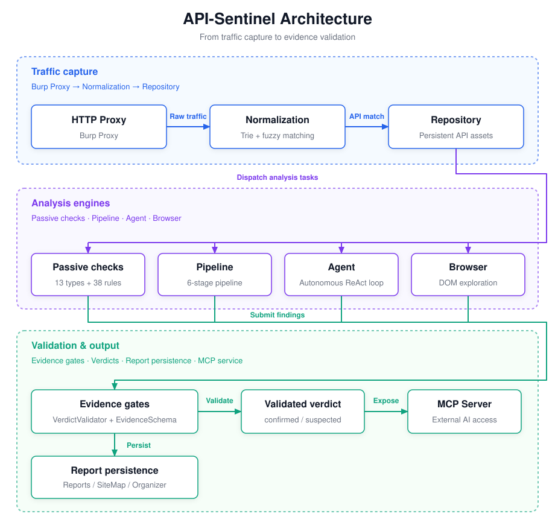
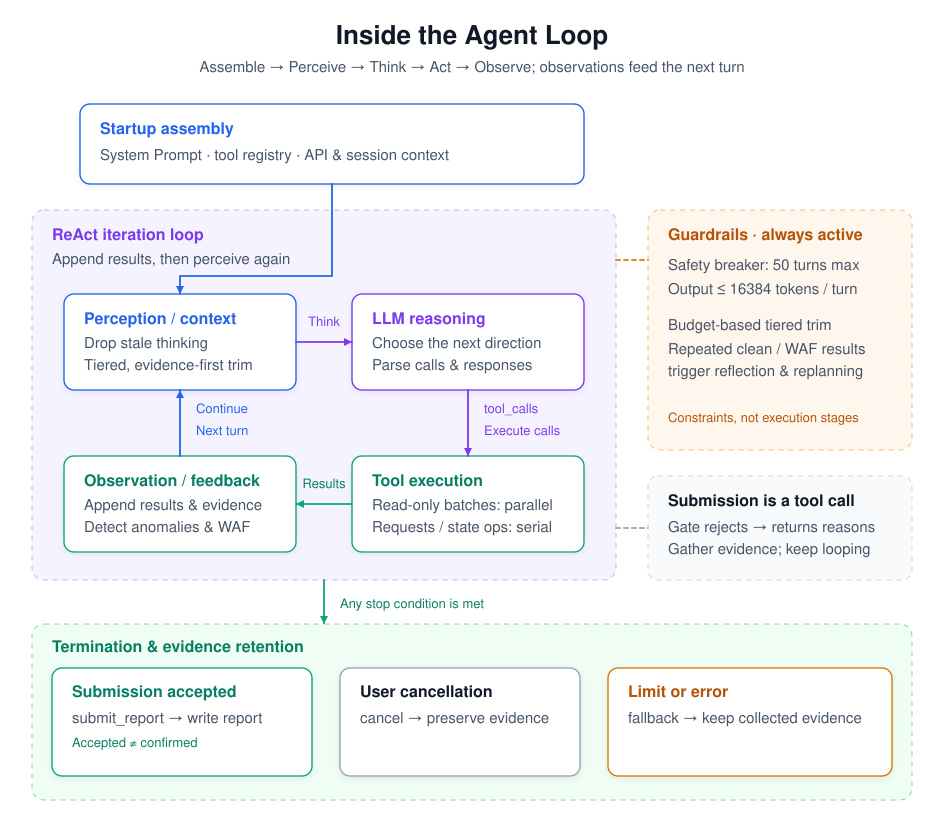
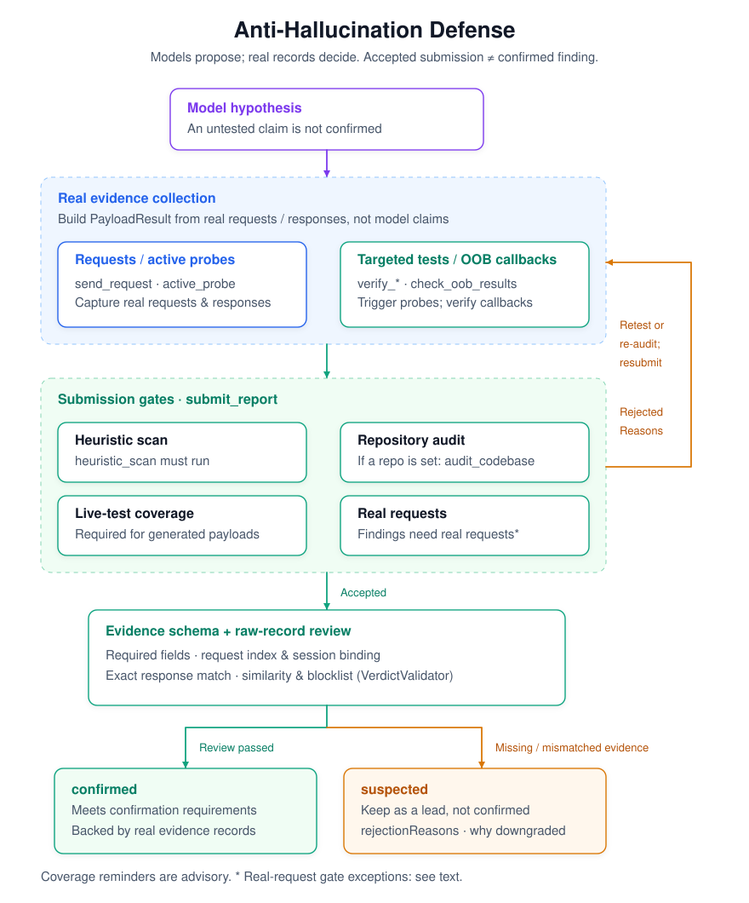
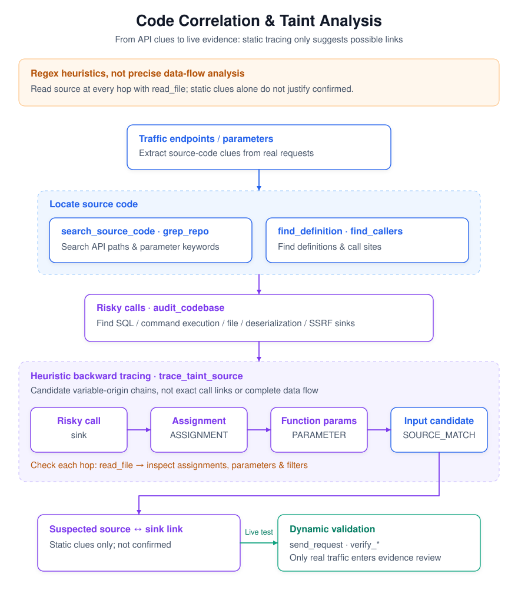
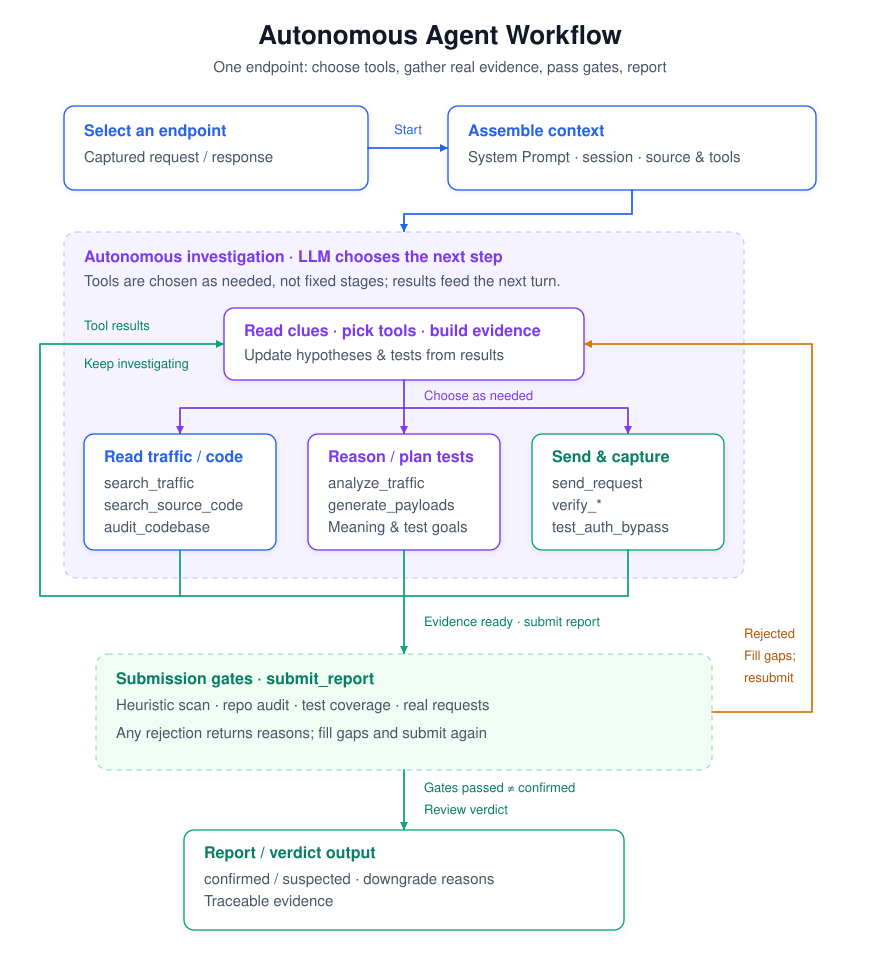

# API Sentinel

> An AI-driven Burp Suite extension for automated API security analysis — from traffic capture to vulnerability verification, with evidence throughout. No need to manually copy traffic into the ChatGPT web interface.

[](https://portswigger.net/burp)
[](https://openjdk.org/)
[](#)
[](LICENSE)

[简体中文](README.md) | **English**


> **Authorized use only**: This tool is intended solely for testing systems **you own or have explicit written authorization to test**. Confirm that you have legitimate authorization before use; any direct or indirect consequences of testing unauthorized targets are the user's sole responsibility. See [LEGAL.md](LEGAL.md).

---

## Table of Contents

- [Project Background](#project-background)
- [Core Capabilities](#core-capabilities)
- [Quick Start](#quick-start)
- [Further Documentation](#further-documentation)
- [Architecture and Design Philosophy](#architecture-and-design-philosophy)
- [Core Engine: AI Analysis](#core-engine-ai-analysis)
  - [Pipeline Mode (6-stage Fixed Pipeline)](#pipeline-mode-6-stage-fixed-pipeline)
  - [Agent Mode (Autonomous ReAct Tool Loop)](#agent-mode-autonomous-react-tool-loop)
  - [Three-layer Anti-hallucination Defense](#three-layer-anti-hallucination-defense)
- [Passive Detection Layer: Zero-cost Instant Scanning](#passive-detection-layer-zero-cost-instant-scanning)
- [Three Analysis Modes Compared](#three-analysis-modes-compared)
- [Embedded Repeater and Test Case Management](#embedded-repeater-and-test-case-management)
- [Task Queue and Batch Analysis](#task-queue-and-batch-analysis)
- [Automated Browser Exploration](#automated-browser-exploration)
- [Extended Capabilities](#extended-capabilities)
- [Advanced Features](#advanced-features)
  - [MCP Server (Let Claude Call the Extension)](#mcp-server-let-claude-call-the-extension)
  - [OOB Blind SSRF Detection](#oob-blind-ssrf-detection)
  - [Intruder AI Payload Generation](#intruder-ai-payload-generation)
  - [WAF Detection and Bypass](#waf-detection-and-bypass)
  - [IDOR Identity Audit](#idor-identity-audit)
- [Benchmark Evaluation](#benchmark-evaluation)
- [Usage Workflow](#usage-workflow)
- [Configuration](#configuration)
- [Matching Modes and API Identification](#matching-modes-and-api-identification)
- [Building](#building)
- [FAQ](#faq)
- [Limitations](#limitations)
- [Gamification](#gamification)
- [Acknowledgements and Third-party References](#acknowledgements-and-third-party-references)
- [Standalone Operation (CLI Mode)](#standalone-operation-cli-mode)
- [Budget Management](#budget-management)
- [License](#license)

---

## Project Background

API-Sentinel is the **Java-based, AI-powered successor** to [API-Highlighter](https://github.com/Flechzao/API-Highlighter). API-Highlighter is a Python Burp extension for *rule-driven* API identification and highlighting: exact/semi-exact/fuzzy matching, endpoint status management, and sensitive-information and unauthorized-access detection. It solved the problem of seeing APIs, but deciding whether they were vulnerable still required manual work.

As large language models (LLMs) matured, having an AI autonomously analyze endpoints, generate payloads, and verify them with real requests became practical. API-Highlighter was therefore rewritten as a Java extension using the latest Montoya API and deeply integrated with LLMs. The result is API-Sentinel: alongside API identification and passive detection, it adds an AI analysis engine (a fixed Pipeline and an autonomous ReAct Agent loop), anti-hallucination cross-validation, WAF detection and bypass, and OOB blind testing.

Burp Suite introduced [Burp AT](https://portswigger.net/burp/burp-at) in release 2026.7 — agentic AI for active security testing during human-led penetration tests. API-Sentinel takes a similar approach but serves as an **open-source alternative or complement with a choice of models**: connect Claude, OpenAI, Ollama, or another model. **When using a local model through Ollama, model-processing data stays on your machine**, making this suitable for environments with strict data-residency requirements. Cloud providers receive the data sent to their APIs. In either case, you retain control over the rules and workflow.

---

## Core Capabilities

**Fully automated analysis**: from traffic capture to vulnerability verification in a single Pipeline run, without manual intervention.

**AI-driven decisions**: in Agent mode, the LLM autonomously orchestrates **52** tools for in-depth analysis, with each reasoning step visible.

**Prioritizing the prevention of false positives**: three anti-hallucination layers (prompt rules → programmatic cross-validation → identity audit). A `confirmed` vulnerability requires evidence that a real payload triggered an anomaly; `overall_risk=HIGH` requires at least one surviving confirmed finding, otherwise it is automatically downgraded.

**Evidence-driven findings**: every finding includes concrete evidence from requests, responses, or source code, making it traceable and reproducible.

**Zero-cost local detection**: all traffic passes through 13 categories of regex checks in real time (SQL errors, stack traces, security headers, JWT, CORS, CSRF, and more), without consuming AI tokens.

**Authorization testing**: three sessions (A/B/C) support multi-tier privilege testing through pairwise comparisons (C(N,2)). Credentials use both Cookie and Auth Headers (Bearer/X-Token/API-Key), with domain-scoped isolation. Privilege levels (HIGH/MEDIUM/LOW) and group/tenant identifiers distinguish horizontal, vertical, and cross-tenant access-control failures automatically. IDOR scanning covers URL paths, query parameters, and JSON bodies. LED indicators validate session liveness in real time. Jaccard similarity determines the result, with automatic LLM arbitration in the gray zone.

**Anti-hallucination cross-validation**: LLM-claimed confirmed findings must pass programmatic checks. `citedExecutionIndex` binds a payload to a real PayloadResult; evidence must be a literal substring of a real response; authorization findings require a two-session comparison. `anomalyDetected` is no longer overwritten: `claimedByVerdict` records the verdict claim while preserving the original observation.

**Untrusted-content fencing**: a random nonce is generated for each analysis, and `UntrustedContent.wrap()` encloses all attacker-controlled data (HTTP responses, DOM content, source comments, and grep matches), preventing prompt injection from forging closing fence markers.

**Prompt Caching**: Claude caching at three breakpoints (tools schema, system prompt, and conversation history) reduces per-endpoint input cost by **50–70%**.

**WAF detection and bypass**: passive signatures cover 12 WAF vendors; blocked payloads are automatically retried with encoding variants.

**MCP Server**: exposes the extension as an MCP endpoint with Bearer token authentication and CSRF/DNS rebinding defenses. MCP clients such as Claude Code, Codex, and Qoder can query endpoints, trigger analyses, search source code, and submit external AI findings to `validate_findings` for anti-hallucination checks.

**Benchmark evaluation**: a bundled 53-endpoint test application (32 vulnerable endpoints and 21 secure controls) automatically measures recall, precision, false-positive rate, and F1 to detect regressions.

---

## Quick Start

### 1. Install

Download the latest `API-Sentinel` jar (approximately 41 MB) from **[GitHub Releases](https://github.com/Flechzao/API-Sentinel/releases)**, then:

`Burp Suite → Extensions → Add → Extension type: Java → select the downloaded jar`

An `API Sentinel` tab appears at the top once the extension is loaded.

> **Artifact size**: the jar is approximately 41 MB; roughly half is the browser automation engine (the Playwright Node.js driver), used by tools such as `browser_login` and `browser_explore`. The driver is automatically extracted to `~/.api-sentinel/playwright-driver/` on first use, with no manual installation required. If you do not need browser features, disable `browserEnabled` in settings.

> **Burp Suite Professional** is recommended. OOB Collaborator requires Professional; the other features also work with Community.

### 2. Configure AI

Open the `API Sentinel` tab → **Settings → AI Settings**, choose a provider, and fill in:

| Field | Description |
|-------|-------------|
| Provider | `claude` / `openai` / `ollama` |
| Endpoint | API URL (Ollama defaults to `http://localhost:11434/v1`) |
| API Key | Your API key |
| Model | Model name (Claude Sonnet / GPT-4o class recommended) |

Click "Test Connection" to verify. Configuration is stored in `~/.api-sentinel/ai-config.json` and is not bundled into the jar.


### 3. Your First Analysis

1. Browse the target through the Burp proxy → API Sentinel automatically captures and normalizes endpoints.
2. Select endpoints in the left-hand table → click "AI Analyze".
3. Watch live progress in the Task Center → review the results panel when analysis finishes.

### 4. Try the Demo Test Application (Recommended for Newcomers)

The repository includes a **deliberately vulnerable demo application**, `easyshop-app/` (Spring Boot, with 53 test endpoints covering SQLi, XSS, IDOR, broken access control, race conditions, insecure randomness, and more; the current measured benchmark scores 44 of them). It lets you experience the complete workflow in a **local, authorized, controlled** environment:

```bash
cd easyshop-app
mvn spring-boot:run        # Defaults to http://localhost:8089 (see src/main/resources/application.properties)
```

1. Visit several endpoints at `http://localhost:8089` through the Burp proxy to generate traffic.
2. In API Sentinel, select the captured endpoints → "AI Analyze" (Agent mode recommended).
3. Watch the Agent reason step by step → generate payloads → verify them with real requests → produce a report.

> This application is for local learning and demonstrations only. Do not deploy it on the public Internet. Its intentionally hard-coded weak keys and credentials are for demonstration purposes.

---

## Further Documentation

This README provides a quick start and overview. Complete design documents, specifications, feature references, and interactive architecture diagrams are in `docs/`:

| Document | Contents |
|----------|----------|
| **[docs/ARCHITECTURE.md](docs/ARCHITECTURE.md)** | Architecture handbook combining specifications, code architecture, ADR decisions, and development tooling |
| **[docs/FEATURES.md](docs/FEATURES.md)** | Feature reference: passive detection rules, parameters for 50+ tools, custom templates, WAFs, and component fingerprints |
| **[docs/BROWSER.md](docs/BROWSER.md)** | Browser handbook: Playwright/Chromium setup and agent-browser integration |
| **[docs/THIRD-PARTY.md](docs/THIRD-PARTY.md)** | Third-party acknowledgements and licenses |
| **[docs/diagrams/](docs/diagrams/README.md)** | Four interactive architecture diagrams generated with Archify, supporting clicking, zooming, and view switching |

**Preview the interactive diagrams**:

```bash
# Open in a browser: click components to highlight related connections, switch preset views, and zoom/pan
open docs/diagrams/api-sentinel-architecture.html  # Component overview
open docs/diagrams/api-analysis-sequence.html      # Sequence diagram
open docs/diagrams/mcp-session-workflow.html       # MCP session
open docs/diagrams/findings-dataflow.html          # Data flow
```

---

## Architecture and Design Philosophy

### Design Philosophy

Simply sending a request to ChatGPT and asking whether it is vulnerable has two major problems: pattern-based guessing produces false positives, and it is difficult to identify the step where the judgment went wrong. API Sentinel separates responsibilities: **the AI reasons and decides; the program collects evidence and verifies**.

- **LLMs are good at**: understanding semantics, spotting leads, organizing evidence, and generating targeted payloads.
- **LLMs are not good at**: precisely comparing responses and confirming whether a payload actually triggered an anomaly.
- **Programs are good at**: exact comparisons, similarity calculations, WAF signature matching, and regex detection.

Determining whether a vulnerability is real therefore has two layers: the AI proposes a hypothesis, the program tests it with real requests, and programmatic rules then review the AI's conclusion.

### Architecture Diagram



> Optional local interactive version: [Architecture explorer](docs/diagrams/api-sentinel-architecture.html), with related-component highlighting, view switching, and zooming. Download and open it in a local browser.

**Data flow**: traffic input (Burp Proxy capture) → endpoint normalization (Trie + fuzzy matching) → passive detection (real-time, zero tokens) → analysis engine (6-stage Pipeline / Agent ReAct / AI Chat) → verdict validation (AI reasoning, programmatic verification, and anti-hallucination verdict cross-validation) → results (tables, cards, Repeater, and reports).

### Deep-dive Diagrams

The following three SVGs show the Agent's core mechanisms directly in this document. The HTML links below each diagram are optional interactive versions; download and open them in a local browser.

**1. Agent main loop internals**



> Optional local interactive version: [Agent main loop internals](docs/diagrams/agent-loop-internals.html) (download and open in a local browser).

**2. Anti-hallucination defense**



> Optional local interactive version: [Anti-hallucination defense](docs/diagrams/anti-hallucination-defense.html) (download and open in a local browser).

**3. Code correlation and taint analysis**



> Optional local interactive version: [Code correlation and taint analysis](docs/diagrams/code-correlation-taint.html) (download and open in a local browser).

> Taint tracing uses **regex heuristics**, not true data-flow analysis. Every hop must be checked with `read_file`; a correlated chain only becomes evidence after live testing with `verify_*`.

### Data Flow

A complete analysis follows this data flow:

```
Traffic (proxy capture / history backfill)
   │
   ├─ Passive detection (real-time, zero tokens): heuristics / sensitive info / unauthorized access → PassiveFinding
   │
   ▼ Select an endpoint → trigger analysis
   │
   ├─ Pipeline mode (fixed workflow):
   │   Stage 1 traffic analysis → Stage 2 code correlation → Stage 3 payload generation
   │   → Stage 4 live verification → Stage 5 auth bypass → Stage 6 final verdict
   │
   ├─ Agent mode (autonomous ReAct loop):
   │   LLM chooses tools (heuristic_scan → analyze_traffic → search_source_code
   │   → generate_payloads → send_request → ... → submit_report)
   │
   ▼ Verdict cross-validation (programmatic review of AI conclusions)
Final results → table / report / Repeater
```

### Key Design Decisions

1. **Evidence first**: the AI may draw conclusions only from responses to payloads actually sent. A theoretical possibility is not enough for `confirmed`.
2. **Prevent false positives even at the cost of recall**: missing a vulnerability is preferable to generating unsupported findings; uncertain findings are downgraded to `suspected`.
3. **5xx is not proof of a vulnerability**: a server error is not a vulnerability. This avoids the classic false positive of sending a payload, receiving 500, and declaring a vulnerability.
4. **WAF blocks are not evidence**: a block page is not the backend's actual response and cannot serve as vulnerability evidence.

---

## Core Engine: AI Analysis

### Pipeline Mode (6-stage Fixed Pipeline)

Pipeline is a systematic, end-to-end analysis mode suited to batches. Six stages run in a fixed order, with each stage's output feeding the next.

#### Stage 1: Traffic Analysis (LLM Call, 60s Timeout)

The LLM analyzes a single HTTP request/response pair for suspicious leads. **No source code is introduced**: this is traffic-only analysis, avoiding confusion from unrelated code snippets.

Input: HTTP request (truncated to 6000 characters) + response (truncated to 6000 characters) + passive findings + component fingerprints.
Output: `AnalysisResult` (overallRisk and a findings list, each containing type/title/description/evidence/location/confidence).

The system prompt includes strict evidence standards, an anti-injection declaration (`=== UNTRUSTED HTTP DATA ===` markers), explicit rules for what does not count as a vulnerability, and confidence-calibration requirements.

#### Stage 2: Code Correlation (Free)

Looks up backend source code for the matching route in indexed repositories. Supports Java (Spring annotations), Python (Flask/Django routes), and Node.js (Express routes).

- Trie route matching first locates the corresponding controller method.
- **SinkMap automatic tagging**: scans 12 categories of dangerous sinks — SQL concatenation, command execution, file operations, deserialization, SSRF, weak cryptography/hard-coded keys, insecure randomness, XXE, SSTI, CRLF injection, open redirects, and NoSQL injection. Snippets receive warning labels such as `SQL SINK`, `WEAK CRYPTO`, and `INSECURE RNG`, prompting the Agent to investigate the service layer.
- `find_definition` and `find_callers` trace call chains across files to uncover logic flaws in service/DAO layers.
- Re-index manually after changing source code.

#### Stage 3: Payload Generation (LLM Call, 90s Timeout)

Using Stage 1 findings and Stage 2 source context, the LLM generates targeted test cases. Each includes:

- A name and category (SQLi/XSS/IDOR/SSRF/path traversal/command injection/SSTI/mass assignment/CORS/deserialization).
- The target parameter, payload content, and expected vulnerable behavior.
- If OOB is enabled, a probe domain is injected into the prompt for SSRF and blind injection tests.

#### Stage 4: Live Verification (Programmatic, Free)

Uses Burp's `RequestExecutionEngine` to send all payloads concurrently to the target, compare results with the baseline, and detect anomalies programmatically.

**Anomaly detection logic** (`detectAnomaly`):
- Status-code changes (baseline 200 → payload 500; 5xx is an anomaly signal, not proof of a vulnerability).
- SQL errors (precise MySQL/PostgreSQL/Oracle/SQLServer/SQLite engine signatures).
- Stack traces (Java/Python/C# exception stacks).
- Response-length changes (baseline 200 B → payload 5000 B or more).
- Reflection (the payload appears verbatim in the response → an XSS signal).
- File-content disclosure (`root:x:0:0`, `[extensions]`, and similar markers).

**WAF integration**: each payload response first passes through the WAF detector (12-vendor signatures). Blocked payloads receive `wafBlocked=true`. They do not trigger an anomaly, but the system automatically retries WAF-bypass variants.

#### Stage 5: Authorization Bypass Testing (Programmatic, Free)

- **Multi-session discovery**: automatically discovers different users' sessions in proxy history, including Cookie, Authorization, X-Token, API-Key, and other authentication headers. The panel detects and fills these when first opened.
- **Three-session, multi-tier testing**: supports A/B/C sessions with pairwise tests (A↔B, A↔C, B↔C). Each session can specify domain scope (Cookie domain isolation), privilege level (HIGH/MEDIUM/LOW), and group/tenant identifier. Tests are classified automatically: same level + different group = horizontal access-control failure; different level + same group = vertical access-control failure; different level + different group = cross-tenant access-control failure.
- **Session liveness checks**: LEDs indicate green = valid, red = expired, yellow = unreachable, and gray = unverified. Saving triggers validation by sending a credential-bearing GET request to each session's domain to check whether the token is still valid.
- **IDOR tests**: replace resource IDs in URL paths (numbers/UUIDs), query parameters, and JSON bodies. Covers 18 common ID parameter names, prioritizing another user's resource ID with the same path pattern.
- **Unauthenticated access**: remove all authentication headers and replay the request.
- **Jaccard similarity**: compare response bodies using 3-grams.
  - ≥ 85%: VULNERABLE (access-control failure confirmed).
  - 60–85%: SUSPICIOUS → automatic LLM semantic arbitration to reduce false positives.
  - < 60%: SAFE (substantially different responses indicate effective authorization).

#### Stage 5.5: Active Probes (Programmatic, Trigger-based)

Programmatic verification probes bypass LLM judgment and feed their results directly into verification:

- **CORS**: Origin-variant reflection tests (exact Origin reflection + credentials = HIGH).
- **JWT**: forged alg:none replay.
- **CRLF**: canary header-injection tests.
- **NoSQL**: differential tests (baseline rejected, operator variant accepted → anomaly) and timing tests.

#### Stage 5.6: Blind Injection Verification (Automatic Escalation)

When Stage 1 finds SQLi leads but error-based injection does not trigger, verification escalates in order:

1. **Boolean blind injection** (`verify_boolean_blind`): compare responses to true/false conditions, trying at most 3 pairs (≤6 requests).
2. **Time-based blind injection** (`verify_timing_blind`): measure SLEEP delays; auto mode tries database types in sequence and rechecks the baseline for suspected delays (up to 11 requests including rechecks).
3. If both fail, the verdict notes "no SQL injection found".

#### Stage 5.7: Business Logic Verification (Disabled by Default, Safe Subset)

- Price tampering (price → 0.01).
- Coupon replay (apply the same coupon repeatedly).
- Negative-value attacks (quantity → -1).
- Step skipping (skip checkout and confirm directly).

These operations change real business state. Use them only against authorized targets.

#### Stage 6: Final Verdict (LLM Call, 180s Timeout)

The LLM combines evidence from the preceding five stages into a final verdict. The prompt includes:

- The baseline response for comparison.
- Component fingerprints, such as Fastjson or Shiro, to guide targeted assessment.
- Stage 1 findings (traffic-analysis leads).
- Stage 2 source code (implementation context).
- Every Stage 3+4 payload and response (anomaly flags, WAF status, and response snippets).
- Stage 5 authorization results (per-round similarity and AI arbitration).
- `SafetyRules.NEVER_CONFIRM_PROMPT_TEXT` (12 never-confirm rules and Kill Signals).
- `SafetyRules.CONDITIONALLY_VALID_PROMPT_TEXT` (the chain-escalation table).

The resulting JSON verdict contains:
- `overall_risk` (HIGH/MEDIUM/LOW/SAFE).
- `confirmed_vulns` (type + title + evidence + payload_used + response_snippet + verify_command + identity_proof + cvss).
- `suspected_vulns` (type + title + reason + verify_command + escalation_path).
- `summary` and `recommendations`.

**Key constraints**: only payloads with a positive anomaly-detection flag may support a confirmed finding. WAF-blocked payloads cannot support confirmed findings. If all payloads are WAF-blocked and no other concrete evidence exists, `overall_risk ≤ LOW`.

#### Verdict Cross-validation (After Stage 6)

The LLM's verdict is **not used directly**. It first passes programmatic checks in `VerdictValidator`:

```
Phase 1: Payload-match validation
  for each confirmed_vuln claimed by LLM:
    match = findPayloadResult(citedPayload)  // Supports URL-decoded fuzzy matching
    if match == null:
      → demote to suspected ("payload not sent")
    if match.wafBlocked:
      → demote to suspected ("WAF block page is not evidence")
    if requireAnomaly && !match.anomalyDetected:
      → demote to suspected ("no anomaly triggered")

Phase 2: Remove informational findings
  for each surviving confirmed + suspected:
    if isInformationalType(type) && !hasChainEvidence(evidence):
      → remove entirely (retain only in recommendations)
  // Exception: evidence containing keywords such as credentials, exfiltration,
  // internal data, row data, time difference, SLEEP, or password is exempt
  // from removal, because it indicates an actual exploitation chain.

Phase 3: Authorization identity audit
  for each surviving confirmed:
    if isAuthClass(type) && identityProof.isBlank():
      → demote to suspected ("identity_not_proven")
  // Authorization findings must answer three questions:
  // (1) Which session context was used?
  // (2) Was anonymous access tested?
  // (3) How was the data shown to belong to another account?

Phase 4: Cross-check against Stage 5 programmatic authorization tests
  if Stage 5 confirms VULNERABLE but the verdict has no corresponding confirmed:
    → add a missed-finding reminder to rejectionReasons
  if Stage 5 determines SAFE but the verdict includes an authorization-class confirmed:
    → add a soft-conflict reminder to rejectionReasons

Phase 5: Downgrade overall_risk
  if overallRisk == HIGH && survivingConfirmed.isEmpty():
    → downgrade to MEDIUM (if suspected exist) or LOW (if no suspected exist)
```

All downgrades are recorded in `rejectionReasons`, providing a complete, traceable audit trail.

### Agent Mode (Autonomous ReAct Tool Loop)

Unlike Pipeline's fixed workflow, Agent mode lets the LLM choose its own analysis path. It is suited to flexible, in-depth investigation of a single endpoint.




#### ReAct Loop Control

```
Loop (maximum 50 rounds: a safety circuit breaker; normal analyses finish much earlier):
  1. Strip stale thinking blocks (keep only the most recent assistant thinking block).
  2. Compact context if the token estimate exceeds contextWindowTokens.
  3. Call the LLM (temperature=0.3, MAX_TOKENS=16384; supported providers also receive
     extended thinking with thinking_budget=6000).
  4. Parse the response:
     - tool_calls → execute tools → append results → continue.
       If a batch includes submit_report, execute up to that call first.
       If it passes the gates, finish immediately and skip subsequent tools;
       if rejected, continue executing the remaining tools.
     - Plain text → append "use tools or submit the report" → continue.
     - MAX_TOKENS truncation → append "continue, do not repeat" → continue.
     - RATE_LIMITED → retry with exponential backoff (up to 2 retries).
     - ERROR → build a fallback result.
  5. If submit_report was called and passed the gates → finish.
```

> **Parallel tool execution**: when every tool_call in a batch is read-only (`read_file`, `grep_repo`, `search_source_code`, etc.), the tools run concurrently in a separate thread pool — useful for reading three files at once. If any tool sends requests, calls an LLM, or changes state, the entire batch runs serially to preserve dependency order.

#### Multi-layer submit_report Gates

`submit_report` is not accepted unconditionally. A set of programmatic `preExecute` gates runs before tool execution. Failure at any gate rejects the submission with a specific reason; the LLM must address it and resubmit:

1. **Mandatory heuristic_scan gate**: `heuristic_scan` must have been called at least once. It is free and immediate.
2. **Mandatory audit_codebase gate**: when a source repository is configured, the global white-box `audit_codebase` audit must run first, preventing the Agent from focusing only on the current endpoint's chain and missing other sinks in the repository.
3. **Verification gate**: if `generate_payloads` generated N payloads, at least `min(N, 5)` must actually be tested. Generating payloads without testing them is not sufficient for a conclusion.
4. **Coverage reminder (soft)**: uncovered injection, authorization, or configuration categories produce a log reminder but do not block submission.
5. **Real-request gate**: a report containing any confirmed or suspected finding requires at least one tool that actually sends requests (`send_request`, `verify_*`, `test_auth_bypass`, etc.). The only exception for code-only findings is a genuinely second-order/stored vulnerability that cannot be triggered with a single request; its evidence must explain the chain.

#### Context Management

- **Two-stage, tiered compaction**: when the token estimate exceeds the budget, first compact **regenerable read-only results** (`read_file`, grep, etc., which can simply be requested again). Only then compact evidence-bearing results such as `send_request` if necessary. Structured summaries preserve scoring fields such as status/anomaly/findings; evidence is degraded last.
- **Retention window**: the latest 15 tool results remain intact; only older results are eligible for compaction.
- **Trigger**: `estimateTokens(messages) > contextWindowTokens` (default 150K; configurable for smaller-context Ollama models).
- **Tool-specific truncation**: source tools (`search_source_code`/`read_file`/`audit_codebase`) receive 64K; `grep_repo`/`find_callers` 48K; other tools 32K.
- **Thinking-block stripping**: extended thinking blocks only need to be returned in the round immediately after they were generated. Older blocks are stripped before each round so they cannot accumulate indefinitely and crowd out context.
- **MAX_TOKENS continuation**: truncated responses automatically receive a continuation prompt, avoiding wasted iterations.

#### Rate Limiting and Fault Tolerance

- **RATE_LIMITED**: exponential-backoff retries (2s → 4s, capped at 30s), up to two retries.
- **Timeout**: LLM calls time out after 200s, then produce a fallback result.
- **Exceptions**: any exception produces a fallback containing the analysis data already collected, preserving existing information.
- **Iteration limit**: reaching 50 rounds produces a fallback rather than an infinite loop.

#### The Agent's 52 Tools

**Reconnaissance and code understanding (free)**

| Tool | Purpose |
|------|---------|
| `heuristic_scan` | Local regex checks across 13 categories, including SQL errors, stack traces, security headers, JWT, and CORS |
| `fingerprint_components` | Passive component fingerprinting, including Fastjson, Log4j, and Shiro |
| `search_source_code` | Find related backend source; requires an indexed repository |
| `read_file` | Read a complete source file by path |
| `grep_repo` | Regex search across the entire indexed repository |
| `find_definition` | Locate class or method definitions in Java/Python/JS |
| `find_callers` | Find all call sites of a method to assess the attack surface |
| `trace_taint_source` | Trace backward from a dangerous sink using regex heuristics to locate unfiltered variable sources |
| `audit_codebase` | Global white-box audit listing dangerous sinks across the repository (SQL, commands, deserialization, etc.) |
| `search_traffic` | Search same-domain Burp proxy history for authentication tokens and parameter values |
| `list_sessions` | List available authentication sessions for authorization tests |
| `map_sibling_endpoints` | Map sibling endpoints in the same Controller or under the same prefix as an entry point for cluster hunting |
| `diff_responses` | Compute response differences: Jaccard similarity, JSON fields, and headers; no requests |

**AI reasoning (consumes LLM resources)**

| Tool | Purpose |
|------|---------|
| `analyze_traffic` | AI analysis of HTTP request/response patterns |
| `generate_payloads` | Generate targeted test payloads from findings |

**Live verification (free, programmatic requests)**

| Tool | Purpose |
|------|---------|
| `send_request` | Send HTTP requests to verify suspected vulnerabilities, with built-in adaptive throttling for 429 responses |
| `test_auth_bypass` | Authorization tests: multi-session swaps, IDOR substitutions, and unauthenticated requests |
| `active_probe` | CORS Origin variants, JWT alg:none replay, CRLF, and NoSQL probes |
| `verify_boolean_blind` | Boolean blind injection verification: try at most 3 pairs from 10 built-in variants, automatically skip WAF blocks, ≤6 requests |
| `verify_timing_blind` | Time-based blind injection verification: SLEEP timing and baseline rechecks to avoid jitter-related false positives, up to 11 requests in auto mode including rechecks |
| `verify_xss_reflection` | XSS reflection verification: canary injection, tag probes, and context classification, 2 requests |
| `verify_ssti` | SSTI verification: probes for 7 engines and a control request to prevent false positives, ≤8 requests |
| `verify_path_traversal` | Path traversal verification: 12 encoding variants and baseline comparison, ≤12 requests |
| `verify_xxe` | XXE verification: inline-entity file reads and OOB callbacks, ≤4 requests |
| `waf_bypass_retry` | Vulnerability-specific bypass chains after WAF blocks, including chunked/HPP/Unicode techniques, ≤4 requests |
| `verify_business_logic` | Business logic verification: price tampering, coupon replay, negative values, races, and enumeration |
| `generate_oob_probe` | Generate an OOB probe domain for blind SSRF testing |
| `check_oob_results` | Poll Collaborator interactions to confirm blind callbacks |

**Sub-Agent delegation and special-purpose tools**

| Tool | Purpose |
|------|---------|
| `dispatch_explore_agent` | Delegate exploratory questions, such as locating JWT validation across a repository, to an **isolated sub-Agent**; only the conclusion returns to the main context |
| `chain_hunter` | Delegate live sibling-endpoint tests and A→B chaining to a **cluster-hunting sub-Agent** |
| `run_sandboxed_code` | Run short scripts in a sandbox for pure computation (algorithm reproduction, encoding/decoding, cryptography), without requests |
| `ask_user` | Ask the operator a question during execution, such as confirming sandbox execution |
| `submit_report` | Submit the final assessment report after passing the gates |

**Other tools (browser suite, extended capabilities, and metadata)**

| Tool | Purpose |
|------|---------|
| `list_attack_types` | List 27 attack types and 150+ payloads using a local lookup, with no LLM calls |
| `generate_poc` | Generate a PoC in one step: cURL, Python, reproduction steps, and Markdown |
| `orchestrate_agents` | Multi-Agent collaboration with Planner/Explorer/Executor/Verifier roles |
| `custom_detection` | Load Nuclei-like custom YAML detection templates from `custom-templates/` |
| `scan_mcp_servers` | Scan MCP server endpoints: 7 concurrent endpoint probes and SSRF defenses |
| `browser_discover` | Discover routes and static APIs through XHR/Fetch capture and JS bundle analysis |
| `browser_render` | Render a page and retrieve DOM, console, and CSP data |
| `browser_dom_xss` | Detect DOM XSS |
| `browser_find_page` | Locate a page that triggers the target API through a three-level search |
| `browser_interact` | Execute UI action sequences and handle confirmation dialogs |
| `register_discovered_apis` | Register browser-discovered APIs in the analysis queue |
| `get_burp_scan_issues` | Retrieve issues found by Burp Scanner |
| `mine_history_idor` | Mine proxy history for potential IDOR endpoints |
| `request_tools` | List currently available tools for LLM discovery |
| `read_analysis_notes` | Read analysis notes shared across tools |
| `update_analysis_notes` | Update analysis notes |

> See [Automated Browser Exploration](#automated-browser-exploration) for `browser_login`, `browser_explore`, and `browser_auto_crawl`. All 52 tools are registered centrally by `StandardToolRegistry`.

`StandardToolRegistry` builds every tool. Agent mode and both Chat modes share the same registry for consistent behavior. Sub-Agents (explore/chain-hunter) receive only a **read-only/request-sending subset** of the main Agent's tools. They cannot delegate again or submit reports; final adjudication remains in the main loop.

#### Reflection and Loop Circuit Breaking

The Agent reflects in the following situations to avoid infinite loops and mechanical retries:

| Trigger | Behavior |
|---------|----------|
| **Consecutive identical tool batches** (generic circuit breaker) | Sign each complete tool_call batch: 3 identical consecutive batches inject a reflection prompt requiring a strategy change; 5 **force termination** with a fallback report using collected evidence |
| 3 consecutive `send_request` calls without anomalies | Inject a reflection prompt covering parameter location/type, silent WAF filtering, source-code confirmation, and strategy changes |
| 3 consecutive WAF blocks | Inject a reflection prompt to use `waf_bypass_retry`, switch to keyword-free payloads, or record that the WAF is effective |
| Round 15 without submission | Inject a reflection prompt to assess whether existing evidence is sufficient and whether key hypotheses remain untested |
| Round 40, near the limit | Inject a reflection prompt to diagnose the stall, identify repeated tool calls, and submit based on existing evidence |

A cooldown follows each reflection injection to avoid repetition. The repeated-batch counter resets only when the batch actually changes, so repeatedly reflecting without changing strategy still reaches the hard stop at five identical batches.

#### Termination and Finalization

Every exit path — accepted `submit_report`, iteration limit, LLM timeout/error, circuit breaker, or user interruption — uses the same finalization path. Collected evidence (traffic analysis, source code, and payload results) is assembled into a fallback report, JSON/HTML reports are saved, and the panel is refreshed: **existing information is preserved**. LLM calls have a 200s timeout and rate-limit backoff so a stalled tool does not leave the loop hanging indefinitely.

#### Cluster Hunting and Cascading (From One Endpoint to Many)

After a vulnerability is confirmed on one endpoint, the system expands to similar endpoints, turning an individual finding into broader coverage:

- **Active expansion within the Agent**: after a confirmed or suspected finding, `map_sibling_endpoints` locates endpoints in the same Controller or under the same prefix. `chain_hunter` delegates to a **cluster-hunting sub-Agent** that tests them individually and attempts to connect weaker findings into an A→B exploitation chain, such as information disclosure → token acquisition → unauthorized access.
- **Passive cascading in automatic mode**: when Pipeline/Agent analysis produces a **VERIFIED confirmed vulnerability**, `AgentController` automatically queues sibling endpoints for lightweight analysis. `GoalState` imposes two limits: at most 50 endpoints per session, and a circuit breaker after three consecutive endpoints yield no new findings, preventing unbounded expansion through large repositories.
- **Hard boundary**: only programmatically verified confirmed findings trigger automatic cascading; suspected findings never do. Cascading is read-only and does not actively send requests.

#### Sub-Agent Architecture (Context Isolation)

`dispatch_explore_agent` and `chain_hunter` use **independent lightweight ReAct loops** (`ExplorationSubAgent` / `ChainHunterSubAgent`), not recursion within the main loop:

- Each has its own iteration limit (explore: 12 rounds; chain-hunter: 25) and context. Large volumes of intermediate `read_file`/grep output **do not pollute the main Agent's context**; only a conclusion returns.
- Tool permissions are restricted to read-only/request-sending tools: **no further delegation and no report submission**.
- chain-hunter shares the main Agent's `send_request` result pool. Its live evidence passes through `VerdictValidator` together with the main loop's evidence, and final adjudication stays in the main loop.

#### Success-pattern Memory (Cross-run Learning)

Each **verified confirmed** vulnerability becomes a success pattern (vulnerability type, technique, payload preview, endpoint pattern, and domain), persisted in `~/.api-sentinel/patterns.json`:

- At the start of a new analysis, the domain's Top-5 most frequently successful patterns are injected into the initial message. The Agent immediately knows which techniques worked on that domain and can prioritize verified attack chains.
- Repeated success with the same technique on the same endpoint increments its count, so recurring defects naturally rank higher.
- Only VERIFIED confirmed findings are recorded; unverified suspected findings never enter memory. Patterns can be viewed or cleared in settings.

#### Extended Thinking

For supported providers (Claude), each round includes `thinking_budget=6000` to allow deeper reasoning before tool calls. Thinking blocks appear as separate "Thinking" events, distinct from the formal response, making it easier to distinguish reasoning from conclusions. Unsupported providers ignore this setting without changing behavior.

---

### Three-layer Anti-hallucination Defense

These three complementary layers are central to reducing false positives and preventing LLM hallucinations from entering final reports.

#### Layer 1: Prompt-level Rules (LLM Guardrails)

`SafetyRules` is the single source of truth injected into the system prompt of every LLM call:

- **12 NEVER_CONFIRM rules**: explicitly identify what does not count as a vulnerability, such as missing security headers, wildcard CORS without credential-backed exfiltration, DNS-only SSRF callbacks, and SQLi with error messages alone.
- **Kill Signals**: conditions that trigger downgrading and stop further investigation, such as XSS constrained by CSP with no impact path, IDOR returning the tester's own data, or SQLi producing errors but no data.
- **Chain-escalation table**: escalation paths for weak findings, such as open redirect → OAuth authorization-code theft, or wildcard CORS → credential-backed PII exfiltration.
- **Untrusted-content fencing**: `UntrustedContent.wrap(nonce, raw)` generates a random 128-bit nonce for each analysis and wraps all attacker-controlled data (HTTP responses, DOM, source comments, grep matches, and chat history). The unpredictable nonce prevents attackers from forging closing markers. Delimiter patterns are also stripped from untrusted content — including `===` fences, `## ` Markdown headings, and keywords such as `UNTRUSTED`, `反注入`, and `输出格式` — to prevent embedded content from impersonating system instructions.

The same rules are consumed in three places to prevent drift:
- Agent: `AgentLoop.buildSystemPrompt()` uses the condensed `AGENT_CONDENSED_RULES`.
- Pipeline: `FinalVerdictPrompt.getSystemPrompt()` uses the full `NEVER_CONFIRM_PROMPT_TEXT` and `CONDITIONALLY_VALID_PROMPT_TEXT`.
- Programmatic backstop: `VerdictValidator` directly calls `isInformationalType()` and `hasChainEvidence()`.

#### Layer 2: Programmatic Cross-validation (VerdictValidator)

After the LLM produces a verdict, every confirmed finding is checked individually:

- **Payload binding**: `citedExecutionIndex` locates the actual PayloadResult in O(1). A fabricated payload that was never sent is rejected.
- **Literal evidence anchoring**: `response_snippet` must be a literal substring of an actual `receivedResponse()` among the available results. Fabricated response excerpts are rejected.
- **Two-session authorization comparison**: IDOR/auth-bypass checks compare requests to the same endpoint under different `authSession` values. Confirmation is rejected when the required session comparison is missing.
- **WAF-block rejection**: a blocked payload (`waf_score ≥ 60`) has an untrustworthy anomaly signal, so its finding is downgraded to suspected.
- **Preserving observations**: `markConfirmedPayloads` no longer overwrites `anomalyDetected`; it sets `claimedByVerdict` instead. The UI combines them (a green check means `anomalyDetected || claimedByVerdict`), while audits and exports retain the original observation.

> **Current boundaries**: response-snippet checks are skipped on paths involving an empty citation, no response body, or only one result. With multiple results, a snippet may match any response body rather than strictly the response at the cited index. Authorization findings use separate identity checks, and legacy records have compatibility paths. These rules reduce false positives but do not independently prove account ownership or guarantee zero hallucinations.

#### Layer 3: Identity Audit (IDOR-specific)

Broken access control and IDOR are especially prone to false positives. API Sentinel requires `identity_proof` to answer three questions explicitly:

1. **Which session context was used for verification?** Session A, session B, or anonymous?
2. **Was anonymous access tested after removing authentication headers, and what happened?**
3. **How was it established that the returned data belongs to another account rather than the tester's own?** Receiving one's own data is a false positive.

An authorization-class confirmed finding with an empty `identity_proof` is automatically downgraded to suspected (`identity_not_proven`), with the reason recorded in `rejectionReasons`.

---

## Passive Detection Layer: Zero-cost Instant Scanning

All proxy traffic passes through passive detection in real time, completing in milliseconds without consuming AI tokens. Structured `PassiveFinding` results appear as a one-line summary in the table's "Passive" column, colored by highest risk. Double-click or right-click for details.


| Detection | Description |
|-----------|-------------|
| SQL errors | Precise MySQL/PostgreSQL/Oracle/SQLServer/SQLite engine signatures, avoiding false positives from a mere mention of "mysql" |
| Stack traces | Java/Python/C# exception stack disclosure |
| Server versions | Framework versions exposed in Server/X-Powered-By headers |
| Debug mode | debug=true, Django debug, Laravel session, Whitelabel Error |
| Internal IP addresses | 10.x/172.16-31.x/192.168.x, with boundary anchors to avoid matching version numbers |
| CORS | `*` + credentials, Origin reflection, null Origin |
| JWT | alg:none, missing expiration, embedded jwk, jku/x5u/kid injection, and checks across all tokens |
| CSRF | State-changing method + Cookie authentication + no CSRF Token |
| Request smuggling | Coexisting Content-Length and Transfer-Encoding, or duplicate CL |
| Dangerous uploads | Successful uploads with executable extensions (jsp/php/exe/...) |
| Deserialization | Java serialization magic bytes and .NET ViewState |
| Missing security headers | HSTS, CSP, X-Frame-Options, X-Content-Type-Options, Referrer-Policy; limited to HTML 2xx responses |
| Sensitive information | 38 built-in rules using HaE's three-layer format (main regex + exclusion filter + scope), covering AWS/GCP/Azure/GitHub/GitLab/Slack/Stripe and other cloud-native credentials, JDBC, national ID numbers, phone numbers, email addresses, internal IPs, MAC addresses, SSH private keys, and more |

Add custom sensitive-information rules in settings; saving merges them into the detector immediately.

> See [docs/FEATURES.md](docs/FEATURES.md) for the complete detection-rule table and sensitive-information rule format.

---

## Three Analysis Modes Compared

| Mode | Best for | Workflow | Notes |
|------|----------|----------|-------|
| **Pipeline** | Systematic batch analysis | Fixed 6-stage pipeline | Broadest coverage; suited to analyzing multiple endpoints at once |
| **Agent** | In-depth investigation of one endpoint | Autonomous ReAct tool loop | The LLM decides which tools to use and in what order |
| **AI Chat** | Flexible questions and answers | Natural-language conversation | Ask "Does this endpoint have XSS?" and follow tool calls in the step view |

Agent and AI Chat both use the **step-progress view** (step list on the left, details on the right), exposing each AI reasoning step. Steps include Prompt, Thinking, Tool Call, and Response; click a step to inspect its details.

---

## Embedded Repeater and Test Case Management

The Task Center → Request Testing sub-tab integrates test-case management:

- **Test-case table**: name, category, target parameter, Payload, and verification result. Double-click to edit method, path, domain, or notes.
- **Verification results**: anomaly (anomaly detected), WAF blocked, no risk (403/401/400 or no anomaly), and safe.
- **Manual actions**: add a test case; resend with Send; send to Burp's native Repeater; send to Comparer for comparison.
- **Persistence across restarts**: analysis results (`testCases` and `PayloadResults`) are stored in `data.json` and automatically restored after restarting.


---

## Task Queue and Batch Analysis

- **Batch analysis**: select multiple endpoints → AI Analyze. Selecting more than five opens an estimate dialog. The default concurrency limit is two to avoid overwhelming the LLM service.
- **Progress tracking**: live N/M progress bar and status colors for queued, running, completed, failed, and cancelled tasks.
- **Per-row actions**: right-click to cancel a queued task or retry a failed one. Hover over a failed row for its error reason.
- **Automatic retries**: transient timeout/network failures receive two retries with backoff; budget exhaustion is not retried.
- **Record eviction**: retain the latest 500 records, evicting completed/failed records first.
- **Risk filtering**: HIGH/MEDIUM/LOW/SAFE/unanalyzed, with select-all-visible support.
- **Report export**: CSV, Markdown, or a full report, for selected rows or all rows.
- **False-positive feedback**: right-click a finding → "Mark as False Positive". The decision is persisted to `rules.json`, automatically suppressing future findings with the same path+type.

---

## Automated Browser Exploration

> Let the AI Agent log in, navigate intelligently, and trigger target APIs automatically — **without requiring developers to supply screenshots or step-by-step instructions**.

Traditionally, developers must log in manually, copy Cookies, and describe the interaction steps with screenshots. Browser automation lets the Agent complete the entire flow autonomously: log in → explore pages → find the action path that triggers the target API → cache that path for reuse.

**Zero-configuration startup**: on first enablement, the extension extracts the Playwright driver and detects installed Chrome/Edge/Chromium browsers. Most users need no additional configuration.

### Three New Tools

| Tool | Purpose | Example |
|------|---------|---------|
| `browser_login` | Log in automatically and inject Cookies into AppConfig | `browser_login(profile_name="生产环境")` |
| `browser_explore` | Use LLM-guided exploration of nested menus to trigger a target API | `browser_explore(target_api="POST /api/v1/roles", start_url="http://app/")` |
| `browser_auto_crawl` | Scan a site in one step: login → discovery → exploration → registration | `browser_auto_crawl(start_url="http://app/")` |

### Vision Model Support (DeepSeek-V4-Flash-Vision-Exp)

With DeepSeek vision integration, `browser_explore` sends **both a screenshot and DOM elements** to the vision model at each step, allowing the LLM to see the page before deciding what to do:

- **Understand complex UIs**: nested menus, dialogs, tab switching, and hover-to-expand controls.
- **No reliance on selectors**: visual understanding of button meaning improves handling of Chinese-language interfaces and icon-only buttons.
- **Fallback**: if screenshot capture fails, automatically use text-only mode.

**Configuration**: AI Settings → choose provider "deepseek" → the lightweight model is automatically set to `DeepSeek-V4-Flash-Vision-Exp`.

### How It Works

```
browser_auto_crawl workflow:
  1. browser_login → automatic login (SSO/BUC supported)
  2. browser_discover → discover all routes and static APIs
  3. For each API → browser_explore:
     ├── DomSimplifier → extract 80 interactive elements
     ├── Capture a screenshot (vision model)
     ├── LLM decides → click/fill/hover/back
     ├── Execute the action → check whether the target was triggered
     └── Repeat until successful (cache the path on disk)
  4. register_discovered_apis → register APIs in the analysis queue
```

See [BROWSER.md](docs/BROWSER.md) for details.

---

## Extended Capabilities

Drawing on research into 25+ open-source projects, API Sentinel provides eight extended capabilities alongside security hardening and performance improvements. See [CHANGELOG.md](CHANGELOG.md).

| Capability | Agent Tool | Description |
|------------|------------|-------------|
| Attack taxonomy (27 types) and payload library (150+) | `list_attack_types` | Full OWASP API Top 10 coverage through local lookups, with no LLM calls |
| Automatic PoC generation (15+ vulnerability types) | `generate_poc` | Generate cURL, Python, reproduction steps, and a Markdown report in one step |
| Multi-Agent collaboration | `orchestrate_agents` | Four-role workflow: Planner/Explorer/Executor/Verifier |
| Custom detection templates (Nuclei-like YAML DSL) | `custom_detection` | Load templates from `custom-templates/` without coding; regex/word/status matchers |
| MCP server security scanning | `scan_mcp_servers` | Concurrent probing of 7 endpoints, SSRF defenses, and risk assessment |
| Enhanced IDOR/BOLA detection | — | 6 ID formats, 16 owner fields, and confidence scoring |
| Mass Assignment / excessive data exposure | — | Two additional detection patterns in `HeuristicDetector` |

**Security hardening**: SSRF protection for MCP scanning (reject cloud metadata/link-local targets), command/code injection protection in PoC generation, ReDoS protection for custom regexes, and nonce-based fences against prompt injection.

**Performance**: cached precompiled regex Patterns, concurrent MCP scanning (worst case reduced from 70s to approximately 10s), and Ollama availability caching.

**Quality**: 1231 tests passed out of 1233 cases, with 2 skipped and 0 failures.

---

## Advanced Features

### MCP Server (Let Claude Call the Extension)

API-Sentinel can expose an MCP Server bound only to `127.0.0.1`, using JDK `ServerSocket` with no additional transport dependencies. MCP clients such as Claude Code, Codex, and Qoder can invoke extension capabilities as tools. The server does not depend on `jdk.httpserver`, which may be absent from Burp's trimmed-down JRE.

**Security defenses** (P2-8):
- **Bearer token authentication**: enabled by default (`mcpRequireAuth=true`). A random 256-bit token is generated when first needed, persisted, and reused after restarts. Clients send `Authorization: Bearer <token>`. View or copy the full token in the MCP settings panel; normal startup logs show only its prefix.
- **CSRF protection**: requests carrying a non-empty `Origin` header are rejected. A malicious page can otherwise POST `text/plain` without a preflight request.
- **DNS rebinding protection**: the `Host` header must exactly match `127.0.0.1:<port>` or `localhost:<port>`.
- **Content-Type validation**: `application/json` is required as an additional CSRF defense.

**Configuration**: start/stop the server or change its port in Settings → MCP; changes take effect immediately (`mcpServerEnabled` / `mcpServerPort`, default port 9877). If editing `config.json` directly, reload the extension to read the new settings. Copy the token or client configuration from the MCP settings panel.

**Claude Code configuration** (`.mcp.json`):
```json
{ "mcpServers": { "api-sentinel": {
  "type": "http",
  "url": "http://127.0.0.1:9877/mcp",
  "headers": { "Authorization": "Bearer <token-from-MCP-settings>" }
} } }
```

**Core exposed tools**: the table below lists the curated native tools. Once an MCP session is established, the built-in Agent's full tool registry is also available, covering request sending, active probes, blind injection verification, browser login, interaction, and exploration — matching the extension's built-in AI Chat capabilities, subject to the active-tool opt-in described below.

| Tool | Type | Description |
|------|------|-------------|
| `list_apis` | Read-only | Query captured endpoints with domain/risk filters |
| `get_api_detail` | Read-only | Get one endpoint's details and latest verdict |
| `get_passive_findings` | Read-only | Retrieve passive detection findings |
| `get_analysis_history` | Read-only | Retrieve AI analysis history |
| `search_code` | Search | Regex grep across indexed repositories, with ReDoS protection |
| `get_source_code` | Search | Get backend source by path (endpoint → Controller) |
| `get_untracked_apis` | Search | Compare source routes with captured traffic to find endpoints that have never been triggered |
| `analyze_api` | Analysis trigger | Run a real Pipeline/Agent analysis, wait for completion, and return its verdict; concurrency limit 2, maximum 600s |
| `analyze_batch` | Analysis trigger | Trigger batch analysis with a concurrency limit of 2 |
| `get_latest_events` | Events | Poll for analysis-completion events |
| `ingest_traffic` | Data ingestion | Feed APIs discovered outside the Burp proxy (path/method/domain/request/response) into the extension; automatically create/update entries in the API table for subsequent analysis |
| `validate_findings` | **Validation gate** | **External AI findings + request records → two-layer validation (evidence structure and record consistency) → a verdict with downgrade reasons; see below.** |

> **Session-based full tool registry**: after `initialize`, the MCP client receives an `Mcp-Session-Id`. Including it in later calls provides a stateful session with a persistent ToolContext, browser page, and analysis notes. `tools/list` then adds the built-in Agent's complete tool registry (`send_request`/`active_probe`/`verify_*`/`browser_login`/`browser_interact`/`browser_explore`, etc.) alongside the native tools above, aligning with built-in AI Chat. **Active/attack tools are disabled by default** and are exposed only after enabling Settings → MCP → "Allow external clients to call active/attack tools" (`mcpAllowActiveTools`). This allows an external AI client to send real attack traffic through Burp; enable it only for authorized testing.

Asset inventory, white-box analysis, and passive detection add domain-specific capabilities to a general-purpose traffic bridge. `validate_findings` is an **anti-hallucination validation gate**: `EvidenceSchema` checks required evidence fields for defined vulnerability types, while `VerdictValidator` checks payload matching against supplied records, response snippets, identity explanations, and risk-downgrade conditions. Findings that fail these requirements become suspected, with structured `rejectionReasons`.

> **Trust boundary**: this entry point accepts request/response records supplied by the client. Passing validation does not independently prove that the requests actually occurred. Types without a defined schema still undergo generic validation, and some response and legacy-record paths are permissive. The gates are not an absolute guarantee of authenticity. Retain reviewable raw traffic and manually reproduce important findings. The official Burp MCP server can be used alongside API Sentinel as a traffic bridge for history access and replay.

**Usage examples** (after configuring an MCP client):
```
You: List all captured endpoints on api.example.com.
You: Analyze /api/users/{id} in depth for broken access control.
You: What does this endpoint's backend source code look like?
You: I suspect IDOR in /api/order/detail. I have sent one request each under the alice and bob sessions.
     Submit the finding and both request records to validate_findings to check whether it can be confirmed.
```

#### Connect with Qoder, Codex, or Other MCP Clients

MCP is an open protocol. This server uses standard Streamable HTTP, so **any client supporting MCP over HTTP can connect** with an equivalent configuration:

- **Qoder**: add an HTTP server in Settings → MCP (or `mcp.json`):
  ```json
  { "mcpServers": { "api-sentinel": {
    "type": "http",
    "url": "http://127.0.0.1:9877/mcp",
    "headers": { "Authorization": "Bearer <token-from-MCP-settings>" }
  } } }
  ```
- **Codex**: add the same `url` and `Authorization` header in its MCP configuration.
- **stdio-only clients**: use an external stdio↔HTTP bridge such as `mcp-remote`.

**Connection checklist**:
1. Enable the server in Settings → MCP for immediate effect. If editing `config.json` directly, set `mcpServerEnabled=true` and reload the extension.
2. Copy the full token or client configuration from the MCP settings panel. Normal startup logs contain only a token prefix, which cannot be used for authentication.
3. Keep the port consistent (default 9877). The client and Burp must run on the same machine because the server binds only to `127.0.0.1`.
4. Run `tools/list` in the client. Seeing the native tools listed above confirms a successful handshake; a session also adds the built-in Agent registry, subject to the active-tool setting.
5. Optionally enable the official Burp MCP server for history access and replay. API Sentinel's MCP **does not depend on it** to start or operate: it uses an independent ServerSocket with no additional transport dependencies. Combining them gives external AI clients access to Burp's native traffic capabilities as well.

> Two operating modes: if you can connect an MCP client (Qoder/Codex/Claude Code), use **external AI mode**, with the client providing the reasoning and the extension providing evidence infrastructure. If you only have a standalone model endpoint (Ollama/DeepSeek) without an agent harness, use the extension's **built-in Agent/Pipeline engine**. MCP and built-in Chat capability alignment is complete (P0+P1+P2; see [CHANGELOG.md](CHANGELOG.md)).

### OOB Blind SSRF Detection

Optional; enable it with the "OOB Probe" checkbox in the top toolbar:

- **collaborator**: built into Burp Professional; generates probe payloads for verification.
- **internal**: internal dnslog; configure a base domain and optional test URL.

**Automatic Collaborator polling**: when enabled, the background polls interaction records every 30s. After a blind injection/SSRF callback is confirmed, it is linked to the original probe and the finding is updated (suspected → confirmed) without manual intervention. In Agent mode, `check_oob_results` can query callbacks at any time. Internal dnslog has no standard callback-query API, so check that platform manually.

### Intruder AI Payload Generation

In Intruder's Payload type, select **"API Sentinel - AI Payload Generation (Context-aware)"** (Extension-generated):

- The LLM generates targeted payloads from the full request template and insertion-point context.
- Vulnerability categories adapt to parameter semantics: numbers → SQLi/IDOR, URL values → SSRF, reflection positions → XSS.
- One LLM call per insertion point, with cached results and at most 60 payloads per call.
- Requires configured AI settings.

### WAF Detection and Bypass

- **Passive detection**: signature scoring for 12 vendors' WAF block pages (≥60 = blocked; 30–59 = needs confirmation).
- **Automatic bypass**: after a block, try vulnerability-specific strategies such as case changes, comment obfuscation, encoding, IP variants, and tag substitution.
- **Evidence isolation**: WAF-blocked payloads receive a shield indicator and are used neither as vulnerability evidence nor as evidence of safety.

### IDOR Identity Audit

Authorization-class confirmed findings must include identity evidence: the three `identity_proof` questions in [Layer 3: Identity Audit](#layer-3-identity-audit-idor-specific). Missing evidence triggers an automatic `identity_not_proven` downgrade. Verdicts include a `rejection_reasons` audit trail and CVSS, with bidirectional Stage 5 cross-checks for SAFE conflicts and missed findings.

---

## Benchmark Evaluation

API-Sentinel includes a 53-endpoint test application (`easyshop-app/`: 32 vulnerable endpoints and 21 secure controls). It automatically measures recall, precision, false-positive rate, and F1 to catch detection regressions after code changes.

See [docs/benchmark/README.md](docs/benchmark/README.md) for details.

API-Sentinel distinguishes **candidate findings** from **confirmed findings (accepted by the current validation rules)**. The aim is to support confirmed findings with reproducible evidence; findings that fail validation requirements are downgraded to suspected with structured reasons. Passing the gates does not replace manual verification.

**Latest benchmark measurements** (2026-09-06, DeepSeek-V4-Pro + V4-Flash, candidate level; scored subset: 44/53 endpoints = 27 vulnerable + 17 secure):

| Metric | Value |
|--------|-------|
| Recall | 92.6% (25/27) |
| Precision | 69.4% (25/36) |
| FP rate (secure endpoints incorrectly flagged) | 64.7% (11/17) |
| F1 | 0.794 |

> **Candidate scoring**: confirmed and suspected findings are combined, and endpoints are scored by whether they have a non-INFO/NONE finding. The finding type need not match the test application's label. This measures candidate endpoint coverage, not vulnerability-type classification accuracy.

**Three-gate validation results** (115 analysis reports generated before 2026-09-18, used in the accompanying paper; 193 candidate findings in total: 67 confirmed and 126 suspected):

| Metric | Value |
|--------|-------|
| Suspected share (model-reported suspected findings + gate downgrades) | 65.3% (126/193) |
| Gate rejection rate for confirmed claims (19 reports with downgrade records) | 70% (21/30) |
| Confirmed Precision | 100% (14/14) |
| Confirmed Recall | 51.9% (14/27) |
| Confirmed false positives on secure endpoints | 0% (0/17) |
| Source-code contribution to confirmed findings | ~70% (ablation experiment) |

The **65.3% suspected share is not the gate rejection rate**: it includes findings the model already labeled suspected as well as gate downgrades. The **70% (21/30)** figure measures intercepted confirmed claims in the 19 reports with downgrade records; the 115-report totals and scored-endpoint precision/recall use different denominators.

> The framework separates hypotheses from confirmation. Candidate recall of 92.6% describes candidate endpoint coverage in this scored set. Confirmed precision of 100% is a small-sample result of 14/14, with confirmed recall of only 51.9%; it does not imply universally zero false positives on other targets. Ablation shows that source access contributes about 70% of confirmed findings (SQLi 9→0; authorization flaws 4→1 without source). Confirmation is rarely possible without source access in this experiment.

**Comparison with a template scanner**: on the same application, Nuclei v3.11.1 (7,036 templates, 10,744 requests) found just one low-severity issue, a Tomcat stack-trace disclosure. This custom Spring Boot application's vulnerabilities did not match built-in templates, illustrating how AI-driven and template-driven approaches complement one another.

**Quick benchmark run**:
```bash
cd easyshop-app && mvn spring-boot:run   # Start the test application
BENCHMARK_ENABLED=true ./gradlew test --tests BenchmarkIntegrationTest  # Run the benchmark
cat build/benchmark-report.txt  # View the report
```

---

## Usage Workflow

### 1. Capture Traffic

Browse the target through the Burp proxy. API Sentinel automatically captures and normalizes endpoints, recognizing `{id}`/`:id`/`<id>` placeholders and numeric, UUID, or prefixed-UUID dynamic segments.

### 2. Manage the API List

- Edit method, path, domain, and notes directly in the table. Machine-detected findings appear in the "Passive" column as a one-line summary; double-click for details.
- Use "Import" to add endpoints in bulk: one `METHOD /path` or bare path per line, with `{id}` placeholders supported.
- In Proxy History, right-click → "API Sentinel" to send an individual entry to the list.
- Use the risk-filter dropdown and right-click → "Select All Visible Rows".

### 3. Analyze

Select one or more endpoints → "AI Analyze". Selecting more than five opens an estimate dialog. The Task Center shows progress in real time.

### 4. Review Results

- **Analysis Results** tab: verdict, findings, test cases, payload verification, and a history dropdown.
- **Task Center**: AI Chat (step view), Repeater (live test-case verification), and source code.


### 5. Verify

Modify and resend payloads in the Repeater, comparing results against the baseline response. You can also add custom test cases.

### 6. Export

Export CSV, Markdown, or a full report, choosing selected rows or all rows.

---

## Configuration

All configuration and data default to `~/.api-sentinel/`. Override this with the `API_SENTINEL_HOME` environment variable.

| File | Contents |
|------|----------|
| `config.json` | Matching mode, detection switches, OOB, MCP Server, and repository list |
| `ai-config.json` | AI provider / endpoint / apiKey / model |
| `data.json` | Endpoint inventory, analysis history, and passive findings |
| `rules.json` | Learned rules and false-positive suppression |
| `chat-history.json` | AI chat history |
| `code-index.json` | Repository inverted-index cache |
| `sensitive-rules.json` | User-defined sensitive-information detection rules |

Runnable configuration templates are in **[examples/](examples/README.md)**: ai-config, config, mcp-client, login-profiles, and custom sensitive-information rules.

**AI configuration**: Settings → AI Settings. Fill in provider (claude/openai/ollama), endpoint, apiKey, and model, then click "Test Connection".

**Detection switches**: top toolbar → Detection group → Sensitive Information / Authorization Check / OOB Probe checkboxes.

**OOB configuration**: Settings → Callback Platform sub-tab → choose collaborator/internal and configure the internal dnslog domain.

**Portable or isolated environments**: set `API_SENTINEL_HOME=/path/to/dir`; all configuration and data are read from and written to that directory.

---

## Matching Modes and API Identification

Switch modes in the top toolbar:

- **Exact matching** (default): Trie route matching with `{id}` placeholders, dynamic segments (numbers/UUIDs/prefixed UUIDs), and `**` globs.
- **Fuzzy matching**: Aho-Corasick literal substring search to find references to registered APIs in request bodies or URLs. It does not recognize placeholders.

**Dynamic-segment detection** in exact mode: numbers, standard UUIDs, prefix+UUID, prefix+number, and long hexadecimal strings.

---

## Building

```bash
# Requires JDK 17 (ensure java 17 is on PATH, or set JAVA_HOME manually)
./gradlew shadowJar
# Output: dist/API-Sentinel-<version>.jar
```

```bash
# On macOS, explicitly select JDK 17 if it is not the default:
JAVA_HOME=$(/usr/libexec/java_home -v 17) ./gradlew shadowJar
```

The Burp Montoya API is vendored in `libs/` (Apache 2.0; see [docs/THIRD-PARTY.md](docs/THIRD-PARTY.md)), so that dependency does not need to be fetched from the network for an offline build after cloning.

> **Release builds**: `shadowJar` embeds only the Playwright driver for the build machine's OS (approximately 43 MB per jar); that driver will not work across platforms. Public releases therefore provide platform-specific artifacts. See [docs/RELEASING.md](docs/RELEASING.md) for the GitHub Actions multi-platform matrix and release checklist.

---

## FAQ

**Q: Why does my `/api/users/{id}` pattern not match traffic?**
A: Check that "Exact matching" is selected; fuzzy matching does not recognize placeholders. The traffic path and pattern must have the same number of segments.

**Q: Why did a payload receive 500 yet get marked HIGH/MEDIUM?**
A: A 5xx response alone is not evidence of a vulnerability. If an old result still treats it that way, it may be cached analysis data; run the analysis again.

**Q: Are analysis results lost after restarting?**
A: Completed analysis automatically marks data dirty, and unloading flushes it to disk, preserving results across restarts.

**Q: What if reloading the extension fails?**
A: Use Unload (uncheck) followed by Load (check) in Extensions instead of the Reload button. If that still fails, restart Burp.

**Q: How do I configure an internal dnslog platform?**
A: Settings → Callback Platform → select internal → enter the base domain and optional test URL → click "Test Platform Availability".

**Q: How can I keep multiple environments portable or isolated?**
A: Set `API_SENTINEL_HOME=/path/to/dir`.

**Q: Why does memory usage not drop after unloading the extension?**
A: This is known Burp Suite behavior, rather than an extension memory leak. Burp's Extension ClassLoader is not reclaimed immediately after unloading; associated `HttpClient` thread pools, browser processes, and other resources may remain until JVM garbage collection. The extension performs best-effort cleanup on unload — closing HttpClient and browser processes, cancelling Event Bus subscriptions, and flushing data — but Burp's classloader caching prevents an immediate memory drop. **Restart Burp to fully release memory.**

**Q: Do browser features require extra installation?**
A: The jar includes the Playwright Node.js driver, extracted automatically on first use. The browser executable is detected separately: a configured path takes priority, followed by installed Playwright Chromium and system Chrome/Edge/Chromium. No manual path is needed when detection succeeds. If no usable browser is found, install one or point Settings → Chrome Path to an existing installation, for example:
- macOS: `/Applications/Google Chrome.app/Contents/MacOS/Google Chrome`
- Windows: `C:\Program Files\Google\Chrome\Application\chrome.exe`

---

## Limitations

- AI analysis quality depends on the configured LLM; a Claude Sonnet / GPT-4o-class model is recommended.
- In internal dnslog mode, blind SSRF hits require manual platform checks. Collaborator mode polls automatically every 30s without manual intervention.
- Source correlation requires indexing a repository first in "Code Repositories" (Java/Python/Node supported); re-index manually after source changes.
- Fuzzy matching does not recognize placeholders by design; use exact matching for parameterized routes.
- Burp memory does not drop immediately after unloading because of its classloader lifecycle; restart Burp to release it fully.
- Browser features require a usable local Chromium/Chrome/Edge installation. If automatic detection fails, install a browser or specify its path in settings.

---

## Gamification

API Sentinel turns repetitive vulnerability verification into a collection experience with positive feedback. Disable it through `effectsEnabled` in settings if preferred.

- **Achievements**: discovering XSS, SQLi, IDOR, SSRF, and other classes for the first time unlocks rarity-ranked achievements with live notifications during analysis.
- **Vulnerability collection**: each newly confirmed vulnerability type unlocks an entry in a Pokédex-style catalog covering injection, authorization, configuration, and logic flaws, with collection-progress tracking.
- **Particle effects**: confirming a HIGH-severity vulnerability triggers particle animations in Burp's main window, with severity-dependent effects.
- **Statistics panel**: cumulative findings, vulnerability-type distribution, and token-consumption trends.
- **Easter egg**: the Konami code (↑↑↓↓←→←→BA) unlocks all remaining achievements.

> The catalog, achievements, and statistics persist in `~/.api-sentinel/` across restarts. These features are motivational only and do not affect detection capabilities.

---

## Acknowledgements and Third-party References

Some detection knowledge in this project is distilled from [claude-bug-bounty (BugHunter)](https://github.com/shuvonsec/claude-bug-bounty), licensed under MIT. See [docs/THIRD-PARTY.md](docs/THIRD-PARTY.md) for the full attribution list and license texts.

**Directly referenced open-source projects**:

- [claude-bug-bounty (BugHunter)](https://github.com/shuvonsec/claude-bug-bounty) — payload knowledge base, false-positive suppression rules, WAF signatures, encoding bypasses, and authorization-audit concepts.
- [gh0stkey/HaE](https://github.com/gh0stkey/HaE) — three-layer sensitive-information rule format: main regex, exclusion filter, and scope.
- [sule01u/AutorizePro](https://github.com/sule01u/AutorizePro) — AI arbitration for authorization tests in the Jaccard gray zone.
- [by-ai](https://github.com/PortSwigger/by-ai) — Intruder payload-generator design.
- [PortSwigger MCP Server](https://github.com/PortSwigger/mcp-server) — Burp MCP integration patterns.
- [PayloadsAllTheThings](https://github.com/swisskyrepo/PayloadsAllTheThings) — upstream source for some public payloads.
- [SecLists](https://github.com/danielmiessler/SecLists) — upstream dictionaries and sensitive-information patterns.

**Design references** (architecture and methodology only; no direct code reuse):

- [OpenAI Agent SDK](https://github.com/openai/openai-agents-python) — Handoff, Tracing, and Guardrails.
- [DeepSeek Harness](https://github.com/deepseek-ai/deepseek-harness) — event-driven Loop, tool pipeline, Subagent, and Session Log.
- [Code Audit Skill](https://github.com/auto-coder/code-audit) — dual-track auditing, coverage matrices, anti-hallucination rules, and attack-chain construction.

This project is built on the **Burp Suite Montoya API**. Its MCP Server uses JDK `ServerSocket` with no additional transport dependencies.

---

## Standalone Operation (CLI Mode)

API Sentinel can run independently of Burp Suite for security-tool integration or batch scanning:

```bash
java -jar API-Sentinel-<version>.jar \
  --target http://localhost:8089 \
  --path /api/users/search?name=x \
  --method GET \
  --endpoint http://your-llm:8080 \
  --api-key sk-xxx \
  --model deepseek-chat \
  --monitor-only \
  --output report.json
```

CLI mode replaces the Burp API with `HeadlessMontoyaApi` and sends HTTP requests through `java.net.http.HttpClient`. All 50+ tools and analysis pipelines remain available.

| Argument | Description |
|----------|-------------|
| `--target URL` | Target application URL |
| `--path PATH` | API path to analyze |
| `--endpoint URL` | LLM API URL |
| `--api-key KEY` | LLM API key |
| `--model MODEL` | Model name, such as deepseek-chat |
| `--repo PATH` | Source repository path for white-box analysis |
| `--monitor-only` | Monitor token consumption without blocking calls |
| `--output FILE` | Report output path |

## Budget Management

Two budget modes are supported:

- **ENFORCE** (default): block LLM calls when the daily budget is exceeded, returning RATE_LIMITED.
- **MONITOR_ONLY**: record consumption without blocking, for scenarios such as internal models with unlimited quotas.

Switch modes in AI Settings or through `AppConfig.budgetMode`. `AnalysisCostTracker` tracks per-endpoint consumption, and reports include token details at the end.

---

## License

MIT. See [LICENSE](LICENSE).
