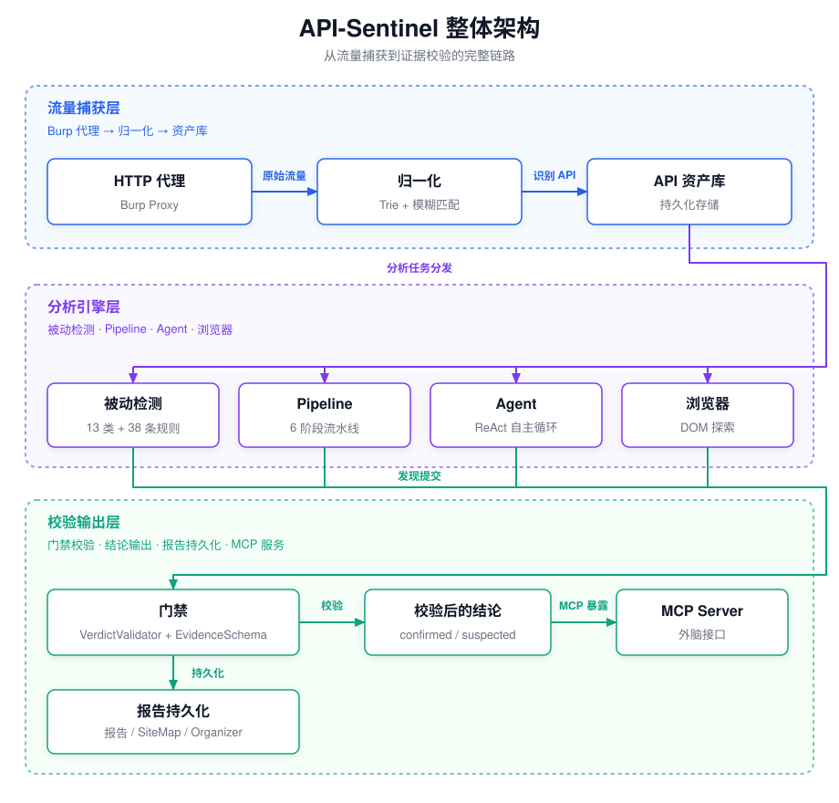
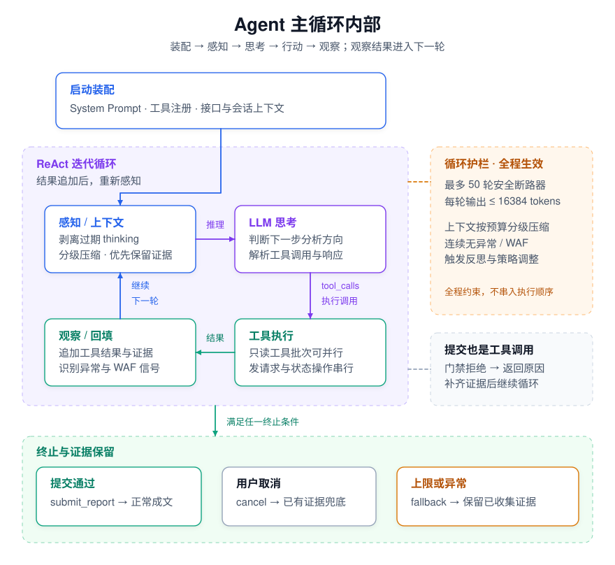
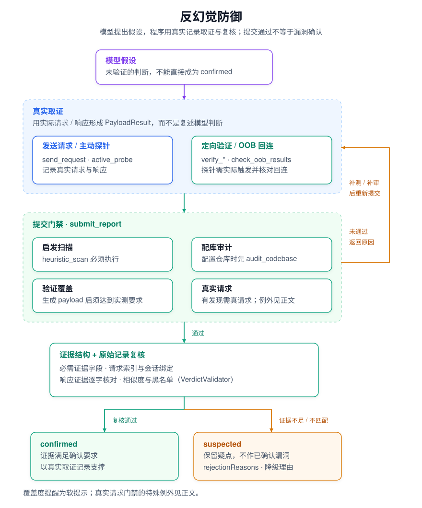
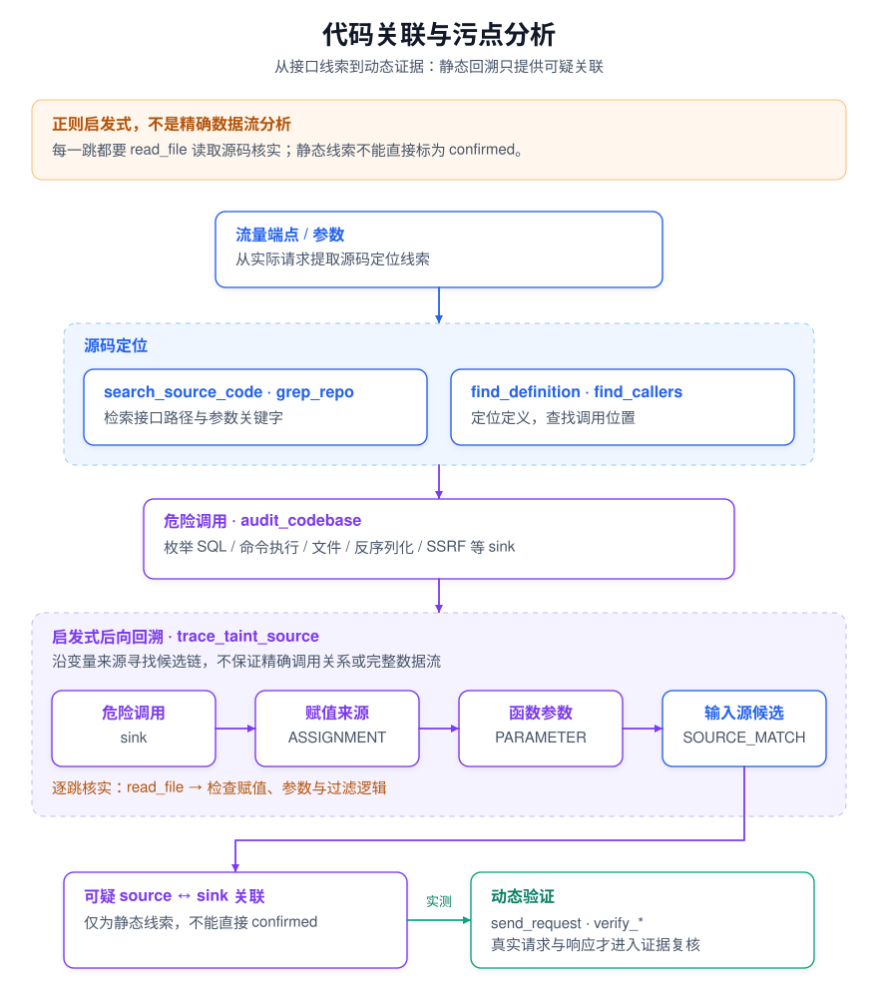
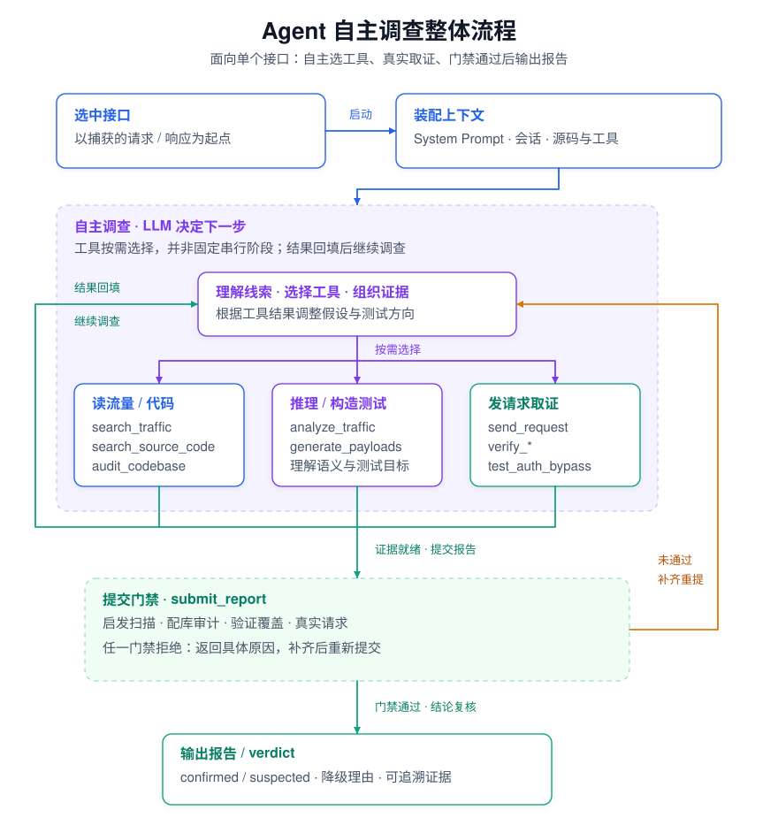

# API Sentinel

> AI 驱动的 Burp Suite API 安全自动化分析插件 —— 流量捕获、漏洞验证、证据驱动的全流程，无需手动把流量复制粘贴给 ChatGPT 网页。

[](https://portswigger.net/burp)
[](https://openjdk.org/)
[](#)
[](LICENSE)

**简体中文** | [English](README.en.md)


> ⚠️ **合规使用声明**：本工具仅可用于测试**你拥有所有权、或已获得明确书面授权**的目标系统。使用前请确认你对目标具备合法测试授权；因用于未授权目标而产生的任何直接或间接后果，由使用者自行承担。详见 [LEGAL.md](LEGAL.md)。

---

## 目录

- [项目背景](#项目背景)
- [核心能力](#核心能力)
- [快速开始](#快速开始)
- [📚 深入文档](#-深入文档)
- [整体架构与设计哲学](#整体架构与设计哲学)
- [核心引擎：AI 分析](#核心引擎ai-分析)
  - [Pipeline 模式（6 阶段固定流水线）](#pipeline-模式6-阶段固定流水线)
  - [Agent 模式（ReAct 自主工具循环）](#agent-模式react-自主工具循环)
  - [防幻觉三层防御体系](#防幻觉三层防御体系)
- [被动检测层：零成本即时扫描](#被动检测层零成本即时扫描)
- [三种分析模式对比](#三种分析模式对比)
- [内嵌 Repeater 与测试用例管理](#内嵌-repeater-与测试用例管理)
- [任务队列与批量分析](#任务队列与批量分析)
- [🤖 浏览器自动化探索](#-浏览器自动化探索)
- [扩展能力](#扩展能力)
- [高级功能](#高级功能)
  - [MCP Server（让 Claude 调用）](#mcp-server让-claude-调用)
  - [OOB 盲 SSRF 检测](#oob-盲-ssrf-检测)
  - [Intruder AI 载荷生成](#intruder-ai-载荷生成)
  - [WAF 识别与绕过](#waf-识别与绕过)
  - [IDOR 身份审计](#idor-身份审计)
- [Benchmark 评测体系](#benchmark-评测体系)
- [使用流程](#使用流程)
- [配置](#配置)
- [匹配模式与接口识别](#匹配模式与接口识别)
- [构建](#构建)
- [FAQ](#faq)
- [限制](#限制)
- [🎮 游戏化元素](#-游戏化元素)
- [致谢与第三方引用](#致谢与第三方引用)
- [独立运行（CLI 模式）](#独立运行cli-模式)
- [预算管理](#预算管理)
- [许可证](#许可证)

---

## 项目背景

API-Sentinel 是 [API-Highlighter](https://github.com/Flechzao/API-Highlighter) 的 **Java 版 AI 化升级版**。API-Highlighter 是一个 Python 编写的 Burp 插件，做的是"规则驱动"的 API 识别与高亮：精确/半精确/模糊匹配、接口状态管理、敏感信息与未授权访问检测——它解决了"看见 API"的问题，但"判断有没有漏洞"仍然依赖人工。

随着大模型（LLM）能力的成熟，"让 AI 自主分析接口、生成 payload 并实测验证"从设想变为可行。于是把 API-Highlighter 重写为基于最新 Montoya API 的 Java 插件，并深度接入 LLM，演进为 API-Sentinel：在保留接口识别与被动检测的基础上，加入 AI 分析引擎（Pipeline 固定流水线 + Agent 自主 ReAct 循环）、防幻觉交叉验证、WAF 识别与绕过、OOB 盲测等能力。

Burp Suite 官方在 2026.7 版本引入了 [Burp AT](https://portswigger.net/burp/burp-at)——面向人工渗透测试的 Agentic AI 主动安全测试能力。API-Sentinel 与其思路相近，但定位为一个**开源、模型可自选**的替代/补充方案：你可以自由接入 Claude / OpenAI / Ollama 等任意模型；其中选用**本地模型（Ollama）时数据完全不出本机**，适合对数据出境敏感的场景，规则与流程完全可控。

---

## 核心能力

**全自动分析**：从流量捕获到漏洞验证，一条 Pipeline 跑到底，无需人工干预。

**AI 自主决策**：Agent 模式下 LLM 自主调度 **52** 个工具进行深度分析，每一步推理可见。

**零误报优先**：三层防幻觉防御（Prompt 规则 → 程序化交叉校验 → 身份审计），`confirmed` 漏洞必须有真实 payload 触发异常的证据，`overall_risk=HIGH` 需有存活 confirmed，否则自动降级。

**证据驱动**：每个发现都有来自请求/响应/源码的具体证据，可追溯、可复现。

**本地零成本检测**：所有流量实时过 13 类正则检测（SQL 错误/堆栈/安全头/JWT/CORS/CSRF 等），不耗 AI token。

**越权检测**：支持 3 会话（A/B/C）多层级权限测试，两两配对（C(N,2)）。Cookie + Auth Headers（Bearer/X-Token/API-Key）双通道凭证，域名作用域隔离，权限等级（HIGH/MEDIUM/LOW）+ 组/租户标识自动区分水平越权 vs 垂直越权 vs 跨租户越权。IDOR 扫描覆盖 URL path + query 参数 + JSON body。LED 指示灯实时验证会话存活。Jaccard 相似度判定，灰色区间自动触发 LLM 仲裁。

**防幻觉交叉验证**：LLM 声称的 confirmed 漏洞需经过程序化校验 —— payload 按 `citedExecutionIndex` 绑定真实 PayloadResult、evidence 必须是真实 response 的字面子串、越权类需双会话对比、`anomalyDetected` 不再被改写（改用 `claimedByVerdict` 保留原始观测值）。

**不可信内容围栏**：每次分析生成随机 nonce，`UntrustedContent.wrap()` 包裹所有攻击者可控数据（HTTP 响应、DOM、源码注释、grep 命中），防止 prompt injection 伪造围栏标记。

**Prompt Caching**：Claude 三断点缓存（tools schema / system prompt / conversation history），单端点 input 成本 **-50~70%**。

**WAF 识别与绕过**：12 厂商 WAF 签名被动识别，被拦截 payload 自动尝试编码变体重试。

**MCP Server**：将插件暴露为 MCP 端点（Bearer token 认证 + CSRF/DNS rebinding 防护），让 Claude Code / Codex / Qoder 等 MCP 客户端查询接口、触发分析、检索源码，并通过 `validate_findings` 对外部 AI 的发现做防幻觉校验。

**Benchmark 评测**：内置 53 端点靶场（32 真漏洞 + 21 安全对照），自动跑出 recall/precision/FP rate/F1，防回归。

---

## 快速开始

### 1. 安装

从 **[GitHub Releases](https://github.com/Flechzao/API-Sentinel/releases)** 下载最新的 `API-Sentinel` jar 包（约 41MB），然后：

`Burp Suite → Extensions → Add → Extension type: Java → 选择下载的 jar 文件`

加载后顶部出现 `API Sentinel` 标签页。

> **制品体积说明：** jar 约 41MB，其中约一半是浏览器自动化引擎（Playwright Node.js 驱动），用于 `browser_login`、`browser_explore` 等工具。驱动在首次使用时自动提取到 `~/.api-sentinel/playwright-driver/`，无需手动安装。如果不需要浏览器功能，可以在设置中关闭 `browserEnabled`。

> 推荐 **Burp Suite Professional**（OOB Collaborator 依赖专业版；其余功能 Community 也可用）。

### 2. 配置 AI

`API Sentinel` 标签页 → **设置 ⚙ → AI 设置**，选择服务商并填入配置：

| 字段 | 说明 |
|------|------|
| 服务商 | `claude` / `openai` / `ollama` |
| Endpoint | API 地址（Ollama 默认 `http://localhost:11434/v1`） |
| API Key | 你的 API 密钥 |
| Model | 模型名（推荐 Claude Sonnet / GPT-4o 级别） |

点"测试连接"验证。配置保存在 `~/.api-sentinel/ai-config.json`，不会打包进 jar。


### 3. 第一次分析

1. 浏览器经 Burp 代理访问目标 → API Sentinel 自动捕获并归一化接口
2. 左侧表格勾选要分析的接口 → 点击"AI 分析"
3. 任务中心实时查看进度 → 分析完成后查看结果面板

### 4. 用 demo 靶场快速体验（推荐新手）

仓库自带一个**刻意植入漏洞的演示应用** `easyshop-app/`（Spring Boot，包含 53 个靶场接口，覆盖 SQLi / XSS / IDOR / 越权 / 竞态 / 不安全随机数等；当前实测评分集为其中 44 个），适合在**本地、合法、可控**的环境里快速体验完整流程：

```bash
cd easyshop-app
mvn spring-boot:run        # 默认监听 http://localhost:8089（见 src/main/resources/application.properties）
```

1. 浏览器经 Burp 代理访问 `http://localhost:8089` 的几个接口（触发流量）
2. 回到 API Sentinel，勾选捕获到的接口 → "AI 分析"（建议选 Agent 模式）
3. 观察 Agent 逐步推理 → 生成 payload → 实测验证 → 出报告

> ⚠️ 该靶场仅用于本地学习/演示，请勿部署到公网。靶场含故意硬编码的弱密钥/凭证，均为演示用途。

---

## 📚 深入文档

本 README 提供快速开始和概览。完整的设计、规格、功能参考和交互式架构图位于 `docs/` 目录：

| 文档 | 内容 |
|------|------|
| **[docs/ARCHITECTURE.md](docs/ARCHITECTURE.md)** | 架构手册（规格+代码架构+ADR 决策+开发工具链，四合一） |
| **[docs/FEATURES.md](docs/FEATURES.md)** | 功能参考（被动检测规则、50+ 工具参数、自定义模板、WAF、组件指纹） |
| **[docs/BROWSER.md](docs/BROWSER.md)** | 浏览器手册（Playwright/Chromium 安装 + agent-browser 集成） |
| **[docs/THIRD-PARTY.md](docs/THIRD-PARTY.md)** | 第三方致谢与许可证 |
| **[docs/diagrams/](docs/diagrams/README.md)** | 4 张交互式架构图（Archify 生成，可点击/缩放/切换视图） |

**交互式架构图预览**：

```bash
# 浏览器打开即可交互（点击组件高亮关联连接、切换预设视图、缩放拖拽）
open docs/diagrams/api-sentinel-architecture.html  # 组件总览
open docs/diagrams/api-analysis-sequence.html      # 时序图
open docs/diagrams/mcp-session-workflow.html       # MCP 会话
open docs/diagrams/findings-dataflow.html          # 数据流
```

---

## 整体架构与设计哲学

### 设计哲学

传统"把请求丢给 ChatGPT 问有没有洞"的做法有两个致命问题：LLM 基于模式猜测容易高误报，而且你不知道它哪一步判断错了。API Sentinel 的设计核心是**"AI 负责判断与决策，程序负责取证与验证"**的分工：

- **LLM 擅长**：理解语义、发现线索、组织证据、生成针对性 payload
- **LLM 不擅长**：精确对比响应、确认 payload 是否真的触发了异常
- **程序擅长**：精确对比、相似度计算、WAF 签名匹配、正则检测

所以系统把"判定一个漏洞是否真实"拆成两层：AI 提出假设，程序用真实请求验证，再用程序化规则复核 AI 的结论。

### 架构图



> 可选本地交互版：[架构交互图](docs/diagrams/api-sentinel-architecture.html)（组件关联高亮、切换视图、缩放），需下载后在本地浏览器打开。

**数据流**：流量入口（Burp Proxy 捕获）→ 接口归一化（Trie+模糊匹配）→ 被动检测层（零 token 实时）→ 分析引擎（Pipeline 6 阶段 / Agent ReAct / AI 对话三模式）→ 结论校验（AI 推理 + 程序化验证 + verdict 交叉验证，防幻觉）→ 结果输出（表格/卡片/Repeater/报告）。

### 深入机制图

下面三张 SVG 在正文中直接展示 Agent 的核心机制。各图后的 HTML 链接仅为可选交互版，需下载后在本地浏览器打开。

**① Agent 主循环内部**



> 可选本地交互版：[Agent 主循环内部](docs/diagrams/agent-loop-internals.html)（下载后在本地浏览器打开）。

**② 反幻觉防御**



> 可选本地交互版：[反幻觉防御](docs/diagrams/anti-hallucination-defense.html)（下载后在本地浏览器打开）。

**③ 代码关联与污点分析**



> 可选本地交互版：[代码关联与污点分析](docs/diagrams/code-correlation-taint.html)（下载后在本地浏览器打开）。

> ⚠️ 污点回溯为**正则启发式**，非真实数据流分析；每一跳都需 `read_file` 核实，关联出的链最终交 `verify_*` 实测才算证据。

### 数据流

一次完整的分析的数据流：

```
流量（代理捕获 / 历史回填）
   │
   ├─ 被动检测层（实时，零 token）：启发式/敏感信息/未授权 → PassiveFinding
   │
   ▼ 选中接口 → 触发分析
   │
   ├─ Pipeline 模式（固定流程）：
   │   Stage 1 流量分析 → Stage 2 代码关联 → Stage 3 生成 Payload
   │   → Stage 4 实测验证 → Stage 5 鉴权绕过 → Stage 6 综合研判
   │
   ├─ Agent 模式（ReAct 自主循环）：
   │   LLM 自主选择工具（heuristic_scan → analyze_traffic → search_source_code
   │   → generate_payloads → send_request → ... → submit_report）
   │
   ▼ verdict 交叉验证（程序化复核 AI 结论）
最终结果 → 表格 / 报告 / Repeater
```

### 关键设计决策

1. **证据先行**：AI 只能基于真实发送的 payload 响应下结论，不能凭理论推测报 confirmed
2. **误报优先于漏报**：宁可漏报也不制造垃圾漏洞，不确定的发现降级为 suspected
3. **5xx 不当漏洞信号**：服务器错误 ≠ 漏洞，避免"扔个 payload 报了 500 就报漏洞"的经典误报
4. **WAF 拦截不当证据**：被 WAF 拦截的响应是拦截页，不是后端真实响应，不能作为漏洞证据

---

## 核心引擎：AI 分析

### Pipeline 模式（6 阶段固定流水线）

Pipeline 是系统化全流程分析模式，适合批量分析。6 个阶段按固定顺序执行，每个阶段的输出是下一阶段的输入。

#### Stage 1：流量分析（LLM 调用，60s 超时）

LLM 分析单个 HTTP 请求/响应对，识别可疑线索。**不引入源码**——纯流量分析，避免 LLM 被不相关的代码片段误导。

输入：HTTP 请求（截断 6000 字符）+ 响应（截断 6000 字符）+ 被动检测发现 + 组件指纹
输出：`AnalysisResult`（overallRisk + findings 列表，每个带 type/title/description/evidence/location/confidence）

系统 prompt 包含严格的证据标准、反注入声明（`=== UNTRUSTED HTTP DATA ===` 标记）、明确"什么不算漏洞"的规则，以及置信度校准要求。

#### Stage 2：代码关联（免费）

从已索引的代码仓库查找匹配路由的后端源码。支持 Java（Spring 注解解析）、Python（Flask/Django 路由解析）、Node.js（Express 路由解析）。

- 先用 Trie 路由匹配找到对应的 controller 方法
- **SinkMap 自动标记**：扫描代码中的 12 类危险 sink（SQL 拼接、命令执行、文件操作、反序列化、SSRF、弱加密/硬编码密钥、不安全随机数、XXE、SSTI、CRLF注入、开放重定向、NoSQL注入），在代码片段中标注 `[⚠ SQL SINK]` / `[⚠ WEAK CRYPTO]` / `[⚠ INSECURE RNG]` 等，引导 Agent 主动跟进 service 层
- Agent 工具 `find_definition` / `find_callers` 支持跨文件追踪调用链，发现隐藏在 service/DAO 层的逻辑漏洞
- 源码变更后需手动重新索引

#### Stage 3：Payload 生成（LLM 调用，90s 超时）

基于 Stage 1 的发现项 + Stage 2 的源码上下文，LLM 生成针对性测试用例。每个测试用例包含：

- 名称、类别（SQLi/XSS/IDOR/SSRF/路径穿越/命令注入/SSTI/批量赋值/CORS/反序列化）
- 目标参数、payload 内容、预期漏洞表现
- 如果开启 OOB，探针域名会注入到 prompt 中供 SSRF/盲注使用

#### Stage 4：实测验证（程序化，免费）

使用 Burp 的 `RequestExecutionEngine` 并发发送所有 payload 到目标服务器，对比基线响应，程序化判定异常。

**anomaly 判定逻辑**（`detectAnomaly`）：
- 状态码突变（baseline 200 → payload 500，但 5xx 不等于漏洞，只看作信号）
- SQL 错误信息（MySQL/PostgreSQL/Oracle/SQLServer/SQLite 精确引擎签名）
- 堆栈跟踪（Java/Python/C# 异常堆栈）
- 响应长度突变（基线 200B → payload 5000B+）
- 反射检测（payload 原样出现在响应中 → XSS 信号）
- 文件内容泄露（`root:x:0:0` / `[extensions]` 等）

**WAF 集成**：每个 payload 的响应先过 WAF 检测器（12 厂商签名），被拦截的 payload 标记 `wafBlocked=true`。被拦截的 payload 不触发 anomaly，但自动尝试 WAF 绕过变体重试。

#### Stage 5：鉴权绕过测试（程序化，免费）

- **多 session 发现**：从代理历史自动发现不同用户的 session（Cookie / Authorization / X-Token / API-Key 等多种认证头），面板首次打开自动检测填充
- **3 会话多层级测试**：支持 A/B/C 三组会话，两两配对测试（A↔B, A↔C, B↔C）；每组会话可设域名作用域（Cookie 域名隔离）、权限等级（HIGH/MEDIUM/LOW）、组/租户标识；系统自动标注测试类型：同级别+不同组=水平越权，不同级别+同组=垂直越权，不同级别+不同组=跨租户越权
- **会话保活验证**：LED 指示灯（绿=有效 / 红=过期 / 黄=不可达 / 灰=未验证），保存后自动验证，向各会话域名发送带凭证的 GET 请求判断 token 是否仍然有效
- **IDOR 测试**：替换资源 ID（URL path 数字/UUID + query 参数 + JSON body），覆盖 18 种常见 ID 参数名，path-pattern 优先匹配同模式的不同用户资源 ID
- **未授权访问**：去掉所有认证头重放请求
- **Jaccard 相似度判定**：3-gram 响应体相似度对比
  - ≥ 85%：VULNERABLE（越权确认）
  - 60-85%：SUSPICIOUS → 自动触发 LLM 语义仲裁（降误报）
  - < 60%：SAFE（响应差异大，鉴权有效）

#### Stage 5.5：主动探针（程序化，按触发条件执行）

程序化验证探针，不经过 LLM 判断，结果直接并入验证：

- **CORS**：Origin 变体反射检测（Origin 精确反射 + 凭证 = HIGH）
- **JWT**：alg:none 伪造重放
- **CRLF**：canary 头注入检测
- **NoSQL**：差分检测（基线拒绝，操作符变体通过 → 异常）+ 时序检测

#### Stage 5.6：盲注验证（自动升级路径）

当 Stage 1 发现 SQLi 线索但显错注入未触发时，自动按升级路径逐级验证：

1. **布尔盲注**（`verify_boolean_blind`）：true/false 条件响应对比，最多尝试 3 组（≤6 个请求）
2. **时序盲注**（`verify_timing_blind`）：SLEEP 计时，auto 模式逐 DB 尝试并对疑似延迟重测基线（含复测最多 11 个请求）
3. 两级都失败 → 结论中标注"未发现 SQL 注入"

#### Stage 5.7：业务逻辑验证（默认关闭，安全子集）

- 价格篡改（price → 0.01）
- 优惠券重放（相同 coupon 多次应用）
- 负数攻击（quantity → -1）
- 步骤跳过（跳过 checkout 步骤直接确认）

这些操作涉及真实业务状态变更，仅对授权目标使用。

#### Stage 6：综合研判（LLM 调用，180s 超时）

LLM 综合前 5 个阶段的所有证据，产出最终 verdict。Prompt 包含：

- 基线响应（用于对比）
- 组件指纹（让 LLM 知道是否有 Fastjson/Shiro 等，指导针对性判断）
- Stage 1 的 findings（流量分析线索）
- Stage 2 的源码（实现上下文）
- Stage 3+4 的每个 payload 及其响应（异常标记、WAF 状态、响应片段）
- Stage 5 的鉴权测试结果（含每轮相似度 + AI 仲裁结果）
- `SafetyRules.NEVER_CONFIRM_PROMPT_TEXT`（12 条禁止列为漏洞的规则 + Kill Signals）
- `SafetyRules.CONDITIONALLY_VALID_PROMPT_TEXT`（链式升级表）

LLM 产出的 JSON verdict 包含：
- `overall_risk`（HIGH/MEDIUM/LOW/SAFE）
- `confirmed_vulns`（type + title + evidence + payload_used + response_snippet + verify_command + identity_proof + cvss）
- `suspected_vulns`（type + title + reason + verify_command + escalation_path）
- `summary` + `recommendations`

**关键约束**：只有 payload 的"异常检测"标记为"是"的，才能列为 confirmed；WAF 拦截的 payload 不能作为 confirmed 证据；所有 payload 被 WAF 拦截且无其他实证 → overall_risk ≤ LOW。

#### Verdict 交叉验证（在 Stage 6 之后）

LLM 的 verdict 产出后，**不直接使用**。先经过 `VerdictValidator` 程序化校验：

```
Phase 1: Payload 匹配校验
  for each confirmed_vuln claimed by LLM:
    match = findPayloadResult(citedPayload)  // 支持 URL-decode 模糊匹配
    if match == null:
      → demote to suspected ("payload 未发送")
    if match.wafBlocked:
      → demote to suspected ("WAF 拦截页不是证据")
    if requireAnomaly && !match.anomalyDetected:
      → demote to suspected ("未触发异常")

Phase 2: 信息级发现移除
  for each surviving confirmed + suspected:
    if isInformationalType(type) && !hasChainEvidence(evidence):
      → remove entirely (仅保留在 recommendations 中)
  // 免死金牌：证据含"凭证/外带/内网数据/行数据/时间差/SLEEP/密码"等
  // 关键词的发现豁免移除（说明有真实利用链）

Phase 3: 越权身份审计
  for each surviving confirmed:
    if isAuthClass(type) && identityProof.isBlank():
      → demote to suspected ("identity_not_proven")
  // 越权类必须回答三问：
  // (1) 用的哪个会话上下文
  // (2) 是否测过匿名访问
  // (3) 如何确认数据属于他人账号

Phase 4: 与 Stage 5 程序化鉴权交叉验证
  if Stage 5 确认 VULNERABLE 但 verdict 无相应 confirmed:
    → 添加"漏报提醒"到 rejectionReasons
  if Stage 5 判定 SAFE 但 verdict 有越权类 confirmed:
    → 添加"软冲突"提醒到 rejectionReasons

Phase 5: overall_risk 降级
  if overallRisk == HIGH && survivingConfirmed.isEmpty():
    → downgrade to MEDIUM (有 suspected) 或 LOW (无 suspected)
```

所有降级操作记录在 `rejectionReasons` 中，完整审计轨迹可追溯。

### Agent 模式（ReAct 自主工具循环）

与 Pipeline 的固定流程不同，Agent 让 LLM 自主决定分析路径。适合需要灵活深挖的单个接口。




#### ReAct 循环控制

```
Loop (最多 50 轮，安全断路器，正常分析远不到):
  1. 剥离过期 thinking 块（仅保留最近一条 assistant 的思考块）
  2. 上下文压缩（如果 token 估算超过配置的 contextWindowTokens）
  3. 调用 LLM（temperature=0.3，MAX_TOKENS=16384；支持的 provider 附加
     扩展思考 thinking_budget=6000）
  4. 解析响应：
     - 有 tool_calls → 执行工具 → 追加结果 → 继续循环
       （批内若含 submit_report：先执行到它为止，通过门禁则立即结束、
        不再执行其后工具；被拒则继续执行剩余工具）
     - 纯文本 → 追加 "请使用工具或提交报告" → 继续循环
     - MAX_TOKENS 截断 → 追加 "继续，不要重复" → 继续循环
     - RATE_LIMITED → 指数退避重试（最多 2 次）
     - ERROR → 构建 fallback 结果
  5. 如果 submit_report 被调用且通过门禁 → 结束
```

> **并行工具执行**：当一轮返回的多个 tool_call 全部是只读工具（read_file /
> grep_repo / search_source_code 等）时，会在独立线程池并发执行（"一次读 3
> 个文件"的常见场景）；只要批内含任何发请求/调 LLM/改状态的工具，就退回串行，
> 保证工具间依赖的顺序正确。

#### submit_report 的多层门禁

`submit_report` 不是无条件接受——在工具执行前有一组程序化门禁（`preExecute`），
任一不通过即拒绝并返回具体原因，LLM 需先补齐再重新提交：

1. **heuristic_scan 强制门禁**：必须至少调用过一次 `heuristic_scan`（免费、即时）才能提交
2. **audit_codebase 强制门禁**：配置了代码仓库时，必须先跑过 `audit_codebase`
   全局白盒审计——防止只盯着当前接口的一条链、漏掉同仓库其它 sink
3. **验证门禁**：如果 `generate_payloads` 生成了 N 个 payload，必须实际验证至少
   `min(N, 5)` 个。不允许只生成不测试就凭猜测下结论
4. **覆盖度提醒（软）**：注入/鉴权/配置三大类若有未覆盖的，会在日志中提醒（不阻断）
5. **真实请求门禁**：只要报告里含任何 confirmed/suspected 发现，就必须调用过至少
   一个真实发请求的工具（send_request / verify_* / test_auth_bypass 等）。纯读代码
   得出的发现不在此列的唯一例外是确无法用单请求触发的二阶/存储型漏洞（需在证据里写明链路）

#### 上下文管理

- **两段式分级压缩**：token 估算超过预算时，优先压缩**可再生的只读工具结果**
  （read_file/grep 等，丢了重调一次即可），仍不够才压缩 send_request 等证据类结果；
  压缩为结构化摘要（保留 status/anomaly/findings 等判分字段），证据最后才退化
- **保留窗口**：最近 15 个工具结果保持完整，更早的才参与压缩
- **触发条件**：`estimateTokens(messages) > contextWindowTokens`（默认 150K，可配置，
  以适配 Ollama 小窗口模型）
- **工具结果差异化截断**：源码类（search_source_code/read_file/audit_codebase）64K，
  grep_repo/find_callers 48K，其他 32K
- **thinking 块剥离**：扩展思考块只需在产生它的下一轮回传，每轮开始前剥离更早的
  thinking 块，避免其无限累积挤占上下文
- **MAX_TOKENS 续写**：响应被截断时自动追加提示，避免浪费迭代

#### 限流与容错

- **RATE_LIMITED**：指数退避重试（2s → 4s → 30s 上限），最多 2 次
- **超时**：LLM 调用 200s 超时，超时后构建 fallback 结果
- **异常**：任何异常都构建 fallback 结果（包含已收集的分析数据），不丢已有信息
- **最大迭代**：达到 50 轮构建 fallback 结果，不会无限循环

#### Agent 可用的 52 个工具

**侦察 / 代码理解（免费）**

| 工具 | 作用 |
|------|------|
| `heuristic_scan` | 本地正则检测（SQL 错误/堆栈/安全头/JWT/CORS 等 13 类） |
| `fingerprint_components` | 被动组件指纹（Fastjson/Log4j/Shiro 等） |
| `search_source_code` | 查找关联后端源码（需先索引代码仓库） |
| `read_file` | 按路径读取源码文件完整内容 |
| `grep_repo` | 正则搜索整个已索引仓库 |
| `find_definition` | 查找类或方法的定义位置（支持 Java/Python/JS） |
| `find_callers` | 查找方法的所有调用点，评估攻击面 |
| `trace_taint_source` | 对危险 sink 做后向污点回溯（regex 启发式，定位未过滤变量来源） |
| `audit_codebase` | 全局白盒审计：列出整个仓库的危险 sink（SQL/CMD/反序列化等） |
| `search_traffic` | 搜索 Burp 代理历史中同域名流量，提取认证 token/参数值 |
| `list_sessions` | 列出可用认证会话（越权测试用） |
| `map_sibling_endpoints` | 映射同 Controller / 同前缀的兄弟端点（集群狩猎入口） |
| `diff_responses` | 响应差异分析（Jaccard 相似度 + JSON 字段对比 + 头差异），纯计算 |

**AI 推理（消耗 LLM）**

| 工具 | 作用 |
|------|------|
| `analyze_traffic` | AI 深度分析 HTTP 请求/响应模式 |
| `generate_payloads` | 基于发现生成针对性测试 Payload |

**实测验证（免费，程序化发请求）**

| 工具 | 作用 |
|------|------|
| `send_request` | 发送 HTTP 请求验证疑似漏洞（内置 429 自适应限速） |
| `test_auth_bypass` | 越权检测：多 session 交换 + IDOR 替换 + 未授权 |
| `active_probe` | CORS Origin 变体 / JWT alg:none 重放 / CRLF / NoSQL |
| `verify_boolean_blind` | 布尔盲注验证（10 种内置变体中最多尝试 3 组，WAF 自动跳过，≤6 请求） |
| `verify_timing_blind` | 时序盲注验证（SLEEP 计时 + 基线复测防抖动误报，auto 模式含复测最多 11 请求） |
| `verify_xss_reflection` | XSS 反射验证（canary 注入 + 标签探针 + 上下文分类，2 请求） |
| `verify_ssti` | SSTI 模板注入验证（7 引擎探针 + 控制请求防误报，≤8 请求） |
| `verify_path_traversal` | 路径穿越验证（12 种编码变体 + 基线对比，≤12 请求） |
| `verify_xxe` | XXE 验证（内联实体读文件 + OOB 回连，≤4 请求） |
| `waf_bypass_retry` | WAF 拦截后按漏洞类型尝试绕过策略链（含 chunked/HPP/Unicode，≤4 请求） |
| `verify_business_logic` | 业务逻辑验证（价格篡改/优惠券重放/负数/竞态/枚举） |
| `generate_oob_probe` | 生成 OOB 探针域名供盲 SSRF 测试 |
| `check_oob_results` | 轮询 Collaborator 交互，确认盲注回连 |

**子 Agent 委派 / 特殊**

| 工具 | 作用 |
|------|------|
| `dispatch_explore_agent` | 委派**隔离子 Agent**做探索性问题（如"全仓库哪里校验 JWT"），只回传结论、不占主上下文 |
| `chain_hunter` | 委派**集群狩猎子 Agent**实测兄弟端点并尝试 A→B 串链 |
| `run_sandboxed_code` | 沙箱执行短脚本做纯计算验证（复现算法/编解码/密码学），不发请求 |
| `ask_user` | 运行中向操作者提问（如沙箱执行确认） |
| `submit_report` | 提交最终评估报告（需通过门禁） |

**其余工具（浏览器套件 / 扩展能力 / 元信息）**

| 工具 | 作用 |
|------|------|
| `list_attack_types` | 列出 27 种攻击类型 + 150+ payload（本地查表，零 LLM） |
| `generate_poc` | 一键生成 PoC（cURL + Python + 复现步骤 + Markdown） |
| `orchestrate_agents` | 多 Agent 协作（Planner/Explorer/Executor/Verifier 四角色） |
| `custom_detection` | 加载 `custom-templates/` 下类 Nuclei 的 YAML 自定义检测模板 |
| `scan_mcp_servers` | MCP server 端点安全扫描（7 端点并发 + SSRF 防护） |
| `browser_discover` | 发现路由 + 静态 API（XHR/Fetch 捕获 + JS Bundle 分析） |
| `browser_render` | 渲染页面取 DOM / console / CSP |
| `browser_dom_xss` | DOM XSS 检测 |
| `browser_find_page` | 三级定位触发目标 API 的页面 |
| `browser_interact` | UI 操作序列执行 + 确认弹窗 |
| `register_discovered_apis` | 把浏览器发现的 API 注册进分析队列 |
| `get_burp_scan_issues` | 读取 Burp Scanner 已发现的漏洞 issue |
| `mine_history_idor` | 从代理历史挖掘疑似 IDOR 端点 |
| `request_tools` | 列出当前可用工具清单（供 LLM 探查） |
| `read_analysis_notes` | 读取分析笔记（跨工具共享上下文） |
| `update_analysis_notes` | 更新分析笔记 |

> `browser_login` / `browser_explore` / `browser_auto_crawl` 见[浏览器自动化探索](#-浏览器自动化探索)。完整 52 个工具由 `StandardToolRegistry` 统一注册。

工具全部由 `StandardToolRegistry` 统一构建，Agent 模式和两个 Chat 模式共享同一套工具注册，确保行为一致。子 Agent（explore/chain-hunter）只能使用主 Agent 工具的**只读/发请求子集**，不能再次委派、不能提交报告，最终裁决权留在主循环。

#### Reflection 自纠机制与死循环熔断

Agent 在以下情况会触发自我反思，避免陷入死循环或机械重试：

| 触发条件 | 行为 |
|----------|------|
| **连续相同工具批次**（通用熔断） | 对整批 tool_call 做签名：连续 3 次完全相同 → 注入反思要求换策略；连续 5 次 → **强制终止**并以已收集证据出 fallback 报告 |
| 连续 3 次 `send_request` 无异常 | 注入反思 prompt：分析参数位置/类型/WAF 静默过滤/代码确认/调整策略 |
| 连续 3 次 WAF 拦截 | 注入反思 prompt：调用 `waf_bypass_retry` 绕过 / 改用无关键字 payload / 标注 WAF 有效 |
| 迭代 15 轮未提交 | 注入反思 prompt：回顾已有证据是否足够、是否存在关键假设未验证 |
| 迭代 40 轮接近上限 | 注入反思 prompt：诊断为何卡住、是否重复调用同一工具、基于已有证据提交 |

反思注入后设冷却期避免重复；重复批次熔断的计数只在批次真正变化时重置，
"反思→继续重复"的震荡最终仍会被 5 次硬熔断兜住。

#### 终止与收尾

无论以哪种方式结束（`submit_report` 通过 / 达到迭代上限 / LLM 超时或报错 / 触发熔断 /
用户中断），都会走统一的收尾：把已收集的证据（流量分析/源码/payload 结果）组装成
fallback 报告，落盘 JSON/HTML 报告并刷新面板，**不会丢已有信息**。LLM 调用带 200s
超时与限流退避，单个工具卡死不会让整个循环无限挂起。

#### 集群狩猎与级联扩散（从单点到面）

单个接口确认漏洞后，系统会自动向"同类接口"铺开，把一个点的发现放大成一片：

- **主动铺开（Agent 内）**：确认/疑似漏洞后，Agent 用 `map_sibling_endpoints` 找到同
  Controller / 同前缀的兄弟端点，再用 `chain_hunter` 委派**集群狩猎子 Agent**逐个实测，
  并尝试把多个弱发现串成 A→B 利用链（如"信息泄露→拿到 token→越权"）。
- **被动级联（自动模式）**：一次 Pipeline/Agent 分析得出 **VERIFIED 确认漏洞**后，
  `AgentController` 自动把源端点的兄弟端点入队做轻量分析。级联受 `GoalState` 双重约束：
  全会话最多 50 个端点 + 连续 3 个无新发现即熔断，防止对大仓库无限扩散。
- **红线**：只有程序化验证过的确认漏洞才触发级联，"疑似"永不扩散；级联只读、不主动发请求。

#### 子 Agent 架构（上下文隔离）

`dispatch_explore_agent` 与 `chain_hunter` 背后是**独立的轻量 ReAct 循环**
（`ExplorationSubAgent` / `ChainHunterSubAgent`），不是主循环的递归：

- 各自有独立的轮次上限（explore 12 轮 / chain-hunter 25 轮）与独立上下文，
  中间大量的 read_file/grep 噪音**不会污染主 Agent 的上下文**，只回传一段结论；
- 工具权限被裁剪：只能用只读/发请求工具，**不能再次委派、不能提交报告**；
- chain-hunter 共享主 Agent 的 `send_request` 结果池，其实测证据与主循环一并进入
  VerdictValidator 交叉校验，最终裁决权留在主循环。

#### 成功模式记忆（跨次学习）

每次**经验证确认**的漏洞会沉淀为一条成功模式（漏洞类型 + 手法 + payload 预览 +
端点模式 + 域名），持久化在 `~/.api-sentinel/patterns.json`：

- 之后每次新分析启动时，把该域名下命中最多的 Top-5 模式注入初始消息——Agent
  一上来就知道"这个域上哪些打法奏效过"，优先复打已验证的攻击链；
- 同手法在同端点反复命中会累加计数，真正反复出现的缺陷自然排在前面；
- 只记录 VERIFIED 确认（未验证的疑似不进记忆），设置面板可查看/清空。

#### 扩展思考（Extended Thinking）

对支持的 provider（Claude），每轮请求附带 `thinking_budget=6000` 的扩展思考，让模型
在调用工具前先做更深的推理；思考块以独立的"🧠 思考"事件呈现，与正式回复分开，方便
区分"内部推理"与"对外结论"。不支持的 provider 自动忽略，行为不受影响。

---

### 防幻觉三层防御体系

这是 API Sentinel 压低误报的核心机制，三层防护从不同维度阻止 LLM 的幻觉进入最终报告：

#### 第一层：Prompt 级规则（LLM 侧护栏）

通过 `SafetyRules` 单一真相源注入到所有 LLM 调用的 system prompt 中：

- **12 条 NEVER_CONFIRM 规则**：明确列出什么不算漏洞（缺安全头、CORS 通配符无凭证外带、仅 DNS 回连的 SSRF、仅报错回显的 SQLi 等）
- **Kill Signals**：出现即降级停止深挖的判定条件（XSS 有 CSP 且无影响路径、IDOR 返回自己数据、SQLi 仅报错无数据等）
- **链式升级表**：弱发现的升级路径（开放重定向→接 OAuth 窃取授权码、CORS 通配符→带凭证外带 PII 等）
- **不可信内容围栏**：`UntrustedContent.wrap(nonce, raw)` —— 每次分析生成随机 128-bit nonce，包裹所有攻击者可控数据（HTTP 响应、DOM、源码注释、grep 命中、chat 历史）。nonce 无法预测，攻击者无法伪造围栏标记关闭。同时剥离不可信内容中的分隔符模式（`===` 围栏、`## ` markdown 标题、`UNTRUSTED`/`反注入`/`输出格式` 等关键词），防止内容内伪造系统指令。

同一规则三处消费，确保不会漂移：
- Agent 的 `AgentLoop.buildSystemPrompt()` → 精简版（`AGENT_CONDENSED_RULES`）
- Pipeline 的 `FinalVerdictPrompt.getSystemPrompt()` → 完整版（`NEVER_CONFIRM_PROMPT_TEXT` + `CONDITIONALLY_VALID_PROMPT_TEXT`）
- 程序化兜底 → `VerdictValidator` 直接调用 `isInformationalType()` / `hasChainEvidence()`

#### 第二层：程序化交叉校验（VerdictValidator）

LLM 产出 verdict 后，逐条校验每个 confirmed 是否站得住脚：

- **payload 绑定**：confirmed 的 `citedExecutionIndex` 直接 O(1) 查到真实 PayloadResult；LLM 编造一个"从未发送"的 payload → 拒绝
- **evidence 子串锚定**：`response_snippet` 必须是某个真实 `receivedResponse()` 的字面子串（多结果场景）；LLM 编造响应片段 → 拒绝
- **越权双会话对比**：IDOR/auth-bypass 类检查不同 `authSession` 对同一 endpoint 的请求；缺少所需会话对比时拒绝确认
- **WAF 拦截拒绝**：payload 被 WAF 拦截（waf_score ≥ 60）→ 异常信号不可信 → 降级为 suspected
- **观测值不被改写**：`markConfirmedPayloads` 不再覆盖 `anomalyDetected`，改设 `claimedByVerdict` 字段；UI 显示合并两者（绿勾 = `anomalyDetected || claimedByVerdict`），审计/导出保留原始观测值

> **当前边界**：响应片段检查在空引用、无响应体或仅单条结果等路径会跳过；多结果时可匹配任一响应体，并非严格绑定到引用索引的同一响应。越权类另走身份校验，旧记录也有兼容路径；这些规则降低误报，但不能独立证明身份归属或保证零幻觉。

#### 第三层：身份审计（IDOR 专用）

越权/IDOR 是最容易误报的漏洞类型之一。API Sentinel 要求在 `identity_proof` 字段中明确回答三个问题：

1. **用的哪个会话上下文验证**（会话 A/会话 B/匿名）
2. **是否测过去掉认证头的匿名访问**、结果如何
3. **如何确认返回的数据属于【他人账号】而不是自己的**（返回自己数据 = 误报）

`identity_proof` 为空的越权类 confirmed 会被程序自动降级为 suspected（`identity_not_proven`），记录在 `rejectionReasons` 中。

---

## 被动检测层：零成本即时扫描

所有代理流量实时经过被动检测层，不耗 AI token，毫秒级完成。检测结果以结构化 `PassiveFinding` 存储，在表格"被动"列以单行摘要呈现（按最高风险着色），双击或右键查看详情。


| 检测项 | 说明 |
|--------|------|
| SQL 错误信息 | 精确 DB 引擎签名（MySQL/PostgreSQL/Oracle/SQLServer/SQLite），避免"mysql"纯提及误报 |
| 堆栈跟踪 | Java/Python/C# 异常堆栈泄露 |
| 服务器版本 | Server/X-Powered-By 头暴露框架版本 |
| 调试模式 | debug=true / Django debug / Laravel session / Whitelabel Error |
| 内网 IP | 10.x/172.16-31.x/192.168.x（带边界锚点防版本号误报） |
| CORS | `*` + credentials / Origin 反射 / null Origin |
| JWT | alg:none / 缺过期 / 内嵌 jwk / jku/x5u/kid 注入 / 多 token 全检 |
| CSRF | 状态变更方法 + Cookie 认证 + 无 CSRF Token |
| 请求走私 | Content-Length + Transfer-Encoding 共存 / 重复 CL |
| 危险上传 | 可执行扩展名（jsp/php/exe/...）上传成功 |
| 反序列化 | Java 序列化魔术字节 / .NET ViewState |
| 安全头缺失 | HSTS / CSP / X-Frame-Options / X-Content-Type-Options / Referrer-Policy（限 HTML 2xx） |
| 敏感信息 | 38 条内置规则，HaE 风格三层格式（主正则+排除过滤+作用域），覆盖 AWS/GCP/Azure/GitHub/GitLab/Slack/Stripe 等云原生凭证 + JDBC/身份证/手机/邮箱/内网 IP/MAC/SSH 私钥等 |

用户可通过设置面板添加自定义敏感信息规则，保存后立即生效（合并进检测器）。

> 完整检测规则表和敏感信息规则格式详见 [docs/FEATURES.md](docs/FEATURES.md)。

---

## 三种分析模式对比

| 模式 | 适用场景 | 流程 | 说明 |
|------|----------|------|------|
| **Pipeline** | 系统化批量分析 | 固定 6 阶段流水线 | 覆盖最全，适合一次分析多个接口 |
| **Agent** | 单个接口深挖 | ReAct 自主工具循环 | LLM 自主决定用什么工具、什么顺序，灵活度高 |
| **AI 对话** | 灵活问答 | 自然语言对话 | "这个接口有 XSS 吗"，带工具调用步骤视图 |

Agent 和 AI 对话都走**步骤进度视图**（左步骤列表 + 右详情面板），AI 每一步推理可见。步骤包括：Prompt、Thinking（思考）、Tool Call（工具调用）、Response（最终回复），可点击切换查看详情。

---

## 内嵌 Repeater 与测试用例管理

任务中心 → 请求测试 子标签，集成测试用例管理：

- **测试用例表**：名称 / 类别 / 目标参数 / Payload / 验证结果，可双击编辑（方法/路径/域名/备注）
- **验证结果**：⚠ 异常（anomaly 触发）/ ⚠ WAF 拦截 / ✓ 无风险（403/401/400 或无 anomaly）/ ✓ 安全
- **手动操作**：添加测试用例 / Send 重发 / → Repeater 送 Burp 原生 Repeater / ⇋ Comparer 送对比
- **跨重启持久化**：分析结果（testCases + PayloadResults）存 data.json，重启后自动回填


---

## 任务队列与批量分析

- **批量分析**：多选接口 → AI 分析，>5 条弹预估对话框（并发上限默认 2，防轰 LLM）
- **进度跟踪**：实时 N/M 进度条 + 状态颜色（排队中/进行中/已完成/失败/已取消）
- **单行操作**：右键取消（排队中）/ 重试（失败）；失败行 hover 显示错误原因
- **自动重试**：瞬时故障（超时/网络）自动重试 2 次 + 退避；预算耗尽不重试
- **记录淘汰**：保留最近 500 条，优先淘汰已完成/失败
- **风险筛选**：HIGH/MEDIUM/LOW/SAFE/未分析 + 全选可见
- **报告导出**：CSV / Markdown / 完整报告，支持选中行/全部
- **误报反馈**：findings 表右键"标为误报" → 持久化到 `rules.json` → 后续自动抑制相同（path+type）发现

---

## 🤖 浏览器自动化探索

> 让 AI Agent 自动登录、智能导航、触发目标 API —— **无需研发提供截图和操作步骤**。

传统流程需要研发手动登录后复制 Cookie、截图描述触发步骤。浏览器自动化能力让 Agent **全自主完成**：登录 → 探索页面 → 找到触发目标 API 的操作路径 → 缓存路径供后续复用。

**零配置启动**：首次启用时，插件会自动提取 Playwright 驱动并检测系统安装的 Chrome/Edge/Chromium 浏览器，大多数用户无需任何额外配置即可使用。

### 三大新工具

| 工具 | 用途 | 示例 |
|------|------|------|
| `browser_login` | 自动登录，Cookie 注入 AppConfig | `browser_login(profile_name="生产环境")` |
| `browser_explore` | LLM 智能探索多层菜单触发目标 API | `browser_explore(target_api="POST /api/v1/roles", start_url="http://app/")` |
| `browser_auto_crawl` | 一键全站扫描：登录→发现→探索→注册 | `browser_auto_crawl(start_url="http://app/")` |

### 🧠 视觉模型支持（DeepSeek-V4-Flash-Vision-Exp）

集成 DeepSeek 视觉模型后，`browser_explore` 在每一步会**同时发送截图 + DOM 元素**给视觉模型，让 LLM "看到"页面后再做决策：

- **识别复杂 UI**：嵌套菜单、弹窗、Tab 切换、hover 展开
- **不依赖 selector**：视觉理解按钮含义，对中文界面/图标按钮更准确
- **降级策略**：截图失败自动回退纯文本模式

**配置**：AI 设置面板 → 服务商选择 "deepseek" → 轻量模型自动填入 `DeepSeek-V4-Flash-Vision-Exp`

### 工作原理

```
browser_auto_crawl 流程:
  1. browser_login → 自动登录 (支持 SSO/BUC)
  2. browser_discover → 发现所有路由 + 静态 API
  3. 对每个 API → browser_explore:
     ├── DomSimplifier → 提取 80 个可交互元素
     ├── 📸 截图 (视觉模型)
     ├── LLM 决策 → click/fill/hover/back
     ├── 执行动作 → 检查是否触发目标
     └── 循环直到成功 (路径缓存到磁盘)
  4. register_discovered_apis → 注册到分析队列
```

详见 [BROWSER.md](docs/BROWSER.md)。

---

## 扩展能力

基于 25+ 开源项目调研，API Sentinel 提供 8 项扩展能力，并配套安全加固与性能优化（详见 [CHANGELOG.md](CHANGELOG.md)）：

| 能力 | Agent 工具 | 说明 |
|------|-----------|------|
| 攻击类型分类（27 种）+ Payload 库（150+） | `list_attack_types` | OWASP API Top 10 全覆盖，零 LLM 本地查表 |
| PoC 自动生成（15+ 漏洞类型） | `generate_poc` | 一键生成 cURL + Python + 复现步骤 + Markdown 报告 |
| 多 Agent 协作 | `orchestrate_agents` | Planner/Explorer/Executor/Verifier 四角色工作流 |
| 自定义检测模板（YAML DSL，类 Nuclei） | `custom_detection` | `custom-templates/` 零代码加载，regex/word/status 匹配器 |
| MCP 服务器安全扫描 | `scan_mcp_servers` | 7 端点并发探测 + SSRF 防护 + 风险评估 |
| IDOR/BOLA 检测增强 | — | 6 种 ID 格式 + 16 种 owner 字段 + 置信度评分 |
| Mass Assignment / 过度数据暴露 | — | `HeuristicDetector` 新增两种检测模式 |

**安全加固**：MCP 扫描 SSRF 防护（拒绝云元数据/链路本地目标）、PoC 生成命令/代码注入防护、自定义正则 ReDoS 防护、nonce 围栏防 prompt injection。
**性能**：检测正则 Pattern 预编译缓存、MCP 扫描并发化（最坏 70s→~10s）、Ollama 可用性缓存。
**质量**：全量 1231 测试通过（1233 用例，2 跳过，0 失败）。

---

## 高级功能

### MCP Server（让 Claude 调用）

将 API-Sentinel 暴露为 MCP Server（仅绑定 127.0.0.1，基于 JDK `ServerSocket` 实现，零额外传输依赖），让 Claude Code / Codex / Qoder 等 MCP 客户端把插件能力当工具调用；不依赖 Burp 精简 JRE 中可能缺失的 `jdk.httpserver` 模块。

**安全防护**（P2-8）：
- **Bearer token 认证**：默认开启（`mcpRequireAuth=true`）；首次需要时生成随机 256-bit token 并持久化，重启后复用。客户端携带 `Authorization: Bearer <token>`，完整 token 从 MCP 设置面板查看或复制；普通启动日志仅显示前缀
- **CSRF 防护**：拒绝带非空 `Origin` 头的请求（`text/plain` 无预检，可被恶意页面 POST）
- **DNS rebinding 防护**：要求 `Host` 头精确等于 `127.0.0.1:<port>` 或 `localhost:<port>`
- **Content-Type 校验**：要求 `application/json`（额外 CSRF 层）

**配置**：在「设置 → MCP」启停服务或修改端口，立即生效（`mcpServerEnabled` / `mcpServerPort`，默认端口 9877）。若直接编辑 `config.json`，需重载扩展读取新配置；在 MCP 设置面板复制 token 或客户端配置。

**Claude Code 配置**（`.mcp.json`）：
```json
{ "mcpServers": { "api-sentinel": {
  "type": "http",
  "url": "http://127.0.0.1:9877/mcp",
  "headers": { "Authorization": "Bearer <从MCP设置面板复制token>" }
} } }
```

**核心暴露工具**（下表是策展的原生工具；MCP 会话建立后还会叠加内置 Agent 的全套工具——发包/主动探测/盲注验证/浏览器登录交互探索等，与插件内置 AI 对话同构）：

| 工具 | 类型 | 说明 |
|------|------|------|
| `list_apis` | 只读 | 查询已捕获接口（支持 domain/risk 过滤） |
| `get_api_detail` | 只读 | 获取单个接口详情 + 最新 verdict |
| `get_passive_findings` | 只读 | 获取被动检测发现 |
| `get_analysis_history` | 只读 | 获取 AI 分析历史 |
| `search_code` | 检索 | 正则 grep 已索引代码仓库（含 ReDoS 防护） |
| `get_source_code` | 检索 | 按路径获取后端源码（端点 → Controller） |
| `get_untracked_apis` | 检索 | 代码路由 ↔ 流量比对，找出从未触发的接口 |
| `analyze_api` | 分析触发 | 触发真实 Pipeline/Agent 分析，等待完成返回 verdict（并发上限 2，最长 600s） |
| `analyze_batch` | 分析触发 | 批量触发分析（并发上限 2） |
| `get_latest_events` | 事件 | 轮询分析完成事件（poll 模型） |
| `ingest_traffic` | 数据摄入 | 外部大脑把在 Burp 代理之外发现的接口（path/method/域名/请求/响应）回灌进插件，自动建/更新 entry 并显示到 API 表格，随后可分析 |
| `validate_findings` | **校验门禁** | **外部 AI 产出的发现 + 请求记录 → 两层校验（证据结构 + 记录一致性）→ 返回带降级理由的 verdict，见下。** |

> **会话化全量工具**：MCP 客户端 `initialize` 后拿到 `Mcp-Session-Id`，后续调用携带它即获得一个有状态会话（持久 ToolContext + 浏览器页面 + 分析笔记）。此时 `tools/list` 会在上表之外叠加内置 Agent 的全套工具（`send_request`/`active_probe`/`verify_*`/`browser_login`/`browser_interact`/`browser_explore` 等），与插件内置 AI 对话能力对齐。其中**主动/攻击类工具默认关闭**，需在「设置 → MCP」勾选「允许外部客户端调用主动/攻击类工具」(`mcpAllowActiveTools`) 才暴露——因为这让外部大脑可借 Burp 发真实攻击流量，仅在授权测试中开启。

资产、白盒和被动检测工具补充了通用流量桥的领域语义；`validate_findings` 是**防幻觉校验门禁**：`EvidenceSchema` 检查已定义漏洞类型的必需证据字段，`VerdictValidator` 检查 payload 与所提供记录的匹配、响应片段、身份说明及风险降级条件；不满足要求的发现降为疑似，并给出结构化的 `rejectionReasons`。

> **信任边界**：此入口接受客户端提交的请求/响应记录，校验通过不等于独立证明请求真实发生。未定义 schema 的类型仍交给通用校验；部分响应和旧记录路径有宽松处理，不能将门禁视为绝对真实性保证。应保留可复核的原始流量并人工复验关键发现。官方 Burp MCP 可作为查历史/重发的流量桥配合使用。

**使用示例**（配好后在 MCP 客户端里直接对话）：
```
你：列出 api.example.com 上所有已捕获的接口
你：深入分析 /api/users/{id}，看有没有越权
你：这个接口的后端源码长什么样？
你：（外脑模式）我怀疑 /api/order/detail 存在 IDOR，我已用 alice/bob 两个会话各发了一次请求，
    帮我把发现和这两条请求提交给 validate_findings 校验一下能不能确认
```

#### 用 Qoder / Codex / 其它 MCP 客户端连接

MCP 是开放协议，本 Server 走标准 Streamable HTTP，**任何支持 MCP + HTTP 传输的客户端都能连**，配置同构：

- **Qoder**：设置 → MCP（或 `mcp.json`）新增一个 HTTP 类型的 server：
  ```json
  { "mcpServers": { "api-sentinel": {
    "type": "http",
    "url": "http://127.0.0.1:9877/mcp",
    "headers": { "Authorization": "Bearer <从MCP设置面板复制token>" }
  } } }
  ```
- **Codex**：在其 MCP 配置中加入同样的 `url` + `Authorization` 头即可。
- 只支持 stdio 传输的客户端：需外挂一个 `mcp-remote` 之类的 stdio↔HTTP 桥。

**连接前检查清单**：
1. 在「设置 → MCP」启用服务（立即生效）；直接编辑 `config.json` 时设 `mcpServerEnabled=true` 并重载扩展；
2. 在 MCP 设置面板复制完整 token 或客户端配置，普通启动日志只有 token 前缀，不能用于认证；
3. 保持端口一致（默认 9877）；客户端所在机器需与 Burp 同机（仅绑定 `127.0.0.1`）；
4. 客户端里执行 `tools/list` 应能看到上表的原生工具（会话建立后还会叠加内置 Agent 全套工具），说明握手成功。
5. （可选）同时开启 Burp 官方 MCP 做流量桥（查历史/重发）——API Sentinel 自身 MCP **不依赖它**即可启动与工作（独立 ServerSocket，零额外传输依赖），但两者组合可让外部 AI 直接复用 Burp 原生流量能力。

> 双模式：连得上 MCP 客户端（Qoder/Codex/Claude Code）→ **外脑模式**，客户端当大脑、插件当证据基础设施；连不上（只有本地裸模型 Ollama/DeepSeek，无 harness）→ 用插件内置的 Agent/Pipeline **自带引擎模式**。MCP 与内置对话的能力对齐已实现（P0+P1+P2 全部完成，见 [CHANGELOG.md](CHANGELOG.md)）。

### OOB 盲 SSRF 检测

可选功能，总开关在顶部工具栏"OOB探针"复选框：

- **collaborator**：Burp 专业版内置，生成探针 payload 验证
- **internal**：内部 dnslog，填基础域名 + 可选测试 URL

**Collaborator 自动轮询**：开启后后台每 30s 自动轮询 Collaborator 交互记录，确认盲注/SSRF 回连后自动关联原始探针并更新 finding 状态（suspected → confirmed），零人工介入。Agent 模式下通过 `check_oob_results` 工具随时查询回连。内部 dnslog 模式因无标准回显 API，需手动在对应平台查看。

### Intruder AI 载荷生成

在 Intruder 的 Payload type 中选择 **"API Sentinel - AI 载荷生成（上下文感知）"**（Extension-generated）：

- LLM 基于完整请求模板 + 插入点上下文生成针对性 payload
- 按参数语义适配漏洞类别（数字→SQLi/IDOR、URL 值→SSRF、反射位→XSS）
- 同一插入点只调一次 LLM（结果缓存），一次产出 ≤60 条
- 依赖已配置的 AI 设置

### WAF 识别与绕过

- **被动识别**：12 厂商 WAF 拦截页签名评分（≥60 拦截/30-59 待确认）
- **自动绕过**：被拦截后按漏洞类型尝试策略链（大小写/注释混淆/编码/IP 变体/标签替换）
- **证据隔离**：被 WAF 拦截的 payload 标记 🛡，不作为漏洞/安全证据

### IDOR 身份审计

越权类 confirmed 必须附身份证据（`identity_proof` 三问，详见[防幻觉第三层：身份审计](#第三层身份审计idor-专用)），缺失自动降级 `identity_not_proven`。verdict 带 `rejection_reasons` 审计轨迹 + CVSS，并与 Stage 5 鉴权测试双向交叉（SAFE 冲突提醒/漏报提醒）。

---

## Benchmark 评测体系

API-Sentinel 内置 53 端点靶场（`easyshop-app/`，32 真漏洞 + 21 安全对照），自动跑出 recall / precision / FP rate / F1，防止代码改动导致检出率退化。

详见 [docs/benchmark/README.md](docs/benchmark/README.md)。

API-Sentinel 区分 **candidate（候选发现）** 与 **confirmed（通过当前校验规则）** 两层结论，目标是让 confirmed 有可复现证据支撑；不满足校验要求者降级为 suspected 并附结构化降级理由。通过门禁仍不替代人工复验。

**最新 benchmark 实测**（2026-09-06，DeepSeek-V4-Pro + V4-Flash，candidate 层；评分集 44/53 = 27 漏洞 + 17 安全端点）：

| 指标 | 数值 |
|---|---|
| Recall | 92.6% (25/27) |
| Precision | 69.4% (25/36) |
| FP rate（secure 端点被误报） | 64.7% (11/17) |
| F1 | 0.794 |

> **candidate 评分口径**：将 confirmed 与 suspected 合并，按端点是否存在非 INFO/NONE 发现计分，不要求发现类型与靶场标注一致。因此它衡量候选端点覆盖，不等同于漏洞类型识别准确率。

**三门验证框架效果**（115 份分析报告，2026-09-18 前生成，配套论文数据；共 193 个候选发现，其中 67 confirmed、126 suspected）：

| 指标 | 数值 |
|---|---|
| Suspected 占比（模型自报疑似 + 门禁降级） | 65.3% (126/193) |
| 门禁对 confirmed 声称的拦截率（带降级记录的 19 份报告） | 70% (21/30) |
| Confirmed Precision | 100% (14/14) |
| Confirmed Recall | 51.9% (14/27) |
| Secure 端点 confirmed 误报 | 0% (0/17) |
| 源码白盒对 confirmed 的贡献 | ~70%（消融实验） |

**65.3% 的 suspected 占比不是门禁拦截率**：它同时包含模型原本就标为疑似的发现与门禁降级结果。**70% (21/30)** 才是带降级记录的 19 份报告中 confirmed 声称的拦截比例；115 份报告的发现总量与评分端点的 precision/recall 使用不同分母。

> 框架把假设与确认分开：candidate 召回 92.6% 表示该评分集中的候选端点覆盖；confirmed 精度 100% 是本次 14/14 小样本结果，同时 confirmed 召回仅 51.9%，不代表其他目标上普遍零误报。消融实验显示源码访问贡献了约 70% 的 confirmed 发现（SQLi 9→0、越权 4→1，无源码时几乎无法确认）。

**与模板扫描器对比**：同一靶场上 Nuclei v3.11.1（7,036 模板，10,744 请求）仅检出 1 个低危（Tomcat 堆栈泄露）——靶场是定制 Spring Boot 应用，漏洞不匹配任何内置模板，体现 AI 驱动与模板驱动的互补性。

**快速跑一次**：
```bash
cd easyshop-app && mvn spring-boot:run   # 启动靶场
BENCHMARK_ENABLED=true ./gradlew test --tests BenchmarkIntegrationTest  # 跑评测
cat build/benchmark-report.txt  # 看报告
```

---

## 使用流程

### 1. 抓流量
浏览器经 Burp 代理访问目标，API Sentinel 自动捕获并归一化接口。支持 `{id}`/`:id`/`<id>` 占位符 + 数字/UUID/前缀UUID 动态段识别。

### 2. 管理 API 列表
- 表格可直接编辑方法/路径/域名/备注。机器检测结果在"被动"列（单行摘要，双击看详情）
- "导入"批量添加（每行 `METHOD /path` 或纯路径；支持 `{id}` 占位符）
- 右键 Proxy History → "API Sentinel" 子菜单可单条发送到列表
- 风险筛选下拉 + 右键"全选可见行"

### 3. 分析
选中接口（可多选）→ "AI 分析"。多选 >5 弹预估对话框。任务中心实时显示进度。

### 4. 查看结果
- **分析结果**标签：verdict / findings / 测试用例 / Payload 验证 / 历史记录下拉
- **任务中心**：AI 对话（步骤视图）+ Repeater（测试用例实测）+ 源码


### 5. 验证
Repeater 里手动改 payload 重发，对比基线响应；可添加自定义测试用例。

### 6. 导出
CSV / Markdown / 完整报告，支持"导出选中行/全部"。

---

## 配置

所有配置/数据默认在 `~/.api-sentinel/`（可用环境变量 `API_SENTINEL_HOME` 覆盖）。

| 文件 | 内容 |
|------|------|
| `config.json` | 匹配模式、检测开关、OOB、MCP Server、代码仓库列表 |
| `ai-config.json` | AI 服务商 / endpoint / apiKey / model |
| `data.json` | 接口清单 + 分析历史 + 被动检测发现 |
| `rules.json` | 学习规则 + 误报抑制 |
| `chat-history.json` | AI 对话历史 |
| `code-index.json` | 代码仓库倒排索引缓存 |
| `sensitive-rules.json` | 用户自定义敏感信息检测规则 |

各类配置文件的可运行模板见 **[examples/](examples/README.md)**（ai-config / config / mcp-client / login-profiles / 自定义敏感规则）。

**AI 配置**：设置 ⚙ → AI 设置，填服务商（claude/openai/ollama）、endpoint、apiKey、model，点"测试连接"验证。

**检测开关**：顶部工具栏 → 检测组 → 敏感信息 / 越权检查 / OOB探针 复选框。

**OOB 配置**：设置 ⚙ → 回连平台 子标签 → 选 collaborator/internal + 配内部 dnslog 域名。

**便携/隔离**：设 `API_SENTINEL_HOME=/path/to/dir` 环境变量，所有配置/数据从该目录读写。

---

## 匹配模式与接口识别

顶部工具栏切换：

- **精确匹配**（默认）：trie 路由匹配，支持 `{id}` 占位符 + 动态段（数字/UUID/前缀UUID）+ `**` glob
- **模糊匹配**：Aho-Corasick 字面子串搜索，用于在请求体/URL 里发现已注册 API 的字面引用。不识别占位符

**动态段识别**（精确匹配下）：纯数字 / 标准 UUID / 前缀+UUID / 前缀+数字 / 长十六进制。

---

## 构建

```bash
# 需 JDK 17（确保 java 17 在 PATH，或手动指定 JAVA_HOME）
./gradlew shadowJar
# 产物：dist/API-Sentinel-<version>.jar
```

```bash
# macOS 若默认 JDK 不是 17，可显式指定：
JAVA_HOME=$(/usr/libexec/java_home -v 17) ./gradlew shadowJar
```

Burp Montoya API 已 vendored 在 `libs/`（Apache 2.0，见 [docs/THIRD-PARTY.md](docs/THIRD-PARTY.md)），clone 后可直接离线构建，无需联网拉取该依赖。

> **发布构建**：shadowJar 只内嵌当前构建 OS 的 Playwright 驱动（单 jar ~43MB，跨平台会失效）。公共发布按平台分别出制品——详见 [docs/RELEASING.md](docs/RELEASING.md)（含 GitHub Actions 多平台矩阵与切发版清单）。

---

## FAQ

**Q: 为什么我的 `/api/users/{id}` 模式匹配不到流量？**
A: 检查匹配模式是否为"精确匹配"（模糊匹配不识别占位符）。流量路径段数要和 pattern 一致。

**Q: 为什么 payload 报 500 却标了 HIGH/MEDIUM？**
A: 5xx 不作为漏洞信号。如果还看到，可能是旧分析结果缓存，重新分析一次。

**Q: 分析结果重启后丢失？**
A: 分析完成时自动标 dirty + 卸载时 flush，重启不丢。

**Q: Reload 扩展失败？**
A: 用 Extensions 面板的 Unload（取消勾选）+ Load（勾选）代替 Reload 按钮。如果仍不行，重启 Burp。

**Q: 内部 dnslog 平台怎么配？**
A: 设置 → 回连平台 → 选 internal → 填基础域名 + 可选测试 URL → 点"测试平台可用性"。

**Q: 如何便携/隔离多套环境？**
A: 设环境变量 `API_SENTINEL_HOME=/path/to/dir`。

**Q: 卸载插件后内存没有回退？**
A: 这是 Burp Suite 的已知行为，不是插件内存泄漏。Burp 的扩展类加载器（Extension ClassLoader）在卸载后不会立即回收，相关的 `HttpClient` 线程池、浏览器进程等需要等 JVM GC 才能释放。插件已在卸载时做了最佳努力清理（关闭 HttpClient、关闭浏览器进程、取消 Event Bus 订阅、flush 数据），但 Burp 本身的类加载器缓存机制导致内存不会立即下降。**完全释放内存需要重启 Burp。**

**Q: 使用浏览器功能需要额外安装什么？**
A: jar 内置 Playwright 驱动（Node.js），首次启用时自动提取；浏览器可执行文件另行检测，优先使用已配置路径，其次查找已安装的 Playwright Chromium 和系统 Chrome/Edge/Chromium。自动检测成功时无需手工填路径；未找到可用浏览器时，需安装浏览器或在「设置 → Chrome Path」指定现有安装，例如：
- macOS: `/Applications/Google Chrome.app/Contents/MacOS/Google Chrome`
- Windows: `C:\Program Files\Google\Chrome\Application\chrome.exe`

---

## 限制

- AI 分析质量取决于所配置的 LLM；建议 Claude Sonnet / GPT-4o 级别
- internal dnslog 模式的盲 SSRF 命中需人工查平台（Collaborator 模式每 30s 自动轮询，零人工）
- 源码关联需先在"代码仓库"索引仓库（支持 Java/Python/Node）；源码变更后需手动重新索引
- 模糊匹配不识别占位符（设计如此，用精确匹配处理参数化路由）
- 卸载插件后 Burp 内存不会立即回退（Burp 类加载器机制限制，需重启 Burp 完全释放）
- 浏览器功能需要本机有可用的 Chromium/Chrome/Edge；自动检测失败时，需安装浏览器或在设置中指定路径

---

## 🎮 游戏化元素

API Sentinel 把枯燥的漏洞验证做成了带正反馈的"收集"体验（设置中可关闭 `effectsEnabled`）：

- **成就系统**：首次发现 XSS / SQLi / IDOR / SSRF 等解锁成就，按稀有度分级，分析过程中实时弹窗
- **漏洞图鉴**：每确认一种新漏洞类型即点亮一条图鉴（类 Pokédex，覆盖注入/越权/配置/逻辑全类别），可看收集进度
- **粒子特效**：确认 HIGH 级漏洞时在 Burp 主窗口播放粒子动画（按严重度分级）
- **统计面板**：累计发现数、漏洞类型分布、token 消耗趋势
- **彩蛋**：Konami 码（↑↑↓↓←→←→BA）一键解锁全部未获得成就

> 图鉴/成就/统计持久化在 `~/.api-sentinel/`，跨重启保留。纯激励向，不影响检测能力。

---

## 致谢与第三方引用

本项目的部分检测知识蒸馏自 [claude-bug-bounty (BugHunter)](https://github.com/shuvonsec/claude-bug-bounty)（MIT License）。完整借鉴清单与许可证全文见 [docs/THIRD-PARTY.md](docs/THIRD-PARTY.md)。

**直接借鉴的开源项目**：

- [claude-bug-bounty (BugHunter)](https://github.com/shuvonsec/claude-bug-bounty) — payload 知识库、误报抑制规则、WAF 签名、编码绕过、越权审计思想
- [gh0stkey/HaE](https://github.com/gh0stkey/HaE) — 敏感信息规则三层格式（主正则+排除过滤+作用域）
- [sule01u/AutorizePro](https://github.com/sule01u/AutorizePro) — 越权 Jaccard 灰色区间 AI 仲裁
- [by-ai](https://github.com/PortSwigger/by-ai) — Intruder 载荷生成器思路
- [PortSwigger MCP Server](https://github.com/PortSwigger/mcp-server) — Burp MCP 集成模式参考
- [PayloadsAllTheThings](https://github.com/swisskyrepo/PayloadsAllTheThings) — 部分公开 payload 上游来源
- [SecLists](https://github.com/danielmiessler/SecLists) — 字典/敏感模式上游来源

**设计参考**（不直接引用代码，仅借鉴架构/方法论）：

- [OpenAI Agent SDK](https://github.com/openai/openai-agents-python) — Handoff、Tracing、Guardrails
- [DeepSeek Harness](https://github.com/deepseek-ai/deepseek-harness) — 事件驱动 Loop、工具管道、Subagent、Session Log
- [Code Audit Skill](https://github.com/auto-coder/code-audit) — 双轨审计、覆盖率矩阵、防幻觉规则、攻击链构建

本项目基于 **Burp Suite Montoya API** 构建，MCP Server 使用 JDK `ServerSocket` 实现（零额外传输依赖）。

---

## 独立运行（CLI 模式）

API Sentinel 支持脱离 Burp Suite 独立运行，适合安全工具集成或批量扫描场景：

```bash
java -jar API-Sentinel-<version>.jar \
  --target http://localhost:8089 \
  --path /api/users/search?name=x \
  --method GET \
  --endpoint http://your-llm:8080 \
  --api-key sk-xxx \
  --model deepseek-chat \
  --monitor-only \
  --output report.json
```

CLI 模式使用 `HeadlessMontoyaApi` 替代 Burp API，HTTP 请求通过 `java.net.http.HttpClient` 发送，所有 50+ 工具和分析管线均正常运行。

| 参数 | 说明 |
|------|------|
| `--target URL` | 目标应用地址 |
| `--path PATH` | 要分析的 API 路径 |
| `--endpoint URL` | LLM API 地址 |
| `--api-key KEY` | LLM API Key |
| `--model MODEL` | 模型名（如 deepseek-chat） |
| `--repo PATH` | 源码仓库路径（白盒分析） |
| `--monitor-only` | 只监控 token 消耗，不拦截 |
| `--output FILE` | 报告输出路径 |

## 预算管理

支持两种预算模式：

- **ENFORCE**（默认）— 日预算超限时拦截 LLM 调用，返回 RATE_LIMITED
- **MONITOR_ONLY** — 只记录消耗，不拦截。适用于内部模型无限额度场景

在 AI 设置面板中切换，或通过 `AppConfig.budgetMode` 配置。单端点消耗通过 `AnalysisCostTracker` 追踪，报告末尾输出 token 明细。

---

## 许可证

MIT，详见 [LICENSE](LICENSE)。
