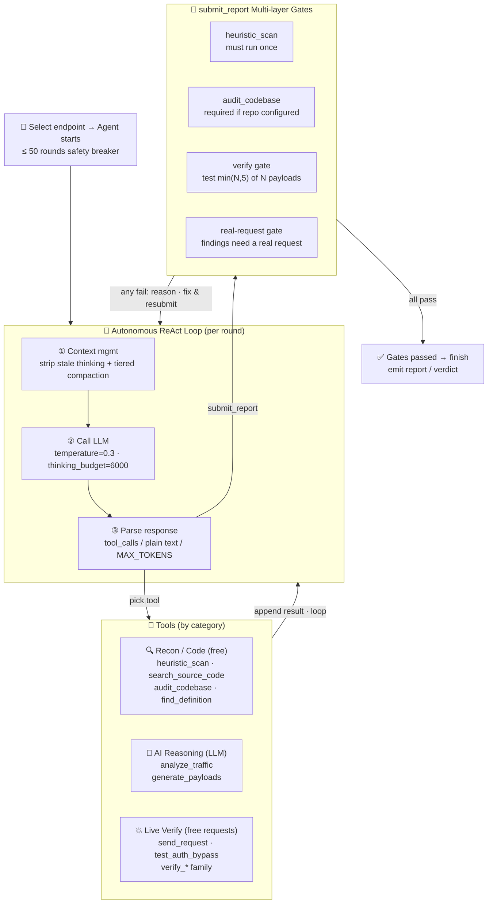

# Agent ReAct Loop · Mermaid (EN)

```mermaid
flowchart TB
    START["🎯 Select endpoint → Agent starts<br/>≤ 50 rounds safety breaker"]
    subgraph LOOP["🔄 Autonomous ReAct Loop (per round)"]
        direction TB
        CTX["① Context mgmt<br/>strip stale thinking + tiered compaction"]
        CALL["② Call LLM<br/>temperature=0.3 · thinking_budget=6000"]
        PARSE["③ Parse response<br/>tool_calls / plain text / MAX_TOKENS"]
        CTX --> CALL
        CALL --> PARSE
    end
    subgraph TOOLS["🧰 Tools (by category)"]
        direction LR
        RECON["🔍 Recon / Code (free)<br/>heuristic_scan · search_source_code<br/>audit_codebase · find_definition"]
        REASON["🧠 AI Reasoning (LLM)<br/>analyze_traffic<br/>generate_payloads"]
        PROBE["💥 Live Verify (free requests)<br/>send_request · test_auth_bypass<br/>verify_* family"]
    end
    subgraph GATE["🚪 submit_report Multi-layer Gates"]
        direction LR
        G1["heuristic_scan<br/>must run once"]
        G2["audit_codebase<br/>required if repo configured"]
        G3["verify gate<br/>test min(N,5) of N payloads"]
        G4["real-request gate<br/>findings need a real request"]
    end
    DONE["✅ Gates passed → finish<br/>emit report / verdict"]
    START --> LOOP
    PARSE -->|"pick tool"| TOOLS
    TOOLS -->|"append result · loop"| LOOP
    PARSE -->|"submit_report"| GATE
    GATE -->|"any fail: reason · fix &amp; resubmit"| LOOP
    GATE -->|"all pass"| DONE
```
