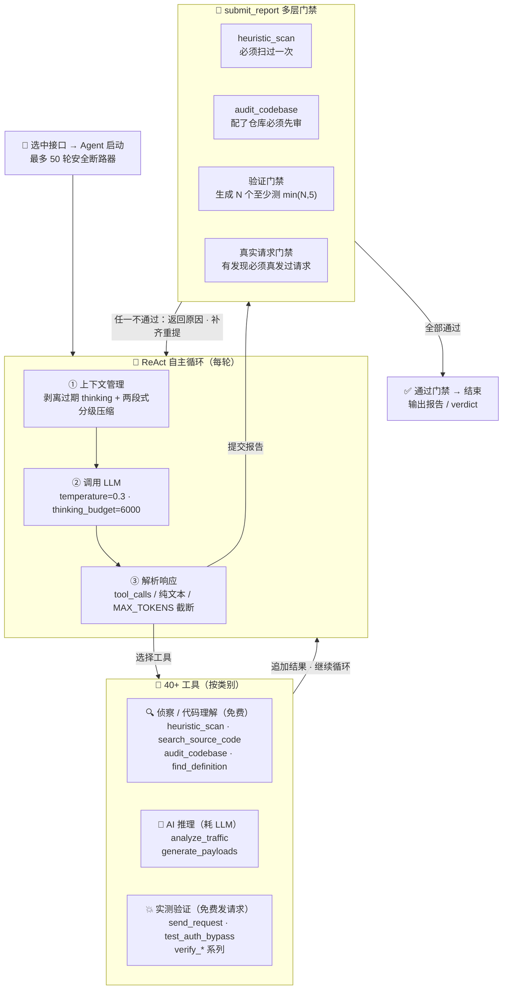

# Agent ReAct 工具循环图 · Mermaid 源

> 生成工具: system-diagram skill（Text → Mermaid → HTML/CSS）
> 用途: README「Agent 模式」章节的逻辑图

```mermaid
flowchart TB
    START["🎯 选中接口 → Agent 启动<br/>最多 50 轮安全断路器"]
    subgraph LOOP["🔄 ReAct 自主循环（每轮）"]
        direction TB
        CTX["① 上下文管理<br/>剥离过期 thinking + 两段式分级压缩"]
        CALL["② 调用 LLM<br/>temperature=0.3 · thinking_budget=6000"]
        PARSE["③ 解析响应<br/>tool_calls / 纯文本 / MAX_TOKENS 截断"]
        CTX --> CALL
        CALL --> PARSE
    end
    subgraph TOOLS["🧰 40+ 工具（按类别）"]
        direction LR
        RECON["🔍 侦察 / 代码理解（免费）<br/>heuristic_scan · search_source_code<br/>audit_codebase · find_definition"]
        REASON["🧠 AI 推理（耗 LLM）<br/>analyze_traffic<br/>generate_payloads"]
        PROBE["💥 实测验证（免费发请求）<br/>send_request · test_auth_bypass<br/>verify_* 系列"]
    end
    subgraph GATE["🚪 submit_report 多层门禁"]
        direction LR
        G1["heuristic_scan<br/>必须扫过一次"]
        G2["audit_codebase<br/>配了仓库必须先审"]
        G3["验证门禁<br/>生成 N 个至少测 min(N,5)"]
        G4["真实请求门禁<br/>有发现必须真发过请求"]
    end
    DONE["✅ 通过门禁 → 结束<br/>输出报告 / verdict"]
    START --> LOOP
    PARSE -->|"选择工具"| TOOLS
    TOOLS -->|"追加结果 · 继续循环"| LOOP
    PARSE -->|"提交报告"| GATE
    GATE -->|"任一不通过：返回原因 · 补齐重提"| LOOP
    GATE -->|"全部通过"| DONE
```
