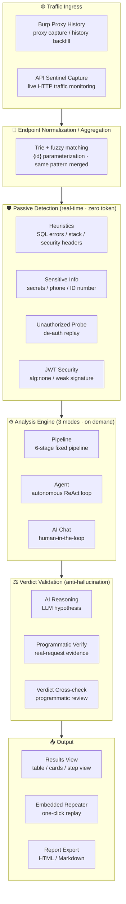

# Overall Architecture · Mermaid (EN)

```mermaid
flowchart TB
    subgraph CAPTURE["🌐 Traffic Ingress"]
        direction LR
        PROXY["Burp Proxy History<br/>proxy capture / history backfill"]
        CAP["API Sentinel Capture<br/>live HTTP traffic monitoring"]
    end
    subgraph NORM["🧬 Endpoint Normalization / Aggregation"]
        NRM["Trie + fuzzy matching<br/>{id} parameterization · same pattern merged"]
    end
    subgraph PASSIVE["🛡️ Passive Detection (real-time · zero token)"]
        direction LR
        HEU["Heuristics<br/>SQL errors / stack / security headers"]
        SENS["Sensitive Info<br/>secrets / phone / ID number"]
        UNAUTH["Unauthorized Probe<br/>de-auth replay"]
        JWT["JWT Security<br/>alg:none / weak signature"]
    end
    subgraph ENGINE["⚙️ Analysis Engine (3 modes · on demand)"]
        direction LR
        PIPE["Pipeline<br/>6-stage fixed pipeline"]
        AGENT["Agent<br/>autonomous ReAct loop"]
        CHAT["AI Chat<br/>human-in-the-loop"]
    end
    subgraph VERIFY["⚖️ Verdict Validation (anti-hallucination)"]
        direction LR
        LLM["AI Reasoning<br/>LLM hypothesis"]
        PROG["Programmatic Verify<br/>real-request evidence"]
        CROSS["Verdict Cross-check<br/>programmatic review"]
    end
    subgraph OUTPUT["📤 Output"]
        direction LR
        TABLE["Results View<br/>table / cards / step view"]
        REPEAT["Embedded Repeater<br/>one-click replay"]
        REPORT["Report Export<br/>HTML / Markdown"]
    end
    CAPTURE --> NORM
    NORM --> PASSIVE
    PASSIVE --> ENGINE
    ENGINE --> VERIFY
    VERIFY --> OUTPUT
```
