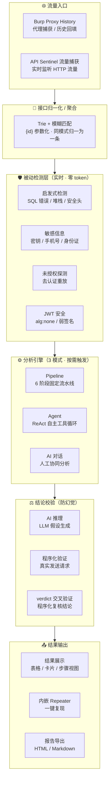

# 整体架构图 · Mermaid 源

> 生成工具: system-diagram skill（Text → Mermaid → HTML/CSS）
> 用途: 替换 README「架构图」章节的 ASCII 罫线图

```mermaid
flowchart TB
    subgraph CAPTURE["🌐 流量入口"]
        direction LR
        PROXY["Burp Proxy History<br/>代理捕获 / 历史回填"]
        CAP["API Sentinel 流量捕获<br/>实时监听 HTTP 流量"]
    end
    subgraph NORM["🧬 接口归一化 / 聚合"]
        NRM["Trie + 模糊匹配<br/>{id} 参数化 · 同模式归一为一条"]
    end
    subgraph PASSIVE["🛡️ 被动检测层（实时 · 零 token）"]
        direction LR
        HEU["启发式检测<br/>SQL 错误 / 堆栈 / 安全头"]
        SENS["敏感信息<br/>密钥 / 手机号 / 身份证"]
        UNAUTH["未授权探测<br/>去认证重放"]
        JWT["JWT 安全<br/>alg:none / 弱签名"]
    end
    subgraph ENGINE["⚙️ 分析引擎（3 模式 · 按需触发）"]
        direction LR
        PIPE["Pipeline<br/>6 阶段固定流水线"]
        AGENT["Agent<br/>ReAct 自主工具循环"]
        CHAT["AI 对话<br/>人工协同分析"]
    end
    subgraph VERIFY["⚖️ 结论校验（防幻觉）"]
        direction LR
        LLM["AI 推理<br/>LLM 假设生成"]
        PROG["程序化验证<br/>真实发送请求"]
        CROSS["verdict 交叉验证<br/>程序化复核结论"]
    end
    subgraph OUTPUT["📤 结果输出"]
        direction LR
        TABLE["结果展示<br/>表格 / 卡片 / 步骤视图"]
        REPEAT["内嵌 Repeater<br/>一键复现"]
        REPORT["报告导出<br/>HTML / Markdown"]
    end
    CAPTURE --> NORM
    NORM --> PASSIVE
    PASSIVE --> ENGINE
    ENGINE --> VERIFY
    VERIFY --> OUTPUT
```
